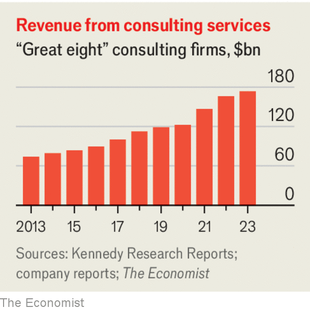

###### Management consulting

# Some advice to the corporate world’s know-it-alls 

##### With growth slowing, consulting firms like McKinsey need some counsel of their own 

 

> Mar 27th 2024 

Dear CHIEF STRATEGy ARCHITECT—As the corporate philosopher behind one of the world’s most illustrious consultancies, you well know how tough business has been lately. Only two years ago you were reaching for the stars. Clients jolted by the covid-19 pandemic sought you out as a supply-chain savant and a doyen of digital businesses. The craze over environmental, social and governance (ESG) considerations turbocharged your bottom line. Unfortunately, you went on a hiring binge.

Now the . Growth has slowed as clients have cut back on splashy projects. Workforce optimisation has been widespread—though at least you gave something back by hiring extra security staff to see the ex-partners off the premises! This month an anonymous memo, purportedly written by McKinsey ex-partners, scolded the Firm’s “unchecked and unmanaged growth” and “lack of strategic focus”.

 


Those are harsh words for a business built on telling companies how to manage their affairs. You might go so far as to say the consultants need some wise counsel. That is where my firm—the premier consultant to the world’s consultancies—comes in. I append a 367-slide presentation that goes into the detail, but my diagnosis is simple: you are all too big. The combined revenue of the eight leading firms in your industry is now double what it was a decade ago. Partly that reflects growing demand. But it is also middle-age spread: you are bloated, my friend. 

You used to be in the advice business, but you have lost your focus and your strategic alignment is out of kilter. Bain, BCG and McKinsey, the best-of-breed strategy advisers, increasingly string out a contract for guidance into months or years of work helping clients to implement their brainy ideas—an incentive to make their advice even harder to understand. The “big four” accounting giants, Deloitte, EY, KPMG and PwC, are taking this a step further by running activities from supply-chain management to cybersecurity on clients’ behalf. They call this “managed services”; to me it seems like outsourcing on steroids, and about as good for you. 

By now you’ll be protesting that you had a sound business case. I know—I have read your pitches. Oceans of experience, alongside massive economies of scale in areas like technology, make you more productive than your clients at many things. Companies have been backing out of back-office ops like payroll management for decades. 

Yet the blurring of responsibilities between client and consultant raises awkward questions. It was bad enough when a top-dollar executive team could not work out their own strategy. Now they have delegated running the business, too. What is left to do? 

A fuzzier definition of consulting also carries two risks for you. The first is that clients begin to question the value of all those pimply 20-somethings you are billing them for (be assured, our team is staffed exclusively with jaded 50-somethings). The second is that, at a time of disruption, you take your eyes off your core business of providing advice. 

For now, artificial intelligence looks like a godsend, as clients turn to you again for help. In time, it could up-end your industry. That is why we have a new transformation programme for firms like yours. You know how this works: I’m not going to tell you what it involves until you sign the contract. But if you commit to be with us for a few years, I am confident you can overcome these challenges. 

Yours, BILL FOLD. Chief Growth Hacker, PDQ Consult. ■

