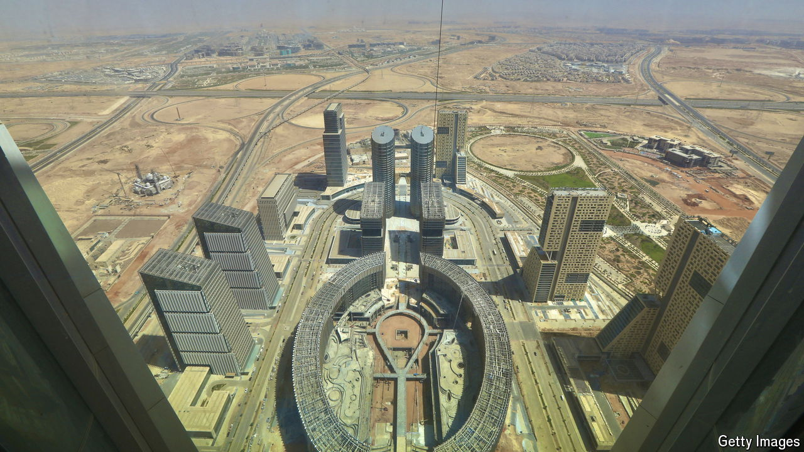
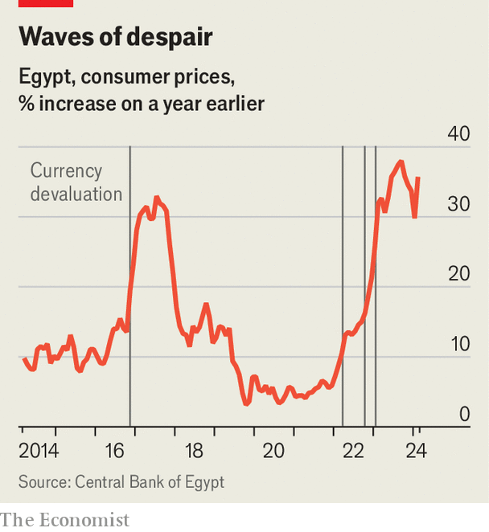

###### A crisis deferred

# After pushing its economy to the brink, Egypt gets a bail-out 

##### But a record-setting investment from the UAE will not fix its chronic problems 

 

> Mar 27th 2024 

IN ANCIENT times, the pharaohs knew their survival might depend on the annual flooding of the Nile. Without its deluge of rich black silt, crops could not be sown, and hungry people tended to turn on their leaders. Times have changed, but Egypt’s modern-day pharaoh still looks elsewhere to sustain his rule: not south, to the headwaters of the Nile, but east, to the oil-rich monarchies of the Gulf.

On February 23rd Egypt and the United Arab Emirates (UAE) signed a $35bn deal to develop Ras el-Hekma, a wedge of land jutting off Egypt’s Mediterranean coast. The biggest urban land sale in Egypt’s history saw the Emiratis buy the rights to 171m square metres (42,000 acres) of land, with plans to build homes, hotels and shopping centres in a sort of Dubai on the Med. Egypt will retain a 35% stake in the project.

This was not just a property deal, though: the deluge of investment also bailed out a country on the brink of economic crisis after a decade of debt-fuelled spending. Two months ago, Abdel-Fattah al-Sisi’s government was scrounging for dollars to pay for imported goods and for an enormous debt-service bill. 

Within weeks of the announcement, the IMF more than doubled the $3bn loan it promised Egypt in December 2022, to $8bn. The European Union (EU) announced a €7.4bn ($8bn) aid package, and the World Bank stumped up another $6bn. All told, Egypt hauled in more than $50bn, a sum that dwarfs the central bank’s $35bn in foreign reserves. The mega-deal has, for now, pulled it back from the brink. But it leaves several big questions.

The first is what the UAE gets in return for its largesse. The answer is partly about politics. The Emiratis are exasperated with Mr Sisi, who begs them for aid even as he disagrees with their foreign policy in neighbouring Libya and Sudan. No one wants to see economic collapse in the biggest Arab country. But the UAE did not want to bail out Mr Sisi as it did after his coup in 2013, when it joined Saudi Arabia and Kuwait in sending $25bn in aid.

The UAE hopes the Ras el-Hekma deal, the largest influx of foreign direct investment in Egypt’s history, will give it more leverage over Mr Sisi—and perhaps turn a profit, too. Property has been a good investment in Egypt, where many people see houses as a safer bet than stocks or savings. Apartments and villas in a fancy Emirati development might appeal to both Egyptian and Gulf buyers.

There are, however, reasons for scepticism. Mr Sisi, a career military man, is unlikely to bend much on foreign policy. Profits may be slow to trickle in: Egypt has a patchy track record with purpose-built cities. The new capital rising in the desert east of Cairo, almost a decade in the making, is still largely a ghost town (it does not even have a name yet). Mostafa Madbouly, the Egyptian prime minister, promises that Ras el-Hekma will attract 8m tourists. That seems unlikely, since the whole country drew only 14.9m last year.

Still, the UAE can afford to be patient—and the real price tag is less than the $35bn headline. ADQ, a sovereign wealth fund in Abu Dhabi, agreed to pay $24bn in fresh money. The other $11bn comes from existing deposits at Egypt’s central bank, which it had never expected to recoup anyway.

The second question is what the deal means for Egypt’s promised reforms. In 2022 it assured the IMF it would float its currency and stop the state from crowding out private enterprise. Similar pledges had come to naught before: Egypt devalued the pound three times between March 2022 and January 2023 but never allowed it to float. By the start of 2024 efforts to prop up the currency were unsustainable. The official rate was around 31 to the dollar; on the black market, it was 75. The IMF refused to unlock further tranches of aid.

On March 6th the Egyptian pound was allowed to sink to 50. In a surprise move, the central bank also raised its main interest rate by six percentage points, to a record 27.25%. That lured back foreign investors, who bought almost half of the $2bn in short-term local-currency debt that Egypt sold the following day. It also convinced the IMF to increase its loan. Time will tell whether any of these reforms are serious. Some analysts doubt the pound is truly floating. And the government is as reluctant as ever to sell state-owned firms, especially those controlled by the army.

Annual inflation set several records last year, peaking at 39.7% in August. Though it had cooled in recent months, the rate unexpectedly jumped to 35.7% in February, from 29.8% a month earlier. Onions, a staple of Egyptian cooking since antiquity, now cost 50 pounds a kilogram at some markets, a 400% increase over a year ago. Sugar prices have doubled. At 400 pounds per kilo, even the cheapest cuts of beef cost almost two days’ pay for the lowest-paid civil servants.

 


In their public statements, Egyptian officials act as if the crisis is over. Mr Madbouly vows that prices will drop: with more dollars in the banks, he says, firms will flood the market with imports. That is not usually how devaluations work, though, as Egyptians know from prior experience (see chart). Pass-through inflation may be lower this time, since many firms have already priced in the weaker currency. But slowing inflation does not mean lower prices.

The first time that Mr Sisi asked the IMF for help, in 2016, external debt was 17% of GDP. At the end of last year it was 46%. Before the Ras el-Hekma deal Egypt had $79bn in payments due by the end of 2026, a sum more than double its foreign reserves. By releasing the $11bn in central-bank deposits, the UAE momentarily reduced Egypt’s debt burden—but also allowed it to borrow an even larger sum from the EU, the IMF and the World Bank, not to mention private investors.

Egypt needs to grow its economy and fix its chronic current-account deficit. But its private sector is anaemic and sky-high interest rates will be a drag on growth. Property sales to local buyers will not bring in dollars. The state will be on the hook to build water, power and transport infrastructure for the new city—which will require big foreign-currency outlays. The country’s fiscal reckoning has not been resolved, only rescheduled. ■

