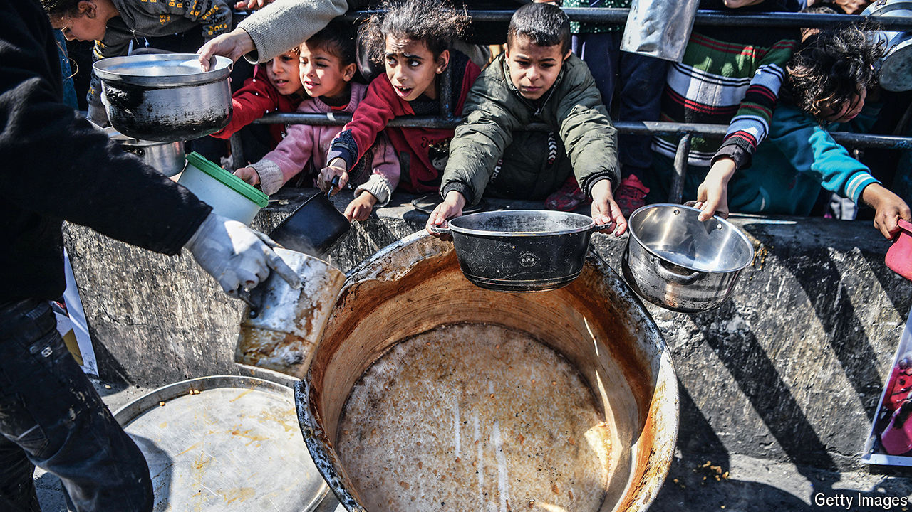
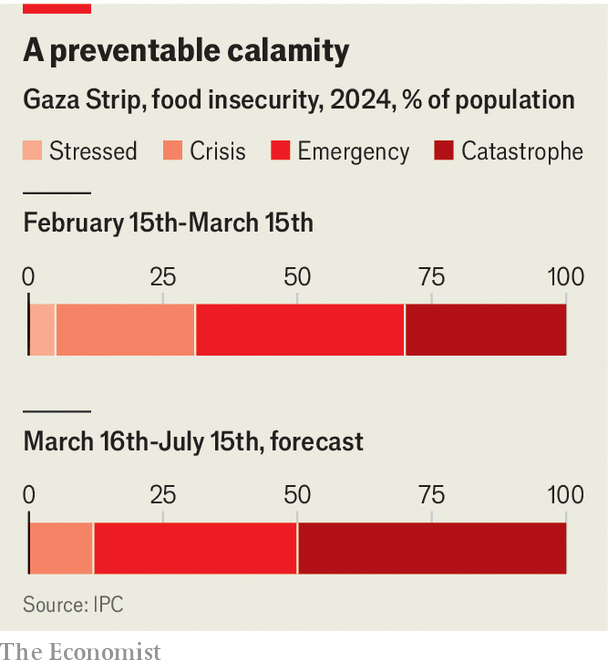

###### Intentionally or by negligence?

# Gaza is on the brink of a man-made famine 

##### Israel and Hamas reject a ceasefire even as people starve 

 

> Mar 27th 2024 

AS American ships were crossing the Atlantic to build a humanitarian pier in Gaza, American diplomats withheld their veto when the UN Security Council voted on March 25th for a ceasefire between Israel and Hamas during the month of Ramadan, which ends on April 9th. America’s dispatch of ships and this diplomatic rebuke reflect the growing frustration of President Joe Biden’s administration with Israel’s conduct of the war as well as wider concerns that many of Gaza’s 2.2m inhabitants will starve unless they get urgent aid. 

These worries crystallised on March 18th with the release of a report warning that about half of Gaza’s population faces “catastrophic food insecurity” and that around 70% of an estimated 300,000 people still in Gaza city will probably experience “famine” within the next two months. The report was compiled by the Integrated Food Security Phase Classification (IPC) system, an international network that provides apolitical assessments. Israel, which previously denied accounts of starvation, has tellingly not rebutted the IPC report.


The famine is caused not only by Israel’s restrictions on food entering Gaza, but also by its interruption of distribution. The UN says Israel routinely denies approval for aid convoys. Earlier this month it bombed a food-distribution centre. Israeli forces occupy most of the farmland and have displaced much of the population. 

Reports from the ground in Gaza are patchy and not always trustworthy. The 365 sq km coastal strip is divided into enclaves, some controlled by the Israel Defence Forces (IDF), others by Hamas. Increasingly there are areas where local crime families have stolen the little food brought in and are selling it for profit. 

 


There are no reliable numbers yet of deaths from hunger but the data the IPC has gathered indicate that in February 29% of children under the age of two in northern Gaza were suffering from acute malnutrition. Some 66% of families there went without any food for 24 hours at least ten times last month. 

The situation is worst in Gaza city, which has been intensively bombarded and cut off by the IDF in the nearly six months since Hamas launched its deadly attack on Israel. Only a small handful of supply convoys have been allowed in. There are now more regular convoys to the 1.5m Palestinians sheltering around Rafah on the Egyptian border, but these supplies, insufficient as they are, will be jeopardised if Israel embarks on the next step of its military campaign against the last major stronghold of Hamas there.

Israel claims its war is to “destroy Hamas”, not the civilian population, and has denied that it is intentionally starving Gaza. But some senior Israeli politicians have called for exactly that and security officials have admitted that withholding supplies is “a lever of pressure on Hamas to release Israeli hostages”. Israel has also cut off the water pipeline to northern Gaza to force the population to move south. 

“Even if it’s not fully intentional, it’s criminal negligence bordering on intentionality, and the result for the people of Gaza is the same,” says Tania Hary of Gisha, an Israeli human-rights organisation. It and others have asked the Supreme Court to order the government to remove restrictions on supplies to Gaza and to accept its responsibility as the occupying power to provide for the population. 

Some IDF officers accept that they are responsible for all the population’s needs. “We will supply them if given the order,” says one. But no such order has been forthcoming from the government of Binyamin Netanyahu, the prime minister, whose hard-right ministers have even tried to block shipments of flour from America. 

Israel’s position on supplies to Gaza has fluctuated since the war began. First it allowed only a minimal number of lorries through the Rafah border crossing with Egypt. It has since opened its own crossing with Gaza, but only for supplies that have first come through Egypt, and started allowing shipments by sea. Yet Mr Netanyahu’s government is also pandering to those Israelis who—traumatised by the massacre on October 7th and demanding that Hamas release hostages—oppose allowing any food in. Some have picketed Israel’s border crossing to Gaza to try to halt aid convoys. As a result, the government has not held any serious discussions or published a policy on humanitarian aid. 

“All the decisions on supplies to Gaza have been made on the fly, without the generals or the government understanding that we have a responsibility to come up with a comprehensive strategy,” says a frustrated IDF officer. On March 13th Israel seemed to change policy when it pledged “to flood the area with aid”. But instead of providing it, Israel will merely facilitate efforts by others to do so. 

Israel has also built a new road into northern Gaza and allowed a resumption of shipments by private Palestinian contractors, who before the war brought in around 90% of Gaza’s food imports. Yet this is not enough and many are calling for a resumption of operations by the UN Relief and Works Agency, the main aid organisation in Gaza, which Israel says has been infiltrated by Hamas. 

The quickest way of preventing famine would be a temporary ceasefire to allow aid in. But Mr Netanyahu has rejected the UN resolution calling for one, because it is not conditional on the release of 134 hostages still held in Gaza. Hamas, meanwhile, has rejected a proposal for a six-week truce, including the release of 40 hostages and hundreds of Palestinian prisoners, because it does not require Israel to withdraw its forces from Gaza. Locked in a deadly battle, both sides seem prepared to let the people of Gaza starve. ■

