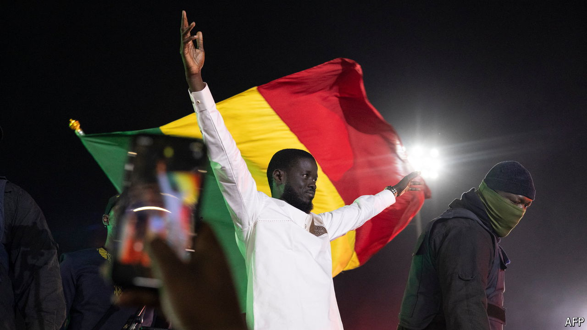

###### Crisis averted

# Senegal proves the doomsayers wrong 

##### Bassirou Diomaye Faye’s win is a triumph for the country’s democracy 

 

> Mar 26th 2024 

Little more than a month ago Senegal was in the midst of a constitutional crisis. , the outgoing president, had tried to delay elections by ten months. His most popular rival was behind bars and disqualified from running. Security forces were beating and arresting protesters. Many feared that a country widely seen as a bulwark of stability in a region once again beset by  and overstaying presidents might be the next domino to fall. 

Yet the doomsayers were proved wrong. On March 24th voters turned out in unusually large numbers to give their verdict on Mr Sall’s 12 chequered years in office. In polls that passed almost entirely without incident, they delivered a comfortable majority to Bassirou Diomaye Faye, an anti-corruption crusader who was freed from prison less than two weeks before the vote as part of a last-minute amnesty deal. 

Within a few hours of the first results, the ruling party’s candidate, Amadou Ba, graciously accepted defeat. Mr Sall, who did much to weaken Senegal’s institutions, and who last year mulled standing for a constitutionally barred third term, hailed the peaceful conclusion to the vote “a victory for Senegalese democracy.” 

At 44, Mr Faye will be Africa’s youngest elected leader. He joins a burgeoning club of millennial men who have recently taken charge in several west African countries—Guinea, Mali and, a bit further afield, Niger and Burkina Faso—at least partly on the back of popular dissatisfaction with greying leaders and predatory elites. Mr Faye is unique among this group in having come to power through the ballot box rather than by a coup. Yet Senegal’s president-elect typifies the same broad populist reaction to regional insecurity, chronic unemployment and the perceived meddling of France, the former colonial power. 

Mr Faye, who has never held elected office, declared his victory a vote for “rupture” over continuity. He has promised to curb graft and clip the powers of the presidency. Before the election he took the unusual step of publishing his net worth in the name of transparency. More controversially, he suggested leaving the CFA franc, a regional currency backed by France, and renegotiating oil and gas licences awarded by his predecessor to foreign investors. 

Behind Mr Faye lurks the figure of Ousmane Sonko, his closest ally and by far Senegal’s most popular opposition leader. A charismatic firebrand, Mr Sonko rattles the country’s political and business classes; in an interview with  last year Mr Sall accused him of inciting violence. (Indeed, the opposition leader did once tell his followers: “If you force open the homes [of those in power] you will find billions there.”) 

Mr Sonko was arrested in 2021 and charged with rape. Acquitted on that charge, he was nonetheless convicted of “corruption of youth”, defined as immoral behaviour with someone under the age of 21. He was also convicted of defamation for accusing a government minister of corruption. He says the charges were politically motivated and denies wrongdoing. But his conviction made him ineligible to stand for president, even after he was freed from prison alongside Mr Faye, who promptly replaced him as their party’s presidential candidate.

The pair are both former tax inspectors who have worked with one another for years. They are said to be joined at the hip: Mr Faye is reported to have nicknamed his son “Ousmane” in his friend’s honour. After leaving prison, they campaigned under the slogan “Diomaye is Sonko”. Mr Faye, the more buttoned-up of the pair, has yet to reveal whether his friend will hold an official government post. But even if he does not, the divisive Mr Sonko will doubtless wield weighty influence behind the scenes. “They will work together in tandem,” says Alioune Tine of Afrikajom Centre, a think-tank in Dakar. “This is their joint project.”

The exact details of this project remain vague. In his first speech as president-elect Mr Faye promised to govern with “humility”. In the days before the vote he had sought to placate foreign investors, declaring himself the strongest guarantor of their security among all the contenders for the presidency, while watering down his pledge to replace the CFA franc with a new national currency. (Though widely seen in the region as a colonial-era relic, the common currency helps to contain inflation and monetary volatility.) Perhaps seeking to put to bed fears that he and Mr Sonko would cut ties with France and open the door to Russia, the incoming president also stressed in his inaugural speech that Senegal would remain a “safe and reliable ally” for all “respectful” foreign partners. 

A review of hydrocarbon contracts is probably a higher priority than ditching the CFA franc. But here, too, Mr Faye’s room for manoeuvre is limited. At 81% of GDP Senegal’s public debt is uncomfortably high after a decade of major infrastructure spending. A much-anticipated windfall from recently discovered oil and gas reserves has yet to land, further tightening the financial squeeze. Because of delays in commencing production, late last year the IMF cut its growth forecast for Senegal this year by more than two percentage points, to (a still-zippy) 8.3%. “Campaign in poetry but govern in prose,” says Mayecor Sar, a co-founder of Think Africa 2050, a Senegal-based think tank. “I think that will be the case here as well.”

For now, though, the mood in Senegal is justifiably buoyant. Concerns that its democracy might succumb to violence on the streets, or even to a coup, have been shown to be overblown. Like the judges in Kenya in 2017 and Malawi in 2020, those on Senegal’s top court stood firm against attempts to subvert the constitution and rig an election. Once the results appeared, all the other candidates in the race promptly conceded and rushed to congratulate the winner. “For democracy, this is a really good result,” says Mr Sar. “And it was the democratic consciousness of the Senegalese people which made all the difference.” ■

