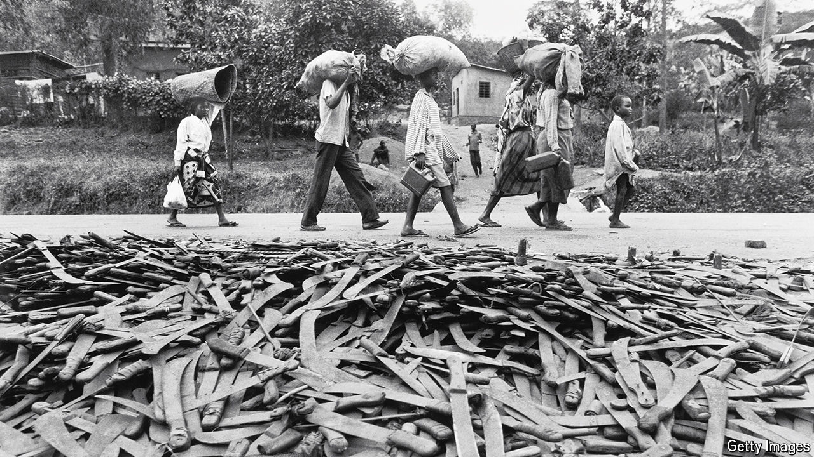
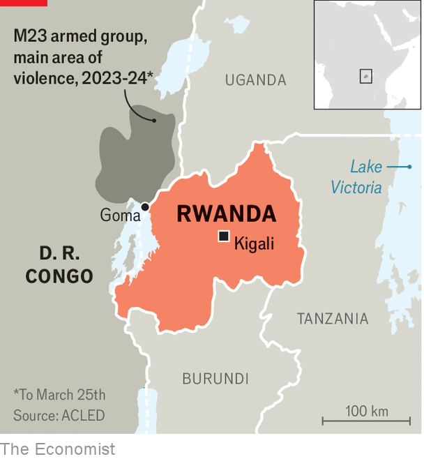

###### The unbearable weight of history

# Three decades after Rwanda’s genocide, the past is ever-present 

##### Paul Kagame sees himself as indispensable to a still fragile country 

 

> Mar 25th 2024 

EVERY YEAR on April 7th Paul Kagame, Rwanda’s president, commemorates the start of the most abominable event of the late 20th century, the Rwandan . Over 100 days in 1994 masses of the majority Hutu population slaughtered hundreds of thousands of their countrymen, mostly from the minority Tutsi group. In these annual speeches Mr Kagame offers glimpses of why he is Africa’s most polarising leader. In one breath there is the official narrative: Rwanda is now a miracle of peace, unity and prosperity—a beacon of progress lit from the embers of the genocide. In the next there are hints of the more sinister figure his critics decry, for instance in his disdain for those who challenge him. They also point out his brutal repression and his warmongering in neighbouring Congo.

Ahead of the 30th anniversary of the genocide some observers in Kigali, the capital, hope that Mr Kagame will use the event to move beyond the question of whether Rwanda is Africa’s Singapore or Africa’s North Korea. About two-thirds of Rwanda’s population are under 30. Some diplomats and businessmen wonder whether the 66-year-old president, who has, in effect, run the country since 1994, might speak of the next 30 years, loosen the grip of his authoritarian state and even suggest when he might plan to step aside. 

That is unlikely. In the “land of a thousand hills” only one man can have the moral high ground. On July 15th Mr Kagame will almost certainly be re-elected as president with a margin that would make even Vladimir Putin blush, in a ballot neither free nor fair. Having won 98% of votes in a constitutional referendum in 2015 that still allows him to run for two more terms of office lasting until 2034, he is going nowhere. 

 


To assess Rwanda today, you can look at Mr Kagame’s policies in three places: at home, in the wider Great Lakes region, and in the rest of the world. Across them a picture emerges of some reform and reconciliation, with a lot of repression and realpolitik. Central to Mr Kagame’s domestic agenda is state-enforced brainwashing. At mandatory  (solidarity) camps and in prisons, an official narrative is drummed into the population. It is a story that emphasises a national Rwandan identity over ethnic ones. It does not mention the crimes committed by Mr Kagame’s party, the Rwandan Patriotic Front (RPF). 

For the government, the case for top-down reconciliation is obvious, given that perpetrators live cheek by jowl with the families of victims. Has it worked? A state-sponsored “reconciliation barometer” shows that nearly 100% of Rwandans respond positively to questions about whether they are tolerant, trusting and united. Phil Clark of the School of Oriental and African Studies at the University of London has written that “most Rwandans…have chosen to get on with life rather than settle old scores.” 

Other researchers argue that in Rwanda reconciliation is often superficial. Susan Thomson of Colgate University in New York has described “everyday resistance” to government schemes. This includes people keeping silent or even laughing during community meetings, and passing critical messages clandestinely at vegetable markets. Though it is impossible to see into the hearts of ordinary Rwandans, you can see the repression that has come with reconciliation. Expansive laws banning “divisionism” and genocide denial are used against dissidents. A system whereby neighbours spy on one another keeps close tabs on villagers. Journalists and opposition politicians have been imprisoned and some have died in mysterious circumstances. Opponents of the regime outside the country have been harassed and some have been killed, according to Human Rights Watch, an international monitor. 

Rwanda prefers it when visitors focus on Kigali’s clean streets, its gleaming convention centre, the lack of petty corruption, its tourism lodges and mountain gorillas. Western diplomats praise Rwanda’s effective use of aid, which adds up to the equivalent of around 75% of government spending. Such is the interest from other African officials that there is now a dedicated agency explaining how they can use Rwanda’s methods. It is a sign of what Ken Opalo, a Kenyan academic, calls “Rwanda envy”. Some of that is justified. GDP grew by more than 8% a year on average from 1995 to 2022. Life expectancy increased from 49 years to 66 between 2001 and 2021. Child mortality fell by 77%.

Yet there may be less to Rwanda’s success than meets the eye. Several researchers have credibly suggested that official measures of poverty underestimate its true extent. Others have questioned official data on agricultural yields. And just 2% of Rwandans have fridges, a symbol of African middle-class life. That is well below the rate in other nearby countries such as Ethiopia (6%) and Tanzania (10%) that have similar income levels, according to the Global Data Lab at Radboud University in the Netherlands.

In private many Rwandans complain about big gaps between the rich and poor. The country has a higher Gini coefficient, a benchmark for income inequality, than regional peers. A sense that the gains from growth are heavily skewed to a narrow elite could be socially dangerous. One study suggests that Tutsis, who make up 10-15% of the population, hold 80% of top jobs in the government and state-owned firms such as Crystal Ventures, run by the RPF, and Horizon, run by the army. Some foreigners praise these firms for investing in the economy, though they can also deter investors by stifling competition. 

Yet Mr Kagame’s ambitions have never been limited by his country’s borders. In the 1980s he and other Tutsi exiles in Uganda helped Yoweri Museveni take power in that country. In the early 1990s the RPF went to war against the then Hutu-led regime in Rwanda, and in 1994 it marched on Kigali to end the genocide, which was sparked when a plane carrying Juvenal Habyarimana, Rwanda’s then president, was shot down. In 1997 Mr Kagame and Mr Museveni together toppled Mobutu Sese Seko, Congo’s dictator for three decades, after he gave sanctuary to Rwandan army and militia leaders who had taken part in the genocide. When the man they replaced him with, Laurent Kabila, proved less than pliant, Rwanda invaded again, instigating a war that led to the loss of 1m-5m lives, mostly from hunger and disease. 

Bad neighbours

Rwanda, which seems to export more minerals than it mines at home, has retained a strong presence in resource-rich regions of eastern Congo. According to the UN, it supports an armed group known as M23, which is accused of murder and rape and is close to capturing the regional capital, Goma, increasing tension between Congo and Rwanda. “War could break out at any time,” worries a Western diplomat. 

Rwanda’s sympathisers argue that its actions in eastern Congo are about self-defence and the protection of Tutsis. The Rwandan government points out that there are links between the Congolese army and a group known as the FDLR, which traces its origins to the Hutu who fled in 1994. Yet there is more to Rwanda’s meddling. The latest spasm of violence by M23 followed Congo’s moves to sideline Rwanda by inviting Burundian and Ugandan troops into the country and by cosying up to Kenya. Michela Wrong, a journalist, wrote last year that “Kagame has long believed in his right to be  [unavoidable], not only in Rwanda but also in the region, on the continent, and even in the global arena.”

Some early aid to Rwanda was motivated by Western guilt for failing to intervene to stop the genocide; some because Rwanda proved that aid to Africa could actually work. Increasingly, though, it is Mr Kagame’s transactional realpolitik that ensures the West backs him. Britain, for instance, wants to send asylum-seekers there. Some in Rwanda’s government regret that deal because they think it tarnishes its brand. But there have been benefits. Britain has agreed to pay £370m ($470m) for the “partnership” by 2026, about ten times more than its annual aid contributions to the country, with more cash if asylum-seekers ever arrive. That contrasts with Britain’s response in 2012 to an M23 offensive, when it cut aid to Rwanda. 

France, too, is cosying up to Mr Kagame. For years relations were strained because a French judge accused the RPF of shooting down the plane carrying Habyarimana, whose regime Paris supported. Emmanuel Macron, who in 2021 in Kigali asked for forgiveness for France’s role during the genocide, has repaired relations. The EU is funding Rwanda’s deployment against jihadists in Mozambique, near where Total, a French energy giant, is building a huge gas project. In February, to the ire of Congo, the bloc said it wanted to boost imports of minerals from Rwanda. 

America has taken a tougher stance. It has imposed sanctions on a Rwandan general for his alleged role in supporting M23 and has suspended military aid. But America remains Rwanda’s largest donor and is reluctant to alienate Mr Kagame, an ally with a strong army that he is willing to send to unstable parts of Africa. Rwanda’s leader also knows his way around Washington; in February he wooed congressmen at a prayer breakfast. (By contrast, a South African delegation turned up during recess and struggled to meet anyone.) 

Indeed, Rwanda has managed to keep friends across several political divisions. China has built most of Rwanda’s major roads and sells it weaponry. Mr Kagame has praised Russia’s role in Africa—yet will be one of a few African countries soon to host a new Ukrainian embassy. Rwanda expressed sympathy with Israel after the massacre by Hamas on October 7th, but has also sent aid to Gaza. Qatar is a major investor in Rwanda but this month a delegation was welcomed from its rival, the United Arab Emirates. “Kagame understands that, ultimately, diplomacy is all about interests,” says a diplomat. 

When Rwanda’s leader speaks on April 7th there will be many foreign dignitaries in attendance. When he wins re-election in July, few of them will speak out. There is a grim logic to such reticence: Mr Kagame will probably be calling the shots for at least ten more years. But as his fourth decade in charge of Rwanda begins, the outside world may want to ponder a question. How stable can Rwanda really be if it depends on the rule of just one man? ■

