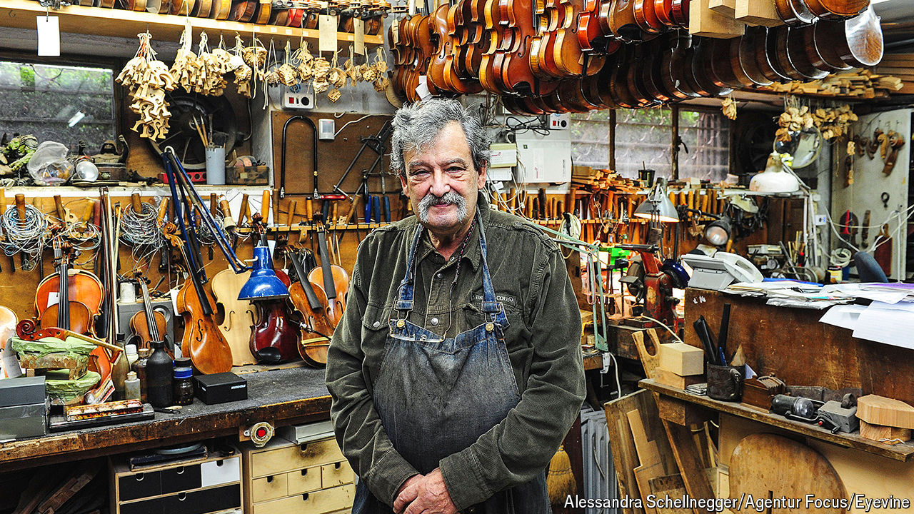

###### A labour of love

# Amnon Weinstein turned grief into music again 

##### The restorer and reviver of Holocaust violins died on March 4th, aged 84 

 

> Mar 27th 2024 

As he grew up, Amnon Weinstein wondered where his extended family was. Where were his grandfather and grandmother, his uncles and aunts? In reply his mother would reach for a book about Vilnius, then in Poland, their home once, and show him a picture of Ponary forest. “Here they are,” she would say. Under the tall, thin, silent trees. 

Gradually he learned about the forest. It was once the loveliest spot in Vilnius, where at weekends people would stroll, picnic and meet friends. Poets wrote verses, painters painted and his father, already in love with violins, played music with his friends. But it was also there that in the second world war the Nazis killed around 100,000 people, 70,000 of them Jews, with rifles and machineguns, burying them crudely under mounds of sand. 

At that point Amnon, too young to remember anything of the Holocaust, buried his curiosity also. His father, who had escaped to British-run Palestine just before the war, never spoke of it. So matters remained until one day in the 1980s, when he was repairing violins in his father’s workshop in Tel Aviv, a young man brought in a battered specimen and asked if he could mend it. 

The instrument was in a dreadful state, scuffed and cracked, its varnish worn away, with damage to the top plate from rain and snow. Yes, the customer explained, it had been outside much of the time, because his grandfather had been forced to play it as he walked to and from the gas chambers in Auschwitz, alongside those who were selected to die. Hearing that, Mr Weinstein almost refused the job. But he took it on. When he opened the violin he found black powder inside, the ash of human beings from the crematoria chimneys. 

This was the most poignant Holocaust violin he came across, but it was not the first. Piled in confusion in a corner of the workshop were dozens more, bought by his father from post-war Jewish immigrants to Palestine and Israel who could no longer bear to play them. Most had been made in Germany, produced cheaply at the turn of the 19th century by Germans who mingled more freely with Jews. Few had had a classical career; instead they played amateur klezmer in the shtetls of eastern Europe, at dances and celebrations. Some were decorated with the star of David, occasionally in mother-of-pearl, because the more Jewish a violin looked, the more likely the rabbi was to recommend that its owner should be hired for weddings. Boys in the shtetl were expected to play, and hung up their instruments proudly on the kitchen wall. But the memories they also carried, of ghettos and camps, were too raw. In dark days, violins spoke of hope; now that their owners were safe, they were discarded. Even his father did nothing more with them. 

Yet each instrument had a story, and these increasingly haunted him. Slowly, over the 1990s, he began to collect the dusty and beaten violins. Some he already had, or found in antique shops; customers brought in more from their attics. One had played Bach Partitas in freezing cold in a labour camp. One had been left as a deposit for rent in Brussels by a young Jewish violinist who never came back; inside it was a withered flower. One had been thrown from a train window to a railway worker somewhere in France, with the cry “Take my violin, that it may live!” It fell on the rails, but was rescued. Inside another was a thickly scratched swastika and the message “Heil Hitler! 1936”—a repairer’s mockery of its Jewish owner, who went on playing it without knowing. Runnels of old glue seeped from the f-holes like tears. That one he would keep but never repair. Never. 

For the rest, he went to infinite pains. A repair might take 18 months, working from morning till night in the workshop in a basement heady with varnish on King Solomon Street. Violins hung everywhere, labelled with the names of their owners and their stories, if he could find them, together with clusters of new bridges, backs and fingerboards. He worked lovingly, scraping away the dirt and damage with chisels and files, applying warm glue from saucepans, dusting off debris with a soft shaving brush. Pare a little, straighten a little; such a light, fragile thing, like a human life. Before involving himself with violins, he had wanted to be a wood sculptor and had studied that for three years. But he found making and repairing violins very similar: not a craft, but an art. A violin was a sculpture that produced sound. 

What kind of sound? Clearly, a good violin had all the beauty of the human voice. But he also sought something distinctively Jewish, a kind of weeping, even when the melody was merry. He did not play violin himself—the viola was his instrument—but when his violins were almost fully repaired, his friend Shlomo Mintz would sometimes drop by to test them. Shlomo believed that their music, like a prayer, could take the listener to mystical realms. When they visited Auschwitz together he played the Hasidic  with fierce emotion on one of the restored violins, outside those terrible gates.

For Mr Weinstein every note played meant victory. Victory of the Jews, who had survived with their culture, over the Nazis, who had disappeared from history. Victory of good over evil, and of music over silence. His collecting had led directly to a project, Violins of Hope, which saw more than 60 of his violins being played by professional musicians in orchestras across Europe and America. He was determined that they should speak again for all the dead of the Holocaust, Jews and others, and for life. With each concert he organised an exhibition and programmes in schools, retelling the instruments’ stories.

The first concert given in Jerusalem, in 2008 beside the Western Wall, caused him terrible anxiety. He couldn’t sleep for worrying what feelings might be unleashed. But it went triumphantly. The violins playing together sounded exactly as he had hoped: like a forest of living, singing souls. ■

