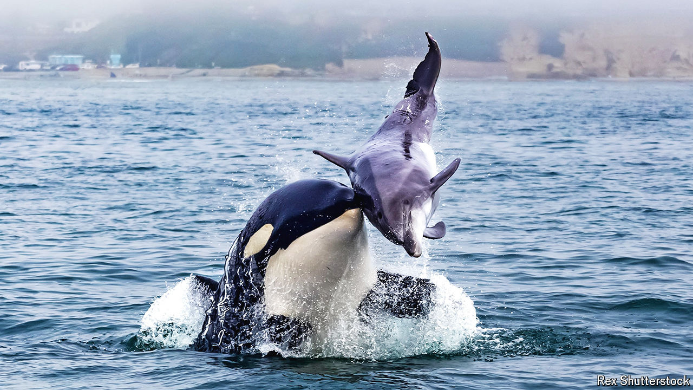

###### Killers’ tactics

# Killer whales deploy brutal, co-ordinated attacks when hunting 

##### Their techniques are passed down through the generations 

 

> Mar 26th 2024 

The killer whales that roam the waters of the Monterey Submarine Canyon, off the coast of California, are brutal animals. When hunting grey whales, they target mother and calf pairs, chasing them until the calves begin to tire. At that point the killer whales separate the grey whales by manoeuvring between them or dragging the calves away by their tail flukes or fins. Once a calf is separated from its mother, the killer whales incapacitate it by bludgeoning it with their heads and tails before drowning it by leaping atop its blowhole to keep it below the surface.

The killer whale () is a diverse species, boasting several isolated populations around the world that occupy varying—and, in several cases, still little described—ecological niches. Two recent studies have shed some light on the unique hunting cultures of the killer whales that stalk the deep waters off the north-east Pacific Ocean. 

Distinct killer whale populations are known as “ecotypes” and can differ in size, colour and body proportion. Where their ecological ranges overlap, ecotypes rarely interact and do not appear to interbreed. Most of what makes killer-whale ecotypes distinct is their culture—socially learned behaviours that killer whales are known to transmit from one generation to the next. These include preferences for different marine prey species and the collaborative strategies used to locate, hunt and kill them, potentially honed over millennia. Different killer-whale ecotypes even communicate using distinct “dialects” made of clicks, whistles and calls, with “accents” that differ between pods.

The most studied killer-whale ecotypes are the three that occupy the north-east Pacific coastline, from northern Alaska to southern California. “Offshore” killer whales, up to 6.6 metres long, patrol distant waters in pods of 100 to 200 individuals, hunting pelagic fishes like sharks. “Resident” killer whales, around 7 metres in length, stalk the coastline in pods of up to 25 individuals, targeting coastal fishes (primarily salmon). Finally, “transient” killer whales, each up to 8 metres in length, are found across both shallow and deep coastal waters and pursue marine mammals, including cetaceans (whales and dolphins), as well as pinnipeds (sea lions and seals). While “inner-coast” transients stalk shallow waters near the shore, “outer-coast” transients hunt in the deep open waters along canyons at the edge of the continental shelf.

To understand these transient killer whales better, Josh McInnes from the University of British Columbia in Canada led a team that analysed 261 sightings of killer whales around the Monterey Submarine Canyon System collected by surveys and whale-watching vessels. The dataset included almost 100 predation events. Publishing their results in the journal , Mr McInnes found patterns in behaviour of outer-coast transients that differed from those of their inner-coast cousins. The latter ambushed harbour seals, sea lions and the occasional otter, while the former tended to perform co-ordinated dives in their hunt for larger mammalian prey.

(Cetacean needed)

Outer-coast transients appear to have developed specialised strategies—such as the repeated battering and drowning of grey whale calves—because their prey is bigger and takes more time to subdue. Like most specialised killer-whale hunting behaviours, these strategies are thought to be honed, down the generations, as a form of cultural knowledge.

While studying the outer-coast transients, Mr McInnes also stumbled upon hints of a previously undescribed population of killer whales that were big-game hunters of an entirely different class. Writing in the journal , his team described nine offshore encounters with 49 killer whales between 1997 and 2021. These killer whales were seen killing sperm whales, pygmy sperm whales and large , as well as scavenging on leatherback turtles. 

The attack on sperm whales, which can grow to around ten times larger than adult killer whales, was a particularly impressive show of predatory force. On October 21st 1997, between 15 and 35 killer whales were observed hunting a herd of nine sperm whales over the course of four hours. The sperm whales were subjected to repeated waves of aggressive attack, injuring all of them and severely injuring several before one sperm whale was finally isolated from the herd and killed. Out of the surviving sperm whales, three are thought to have died from the wounds they sustained and it is possible the entire herd later succumbed to its injuries.

Little more than that is known about these killer whales for now, except that they are identifiable by characteristic circular scars left by bites from cookie-cutter sharks, which suggest these hyper-aggressive creatures stalk the deep waters of the north Pacific.

More data, especially of the genetic kind, will need to be collected from both outer-coast transient killer whales as well as their newly discovered cousins terrorising the pelagic waters of the north Pacific, before scientists can fully describe the new ecotypes and add them to marine-biology textbooks. Nevertheless, the discoveries are a reminder that biodiversity is not just about the diversity between species but also within them. Killer whales seem to exist in many more shades than just black and white. ■


