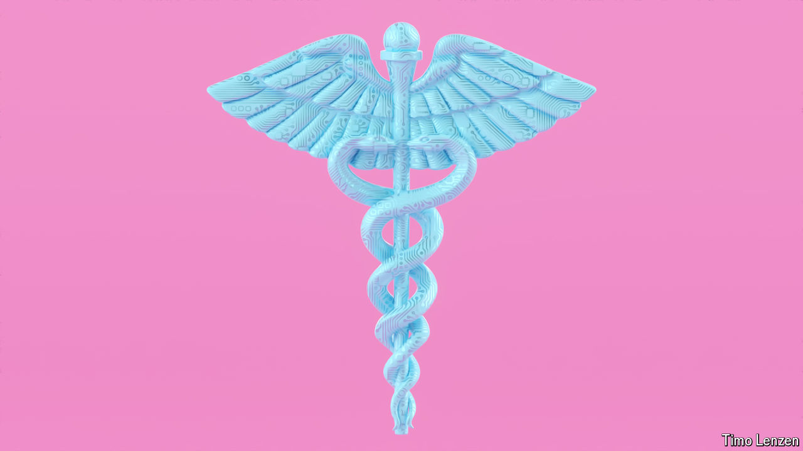
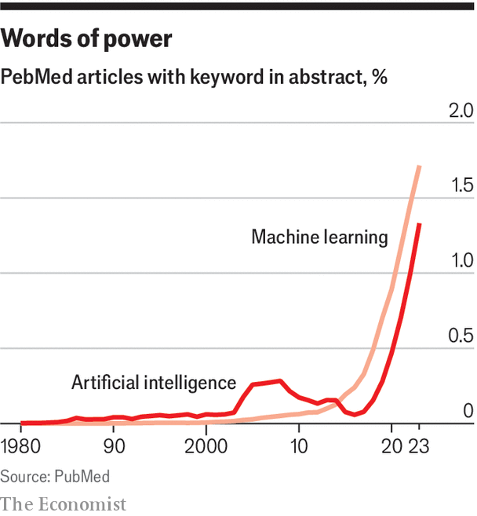

###### Self-programming panaceas

# AIs will make health care safer and better 

##### It may even get cheaper, too, says Natasha Loder 

 

> Mar 27th 2024 

When people set goals which are sky-high to the point of silliness, the sensible scoff. They are normally right to do so. Sometimes, though, it is worth entertaining the possibility that even the most startling aspiration might be achievable.

In 2015 Priscilla Chan, a paediatrician, and her husband Mark Zuckerberg, a founder of Facebook, set up the Chan Zuckerberg Initiative (CZI) with the aim of helping science bring about a world in which all disease could be prevented, cured or managed. Unsurprisingly there was a tech-centric feeling to the undertaking. But it was not until 2020 that the Chan-Zuckerberg’s annual updates started to talk about the potential of artificial intelligence (AI). Four years later it is hard to imagine anyone pursuing their goals not putting it front and centre. 

 


The proportion of biomedical research papers which invoke artificial intelligence was climbing exponentially well before the field started dazzling the world with “foundation models” like OpenAI’s various GPTs (generative pre-trained transformers), Meta’s Llama and Gemini from Google (see chart). Given the vast amounts of data that biomedical research produces, AI’s early application there is hardly a surprise. That past progress and promise, though, is a mere prelude to what is now under way.

Artificial-intelligence systems of similar power to the foundation models and large language models that generate cogent text in all manner of styles, answer complex questions quite convincingly and helpfully, and create images that capture the ideas expressed in verbal prompts are becoming a part of health care. They have applications for almost every part of it. They can improve the choices researchers make about how exactly to edit genes; they are phenomenally good at making sense of big data from disparate sources; they can suggest new targets for drug development and help invent molecules large and small that might work as drugs against them. The CZI itself is now working on building an AI-powered “virtual cell” with which it hopes to revolutionise all manner of biomedical research. 

The effects are not restricted to the lab. Various sorts of diagnosis in which AI is playing a role look ready to be transformed. Robot surgeons are taking on an expanding range of operations. The way that patients access health information and motivate themselves to follow treatment regimes looks ripe for reimagining as chatbots and wearable health monitors learn to work together. The productivity of health-care systems seems likely to be improved significantly. 

Poorer countries may have the most to gain. An earlier generation of AI is already making itself felt in health care there. One advantage is that it can make quite modest equipment much more capable, allowing it to be used more widely and beyond the clinic. Smart stethoscopes can help users pick out salient details, phones can be turned into “tricorders” that measure heart rate, temperature, respiration and blood oxygen saturation all at once. Delivering reliable guidance for health-care workers over the world in their native language offers an advance both straightforward and game changing. 

If such tools can become widespread, and if health-care systems are reshaped to get the most out of them, they should make it possible to deliver much better care. That represents an opportunity to improve the lives of hundreds of millions, even billions. 

Some see not just a humanitarian breakthrough, but an epistemological one: a whole new sort of knowledge. Artificial intelligence can find associations and connections in bodies of disparate data too vast and knotted for humans to unpick without needing pre-existing models of what sorts of cause have what sorts of effect. Demis Hassabis, one of the founders of DeepMind, an AI powerhouse that is now part of Google, thinks that ability will change the way humans understand life itself. 

 

There are caveats. The foundation models that power “generative” applications like ChatGPT have some serious drawbacks. Whether you call it hallucinating, as researchers used to, or confabulating, as they now prefer to, they make stuff up. As with most AI, if you train them on poor or patchy data the results will not be all they should be. If the data are biased, as health data frequently are (good data on minorities, low-income groups and marginalised populations is often harder to come by) the results will not serve the population as a whole as well as they should and may do harm in the underrepresented groups. The models’ “non-deterministic” nature (they will not always respond in the same way to the same stimulus) raises philosophical and practical problems for those who regulate medical devices. Blood-pressure cuffs and thermometers reflect reality more straightforwardly. 

None of this is stopping the market for products and services in health-care AI from growing apace. Big AI companies have been keen on buying health-care specialists; health-care companies are buying AI. Research and Markets, a firm of analysts, estimates that in 2023 the health-care world spent about $13bn on AI-related hardware (such as specialised processing chips and devices that include them) and software providing diagnostics, image analysis, remote monitoring of patients and more. It sees that number reaching $47bn by 2028. Analysts at CB Insights reckon investors transferred a whopping $31.5bn in equity funding into health-care-related AI between 2019 and 2022. Of the 1,500 vendors in health AI over half were founded in the past seven years. 

The digitisation of health care has seen its fair share of expensive disappointments. But there is a real possibility that AI will live up to some of the hope being placed in it. Simpler and more forgiving interfaces should make AI-based systems for handling data and helping with time-management more congenial to doctors, patients and health-care providers than those of yore. And health-care systems sorely need a productivity boost if they are to adapt and improve in a world of high costs and older populations. The shortage of health-care workers is predicted to reach nearly 10m by 2030—about 15% of today’s entire global health workforce. Artificial intelligence will not solve that problem on its own. But it may help. 

This report will look at four of the forms in which this help looks likely to come. There is the help already being provided to doctors making diagnoses—help they sorely need, given that 800,000 Americans are killed or disabled by bad medical decisions every year. There is the help provided to patients who want to understand their symptoms, or need assistance and motivation to stay healthy. There is the help that AI research tools and data wrangling provide to companies trying to develop new treatments more quickly and reliably. And there is the help to the system as a whole. 

Today’s health systems are heavily constrained by the scarcity of workers and knowledge. Artificial intelligence can provide significant support on both fronts; it may be the case that it can offer transformational amounts of it. Would such transformation mean that, by 2100, all diseases will be prevented, cured or managed? Not in itself. But it is making that apparently hubristic goal look more likely. Discussions of the impact of AI are larded with fear and unease, sometimes appropriately. What it offers for health all around the world represents a radical potential for good. ■

