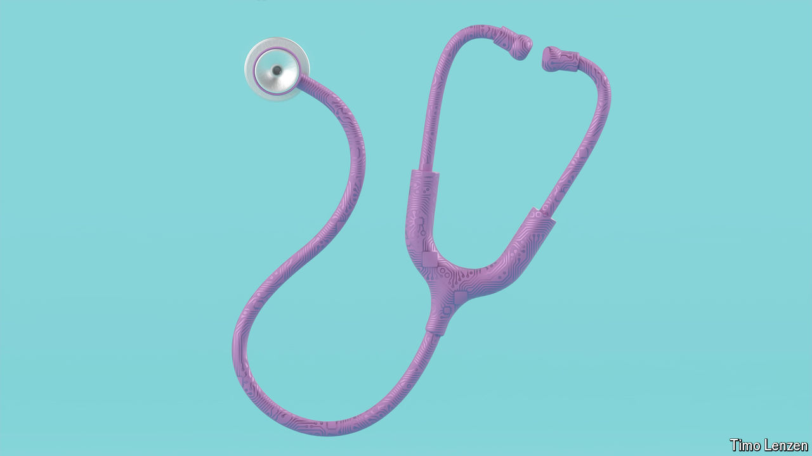
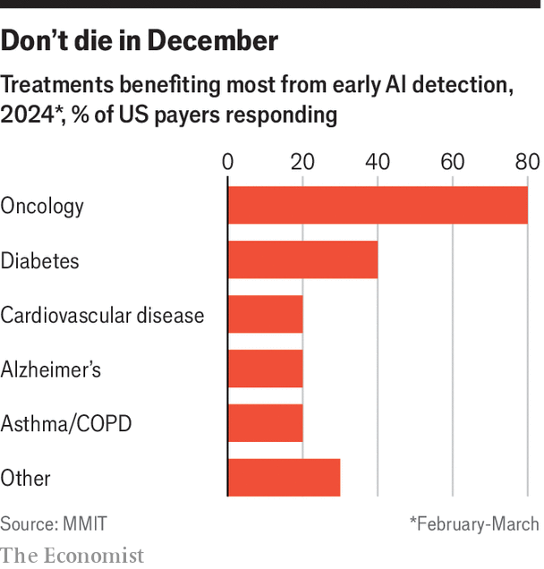

###### Picture this

# Artificial intelligence has long been improving diagnoses 

##### But recently the field has exploded 

 

> Mar 27th 2024 

BARBARA had a routine mammogram in January 2023. A few weeks later she was asked to visit her doctor in the Aberdeen Royal Infirmary, in Scotland. The mammogram had looked fine to two doctors, but an AI system called Mia had seen something amiss: a six-millimetre patch of subtly-off shades of grey. It was stage 2 cancer. Had it not been spotted at that point and removed, it would not have been caught until Barbara came in for her next routine screen—or until it made its presence known in some other way. 

If such tales give a visceral sense of AI’s ability to improve diagnosis, statistics show the scale of the good it could attain. The British government says that analysis of brain scans by e-Stroke, a system developed by Brainomix, a startup spun out of Oxford University, has reduced the time between hospital admission and treatment for stroke patients by more than an hour. It points to as-yet-unpublished data saying that the system’s speed has tripled the number of people achieving functional independence after a stroke from 16% to 48%.

Artificial intelligence has been applied to diagnosis for longer than to any other part of health care, and it shows. But the transformation it offers is far from complete. The AI systems used so far have often been what seem now like quite simple uses of pattern recognition. The foundation models which have so wowed the world since the advent of ChatGPT in 2022 have barely begun to make their mark. 

The revolution began in radiology, the first sort of medical imaging to go fully digital. The transition made storing and sharing images easier; it also produced images which could be read by machines. In 2012, when a neural network called AlexNet beat all comers in the annual “ImageNet challenge”, the machines started to come into their own. 

Neural networks, inspired by the structure of the brain’s visual cortex, are systems in which information flows through layers of “neurons” stacked one on top of the other. In early neural networks all the neurons in one layer were connected to all the neurons in the next. AlexNet was a “convolutional” neural network—one in which the connections were more sparse, something that allows more discriminate forms of analysis. Combining that architecture with new processors of what was then prodigious power allowed AlexNet to revolutionise the science of computer vision, and with it the potential of automated radiology and, later on, of dermatology, ophthalmology and more.

A sight worth seeing

AlexNet’s descendants are increasingly being used to complement, and sometimes replace, human radiologists. Capio Saint Göran Hospital in Stockholm, Sweden, for example, uses an AI system from Lunit, a South Korean company, as the “second pair of eyes” in its radiography department, instead of having mammograms looked at independently by two radiographers. In Denmark Transpara, a product provided by ScreenPoint Medical, a Dutch company, is used as a first reader of mammograms in low-risk cases. 

Being able to do more diagnosis with fewer doctors will be helpful everywhere, but it promises to be a godsend in poor countries. Fujifilm, a Japanese company, has built a 3.5kg, battery-powered x-ray machine which, paired with AI algorithms from Qure.ai, an Indian firm, is being used to screen for tuberculosis in rural Nigeria. It can also assess a host of other diseases including pneumonia, chronic obstructive pulmonary disease (COPD) and heart failure. More ambitiously, Darlington Akogo of MinoHealth Labs in Ghana is building a radiology model trained on images from across Africa. Is it too ambitious to expect a diagnostic tool from this process? “Let’s say we are aiming for the stars,” says Dr Akogo. “Even if we miss it what we end up with is radiology assistance.”

Some AI systems can interpret images made with less radiation than normal, thus reducing not just the number of doctors needed to interpret an X-ray but also the dose needed to make it, which is good for patients. They can also look for things doctors would not check for. In “opportunistic screening” an X-ray taken to look for a specific problem is scanned for signs of other trouble as well. Most of the 80m CT scans done in America each year are undertaken to look for a problem in some specific part of the body, but they almost always contain information about other parts, too. Doctors have no interest in passing images taken to look for one thing around their colleagues on the off chance it reveals something else. Machines have no problem multitasking, and can become experts in identifying many different types of disease. 

Ultrasound systems provide another opportunity for AI. Butterfly, an American company, produces a hand-held ultrasound system which, thanks to built-in AI, can be used to assess high-risk pregnancies and to estimate due dates, fetal weights and the amount of amniotic fluid. Such measurements are not otherwise possible outside a clinic, and they normally require a range of instruments. The Bill &amp; Melinda Gates Foundation sees Butterfly’s scanners as a way of bringing down stubbornly high maternal mortality in sub-Saharan Africa. Such AI-enhanced systems—Philips and GE Healthcare are also in the market—have contributions to make beyond maternal care, for example in cardiology, emergency medicine and orthopaedics. Hundreds of Butterfly’s systems are being used in Ukraine to help first responders assess the wounds of war. 

Other instruments are also getting an AI make-over. Doctors in primary care in London are evaluating an AI-enabled stethoscope to see if it can improve the diagnosis of some sorts of heart disease. Trials in Oxford are comparing measurements of lung function made using an AI-driven spirometer with previous techniques for picking up COPD.

Jonathan Rothberg, the scientist, engineer and entrepreneur who founded Butterfly, is also one of the founders of Hyperfine, the maker of an innovative portable magnetic-resonance-imaging (MRI) machine called Swoop. Its AI capabilities allow it to assess what is going on using data gathered with the use of comparatively weak magnetic fields. Because low fields are easier to generate, Swoop can be taken to the patient’s bedside, rather than having to sit in a room of its own like high-field MRI machines. 

At the other end of the scale EZRA, a firm based in New York, is using AI to drive down the cost of full-body MRI as a cancer-screening tool. Using high-field magnets and proprietary AI it has made scans quicker and thus cheaper; it offers a 30-minute scan for $1,350 and is aiming to bring the cost down to $500. A plain language AI-produced account of what has been found is part of the service. 

One of the advantages of AI systems is that they can be trained on far more data than a medical student can. Microsoft is collaborating with Paige, a firm that develops AI for pathologists, to build an image-based AI tool for diagnosing cancer that will be fed billions of images; a pathologist looking at one slide a second for a hundred lifetimes would not amass the same amount of experience. 

As a paediatric neurologist, Sharief Taraman says he can expect to see thousands of children; but the AI which his Silicon Valley based company, Cognoa, has built to assess children for autism has been trained on footage of hundreds of thousands. As a result it can use video uploaded by parents, along with a questionnaire, to reach an assessment of their condition. 

It is not important simply to be able to reach an assessment; getting the assessment right matters too. With AI there is the opportunity to match or exceed human performance. For example, AIs seem likely to be able to exceed the ability of human pathologists to “grade” prostate cancers as to whether they are benign or malignant. But showing that a system is good enough takes time, and at the moment algorithms are being generated faster than it is possible to test and regulate them. Hugh Harvey, the boss of Hardian Health, a British firm that assesses medical devices, says that it currently takes at least two years for a medical device to get regulatory approval from scratch. 

A sight worth seeing, a vision of you

Looking at the British government’s plans to speed up the use of AIs in the diagnosis of lung cancer, David Baldwin, an honorary professor of medicine at Nottingham University, points out that two recent assessments could not confirm the accuracy and clinical impact of the tools being touted. “This is an example of the pace of development being faster than that of evaluation, and there is much work needed to ensure safe deployment,” he says. 

In 2019 a systematic review of the diagnostic accuracy of 82 algorithms in medical imaging found that the ways in which they had been assessed were often sub par. A particular worry was a lack of “prospective” trials which look at outcomes after an intervention, as opposed to retrospective trials which begin with outcomes and go back to look at what went before. 

One of the reasons this matters is that prospective trials are better at picking up on “false positives”—cases where a system said something was wrong but it wasn’t. Gerald Lip, a consultant radiologist at NHS Grampian in Scotland, has found that some algorithms, like Mia, which are as good or better than humans at finding breast cancers still do this at the expense of more false positives, in part because they work off images alone whereas doctors have other sources of information. False positives are a problem for patients because they lead to worry and potentially painful, even dangerous, follow ups. They are a problem for health systems because they drive up costs. 


If AI is to lead to an increase in “opportunistic screening” for other things when an image is made for a specific purpose then false positives will need to be particularly low. Indeed the same is true for all approaches which screen those who are symptom free. When Eric Topol, director of the Scripps Research Translational Institute, in San Diego looks at systems like EZRA, which does full-body scans on people who are normally healthy, he worries about the potential for incidental findings and “rabbit-hole extensive workups with risk and cost” only to discover that there is no cancer. Daniel Sodickson, EZRA’s chief scientific adviser, says the proper response to incidental findings is follow-up imaging to see if anything is changing. There will have to be a lot of good evidence for that doubling-down approach if sceptics like Dr Topol are to be convinced. 

The situation seems to be improving. As AI gets more mainstream those paying for its use are seeking reliable data to decide what is worth their while. Good prospective studies take time, so it is unsurprising that there are not so many of them early on. Other problems seen in the 2019 study—there were some tests which used the data the system was trained on, rather than data it had not seen before—should become less common as the field matures. Unsurprisingly there are entrepreneurs chafing at assessment processes that cost them and their patients time. Dr Taraman worries that hesitancy about the wider use of tests that offer early diagnosis of autism has clear costs: kids are “missing a window of opportunity and are going to have lifelong consequences.” 

A total portrait, with no omissions

A new generation of foundation models that are trained on an assortment of data sources, not just images and vast bodies of text, looks likely to expand the toolbox further. These models do not require the huge quantities of data on which they are trained to be labelled. They have a capacity for “self-supervised” learning, and this can be applied to images, genomic data, gene-expression data, metabolic data, electronic health records, blood tests, and questionnaires on lifestyle and family history. 

 


Foundation models should not just provide the wherewithal for better diagnoses of conditions already present. They could also provide better early warning of conditions yet to come, such as cancer, heart disease or diabetes (see chart). In 2022 Chinese researchers showed that this sort of model could predict the risk of severe disease in covid patients. That said, this sort of application of AI needs particular care and attention to make sure the models do not introduce or amplify bias. 

This new technology has barely begun to permeate medicine. In 2023 a paper in  put that down to the recency of this development and the fact that, while copious text and video are available on the internet (especially if you are not too fussy about copyright) accessing large, diverse sets of medical data is hard. This offers an advantage to companies with big resources; hence the excitement about Microsoft’s collaboration with Paige on a cancer-diagnosis model. 

Researchers at Moorfields Eye Hospital in London have been applying AI to ophthalmology since 2016. In September last year Pearse Keane and colleagues at Moorfields and University College London published a foundation model for retinal images produced with Google DeepMind. RETFound, which was pre-trained on over a million images before being shown labelled images of conditions such as diabetic retinopathy and glaucoma, can match the performance of experts when making decisions to refer patients for a number of eye diseases. By picking up tiny changes in the eye’s blood vessels it also appears to predict health conditions such as Parkinson’s disease and stroke. Dr Keane says the technology should be widely available on an open-source basis within two or three years. ■

