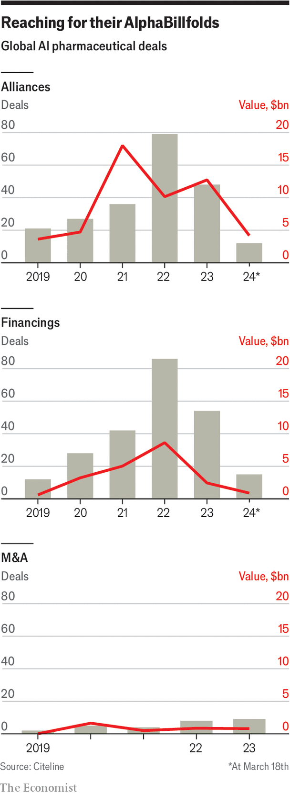

###### Intelligent design

# Artificial intelligence is taking over drug development 

##### Regulators need to up their game to keep up 

 

> Mar 27th 2024 

The most striking evidence that artificial intelligence can provide profound scientific breakthroughs came with the unveiling of a program called AlphaFold by Google DeepMind. In 2016 researchers at the company had scored a big success with AlphaGo, an AI system which, having essentially taught itself the rules of Go, went on to beat the most highly rated human players of the game, sometimes by using tactics no one had ever foreseen. This emboldened the company to build a system that would work out a far more complex set of rules: those through which the sequence of amino acids which defines a particular protein leads to the shape that sequence folds into when that protein is actually made. AlphaFold found those rules and applied them with astonishing success. 

The achievement was both remarkable and useful. Remarkable because a lot of clever humans had been trying hard to create computer models of the processes which fold chains of amino acids into proteins for decades. AlphaFold bested their best efforts almost as thoroughly as the system that inspired it trounces human Go players. Useful because the shape of a protein is of immense practical importance: it determines what the protein does and what other molecules can do to it. All the basic processes of life depend on what specific proteins do. Finding molecules that do desirable things to proteins (sometimes blocking their action, sometimes encouraging it) is the aim of the vast majority of the world’s drug development programmes. 

Because of the importance of proteins’ three-dimensional structure there is an entire sub-discipline largely devoted to it: structural biology. It makes use of all sorts of technology to look at proteins through nuclear-magnetic-resonance techniques or by getting them to crystallise (which can be very hard) and blasting them with x-rays. Before AlphaFold over half a century of structural biology had produced a couple of hundred thousand reliable protein structures through these means. AlphaFold and its rivals (most notably a program made by Meta) have now provided detailed predictions of the shapes of more than 600m. 

As a way of leaving scientists gobsmacked it is a hard act to follow. But if AlphaFold’s products have wowed the world, the basics of how it made them are fairly typical of the sort of things deep learning and generative AI can offer biology. Trained on two different types of data (amino-acid sequences and three-dimensional descriptions of the shapes they fold into) AlphaFold found patterns that allowed it to use the first sort of data to predict the second. The predictions are not all perfect. Chris Gibson, the boss of Recursion Pharmaceuticals, an AI-intensive drug-discovery startup based in Utah, says that his company treats AlphaFold’s outputs as hypotheses to be tested and validated experimentally. Not all of them pan out. But Dr Gibson also says the model is quickly getting better. 

Crystal dreams

This is what a whole range of AIs are now doing in the world of biomedicine and, specifically, drug research: making suggestions about the way the world is that scientists could or would not come up with on their own. Trained to find patterns that extend across large bodies of disparate data, AI systems can discover relationships within those data that have implications for human biology and disease. Presented with new data they can use those patterns of implication to produce new hypotheses which can then be tested. 

The ability of AI to generate new ideas provides users with insights that can help to identify drug targets and to predict the behaviour of novel compounds, sometimes never previously imagined, that might act as drugs. It is also being used to find new applications for old drugs, to predict the side effects of new drugs, and to find ways of telling those patients whom a drug might help from those it might harm. 

Such computational ambitions are not new. Large-scale computing, machine learning and drug design were already coming together in the 2000s, says Vijay Pande, who was a researcher at Stanford University at the time. This was in part a response to biology’s fire hose of new findings: there are now more than a million biomedical research papers published every year. 

One of the early ways in which AI was seen to help with this was through “knowledge graphs”, which allowed all that information to be read by machines and mined for insights about, say, which proteins in the blood might be used as biomarkers revealing the presence or severity of a disease. In 2020 BenevolentAI, based in London, used this method to see the potential which baricitinib, sold by Eli Lilly as a treatment for rheumatoid arthritis, had for treating covid-19. 

This January, research published in described how AI algorithms of a different sort had accelerated efforts to find biomarkers of long covid in the blood. Statistical approaches to the discovery of such biomarkers can be challenging given the complexity of the data. AIs offer a way of cutting through this noise and advancing the discovery process in diseases both new, like long covid, and hard to diagnose, like the early stages of Alzheimer’s. 

The time is right

But despite this past progress, Dr Pande, now at Andreessen Horowitz, a venture-capital firm that is big on AI, thinks that more recent advances mark a step change. Biomedical research, particularly in biotech and pharma, was steadily increasing its reliance on automation and engineering before the new foundation models came into their own; now that has happened, the two seem to reinforce each other. The new foundation models do not just provide a way to cope with big bodies of data; they demand them. The scads of reliable data highly automated labs can produce in abundance are just the sort of thing for training foundation models. And biomedical researchers need all the help they can get to understand the torrents of data they are now capable of generating. 


By finding patterns humans had not thought to look for, or had no hope of finding unaided, AI offers researchers new ways to explore and understand the mysteries of life. Some talk of AIs mastering the “language of biology”, learning to make sense of what evolution has wrought directly from the data in the same way that, trained on lots of real language, they can fluently generate meaningful sentences never uttered before. 

Demis Hassabis, the boss of DeepMind, points out that biology itself can be thought of as “an information processing system, albeit an extraordinarily complex and dynamic one”. In a post on Medium, Serafim Batzoglou, the chief data officer at Seer Bio, a Silicon Valley company that specialises in looking at how proteins behave, predicts the emergence of open foundation models that will integrate data spanning from genome sequences to medical histories. These, he argues, will vastly accelerate innovation and advance precision medicine. 

Like many of the enthusiasts piling into AI Dr Pande talks of an “industrial revolution…changing everything”. But his understanding of the time taken so far leads him to caution that achievements that justify that long-term enthusiasm change will not come overnight: “We are in a transitory period where people can see the difference but there is still work to do.” 

All the data from everywhere all at once

A lot of pharma firms have made significant investments in the development of foundation models in recent years. Alongside this has been a rise in AI-centred startups such as Recursion, Genesis Therapeutics, based in Silicon Valley, Insilico, based in Hong Kong and New York and Relay Therapeutics, in Cambridge, Massachusetts. Daphne Koller, the boss of Insitro, an AI-heavy biotech in South San Francisco, says one sign of the times is that she no longer needs to explain large language models and self-supervised learning. And Nvidia—which makes the graphics-processing units that are essential for powering foundation models—has shown a keen interest. In the past year, it has invested or made partnership deals with at least six different AI-focused biotech firms including Schrodinger, another New York based firm, Genesis, Recursion and Genentech, an independent subsidiary of Roche, a big Swiss pharmaceutical company. 

The drug-discovery models many of the companies are working with can learn from a wide variety of biological data including gene sequences, pictures of cells and tissues, the structures of relevant proteins, biomarkers in the blood, the proteins being made in specific cells and clinical data on the course of disease and effect of treatments in patients. Once trained, the AIs can be fine tuned with labelled data to enhance their capabilities.

The use of patient data is particularly interesting. For fairly obvious reasons it is often not possible to discover the exact workings of a disease in humans through experiment. So drug development typically relies a lot on animal models, even though they can be misleading. AIs that are trained on, and better attuned to, human biology may help avoid some of the blind alleys that stymie drug development. 

Insitro, for example, trains its models on pathology slides, gene sequences, MRI data and blood proteins. One of its models is able to connect changes in what cells look like under the microscope with underlying mutations in the genome and with clinical outcomes across various different diseases. The company hopes to use these and similar techniques to find ways to identify sub-groups of cancer patients that will do particularly well on specific courses of treatment. 


Sometimes finding out what aspect of the data an AI is responding to is useful in and of itself. In 2019 Owkin, a Paris based “AI biotech”, published details of a deep neural network trained to predict survival in patients with malignant mesothelioma, a cancer of the tissue surrounding the lung, on the basis of tissue samples mounted on slides. It found that the cells most germane to the AI’s predictions were not the cancer cells themselves but non-cancerous cells nearby. The Owkin team brought extra cellular and molecular data into the picture and discovered a new drug target. In August last year a team of scientists from Indiana University Bloomington trained a model on data about how cancer cells respond to drugs (including genetic information) and the chemical structures of drugs, allowing it to predict how effective a drug would be in treating a specific cancer. 

Many of the companies using AI need such great volumes of high quality data they are generating it themselves as part of their drug development programmes rather than waiting for it to be published elsewhere. One variation on this theme comes from a new computational sciences unit at Genentech which uses a “lab in the loop” approach to train their AI. The system’s predictions are tested at a large scale by means of experiments run with automated lab systems. The results of those experiments are then used to retrain the AI and enhance its accuracy. Recursion, which is using a similar strategy, says it can use automated laboratory robotics to conduct 2.2m experiments each week. 

The point is to change it

As pharma firms become increasingly hungry for data, concerns about the privacy of patient data are becoming more prominent. One way of dealing with the problem, used by Owkin among others, is “federated learning”, in which the training data it needs to build an atlas of cancer cell types never leaves the hospital where the tissue samples required are stored: what the data can offer in terms of training is taken away. The data themselves remain. 

 


The implications of AI go beyond understanding disease and on into figuring out how to intervene. Generative AI models, such as ProteinSGM from the University of Toronto, are now powerful tools in protein design because they are not merely able to picture existing proteins but also to design new ones—with desired characteristics—that do not currently exist in nature but which are possible ways of embodying a desired function. Other systems allow chemists to design small molecules that might be useful as drugs as they interact with a target in a desired way. 

At every stage the AI hypotheses need to be checked against reality. Even so, such an approach seems to speed up discovery. A recent analysis of drugs from “AI-intensive” firms carried out by BCG, a consulting group, found that of eight drugs for which information was available, five had reached clinical trials in less than the typical time for doing so. Other work suggests AI could yield time and cost savings of 25% to 50% in the preclinical stage of drug development, which can take four to seven years. Given the cost in time and money of the whole process, which can be several billions of dollars for a single drug, improvements could transform the industry’s productivity. But it will take time to know for sure. Drug pipelines are still slow; none of these promised new drugs has yet got to market.

Insilico Medicine is one of the companies hoping for that to change. It uses a range of models in its drug development process. One identifies the proteins that might be targeted to influence a disease. Another can design potential new drug compounds. Using this approach it identified a drug candidate which might be useful against pulmonary fibrosis in less than 18 months and at a cost of $3m—a fraction of the normal cost. The drug recently started Phase 2 trials. 

A lot of pharma firms in China are doing deals with AI-driven companies like Insilico in the hope of seeing more of the same. Some hope that such deals might be able to boost China’s relatively slow-growing drug-development businesses. China’s contract research organisations are already feeling the benefits of AI fuelled interest in new molecules from around the world. Investment in AI-assisted drug discovery in China was more than $1.26bn in 2021. 

The world has seen a number of ground breaking new drugs and treatments in the past decade: the drugs targeting GLP-1 that are transforming the treatment of diabetes and obesity; the CAR-T therapies enlisting the immune system against cancer; the first clinical applications of genome editing. But the long haul of drug development, from discerning the biological processes that matter to identifying druggable targets to developing candidate molecules to putting them through preclinical tests and then clinical trials, remains generally slow and frustrating work. Approximately 86% of all drug candidates developed between 2000 and 2015 failed to meet their primary endpoints in clinical trials. Some argue that drug development has picked off most of biology’s low-hanging fruit, leaving diseases which are intractable and drug targets that are “undruggable”. 

The next few years will demonstrate conclusively if AI is able to materially shift that picture. If it offers merely incremental improvements that could still be a real boon. If it allows biology to be deciphered in a whole new way, as the most boosterish suggest, it could make the whole process far more successful and efficient—and drug the undruggable very rapidly indeed. The analysts at BCG see signs of a fast-approaching AI-enabled wave of new drugs. Dr Pande warns that drug regulators will need to up their game to meet the challenge. It would be a good problem for the world to have. ■

