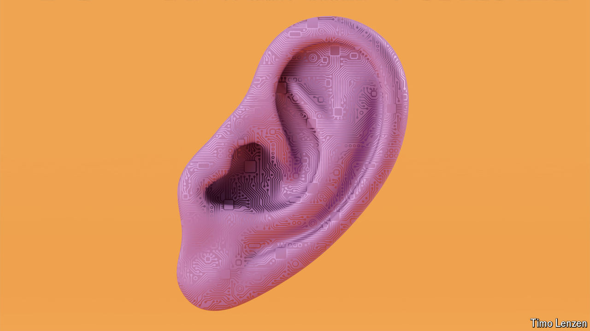

###### Talking things through

# Medical AIs with human faces are their way 

##### The bot will see you now 

 

> Mar 27th 2024 

ASKED ABOUT the future of artificially intelligent avatars in medicine, Nova is optimistic, as well she might be. As a “brand ambassador” for Soul Machines, based in Auckland, the hub of New Zealand’s visual-effects industry, it is her job to play up the “personalised and interactive” experiences such avatars will provide as they help with virtual consultations and assist with post-operative rehabilitation. As she explains this to your correspondent online she looks me in the eye and responds to what I say with approving nods and smiles. Told I have been off colour since my last meal, she says “Oh no!” with a concerned frown before suggesting ginger tea or some over-the-counter medication. The wide blue ribbon she wears over her right shoulder, she tells me, is a “symbol of my existence as a digital person and my connection to Soul Machines, the company that created me”. 

Greg Cross, Nova’s boss at Soul Machines, says Nova’s ability to respond appropriately comes from ten years of research into cognitive modelling that seeks to capture functions such as learning and emotional response. Her face conveys those responses by means of software descended from that used for computer-generated characters in movies. What she says comes in part from a version of OpenAI’s ChatGPT, a system powered by a large language model, or LLM. Mr Cross thinks such avatars are going to be an increasingly important way for companies to communicate with people—and that they are going to prove irresistibly useful for health systems, where the need for something like the human touch increasingly outstrips the number of trained humans available to do the professionally appropriate touching. 

Tell it where it hurts

People have long been keen to ask questions about their health on the internet. Google’s search engine handles about a billion of them a day. Medical charities, patient groups, drugmakers and health-care providers put up scads of information for it to serve up, but this is hardly a guarantee that those who consult “Dr Google” will come away well informed. 

An interest in trustworthy evidence has led to the development of bespoke chatbots designed to teach patients about public health issues and help them work out what their symptoms might mean. Florence was created by the World Health Organisation (WHO), Google and Amazon Web Services during the covid-19 pandemic to combat mis- and disinformation. Since then her knowledge base has expanded to include smoking, mental health and eating sensibly. But she is no one’s idea of good company. 

Ada Health, a German firm, offers a text-based symptom-checking chatbot that navigates a carefully structured database containing thousands of pieces of medical data carefully curated by doctors. It uses the patient’s responses to generate and work through a sequence of questions, and then provides a list of possible diagnoses with the likelihood of each. Launched in 2016 it has 13m users, about one-third of them in India, Asia and Africa. 

Ada’s central “probabilistic reasoning engine” is nothing like as complex as the LLMs recently unleashed on the world. Using it is a bit plodding. But it is also reliable—no hallucinations—and, crucially, “explainable”: when Ada assigns probabilities to diagnoses it is possible to work out exactly how it has calculated them. This reliability and explainability has allowed it to gain regulatory approval as a medical device in Germany and many other countries. Anyone trying to get a ChatGPT-like system based on an LLM approved in the same way would face daunting hurdles based on its source data, its reliability, the reproducibility of its answers and the explainability of its process. As Hugh Harvey of Hardian Health asks, “If the inputs are essentially infinite and the outputs are essentially infinite, how do you prove is safe?”

That does not mean that LLMs have nothing to say about health. Quite the contrary. The internet is awash with claims about ChatGPT’s ability to diagnose perplexing medical dilemmas, analyse blood tests or figure out what a specialist doctor is testing for. Because the huge bodies of information on which they are trained include medical texts, LLMs can respond to quite recondite medical queries convincingly even though not deliberately trained with that in mind. In 2023 researchers rated Chat GPT’s performance in the United States Medical Licensing exam as equivalent to that of a third-year medical student. For a piece of software to do that well would have been more or less unthinkable five years ago. In a recent study a version of ChatGPT based on the GPT4, OpenAI’s biggest publicly accessible model, outperformed the responses human candidates give in a neurology board exam. Even when the model answered incorrectly it did so with a great deal of confidence, which is bad for a medical device but not unheard of among consultants.

Given such facility there is no doubt that the medical advice people get from LLMs can be accurate and appropriate. But that does not mean it will always be so; some is likely to be wrong and potentially dangerous. The regulatory challenges implicit in the opaque way LLMs work have led many to conclude that they are currently unregulatable in areas where mistakes can be lethal, such as diagnostics. 

Some in the industry are looking for middle ways in which at least some of their attributes can be safely put to other sorts of work. Claire Novorol, the founder of Ada Health, says that the strength of LLMs is their ability to take everyday speech as an input; it allows them to get more information out of patients than a questionnaire can. This is one of the reasons she and her colleagues are trying to augment Ada’s probabilistic approach with an LLM. When applied in the right context, she says, its abilities enable better, broader and more granular assessments of symptoms and health needs. One technique which they and others are trying out is “retrieval-augmented generation”, which allows LLMs to extract answers from a verified source of external data. 

Another approach is to use LLMs drawing from verified medical sources as advisers to health-care professionals, rather than to the public at large. Google has developed an LLM that has been fine-tuned on medical data to provide diagnostic support for clinicians in difficult cases. Hippocratic AI, a Silicon Valley startup, is devoted to building new LLMs specific to health care. It says they outperform GPT4 on all sorts of medical exams and certification tests, and it recently raised $50m in new money—despite prominently displaying on its website its unvarnished belief that “LLMs today are not safe enough for clinical diagnosis”. Investors seem to see its plans to support trained staff and provide advice to patients either as promising enough on their own or as a path to something better. 

It’s a little embarrassing 

There is also some optimism about the relationship-like connections people form with LLMs. They might prove useful in the management of long-lasting ailments or in providing psychological support for some mental-health conditions. In Nigeria the health-care firm mDoc has created a ChatGPT-powered service for mobile phones to offer health coaching for people living with chronic conditions such as diabetes or high blood pressure. 


No such systems offer the real empathy of a human interlocutor. But at least one study has found that ChatGPT’s responses to real-world health questions were preferred over those of licensed professionals both for their quality and empathy. Accounts of the relationships some people form with AI services like Replika, a chatbot made by Luka, of San Francisco, make it possible to imagine a future in which friendbots and healthbots converge. Chatbots originally built to provide relationships that have subsequently been given an added ability to provide health advice might compete with chatbots built for medicine whose designers are improving their social skills. 

There are also some human qualities that AI systems may be well rid of. One is moral judgment. When it comes to sexual health people often fail to seek help because they do not want the conversation that would enable it. Caroline Govathson, a researcher at Wits University in South Africa, is running trials of a chatbot to improve the accuracy of HIV risk assessments. She found that people seem to find it easier to disclose their sexual history to a chatbot than to a nurse. Alain Labrique, the director of digital health and innovation at the WHO, sees in follow-ons to Florence “the opportunity to create a realistic interface where you could further reduce the barrier to people seeking information, whether adolescents looking for guidance on safer sex or family planning, or folks looking for information about respiratory illnesses”. 

That said, Dr Labrique and others worry about the technology’s abuse; the thought of what sophisticated AI could do to spread public-health disinformation, he says, keeps him “up at night”. As well as worries about the quality of information going out, there are also worries about what might happen to information going in, both in terms of having training data suitably anonymised and ensuring that chats with chatbots stay confidential. ■

