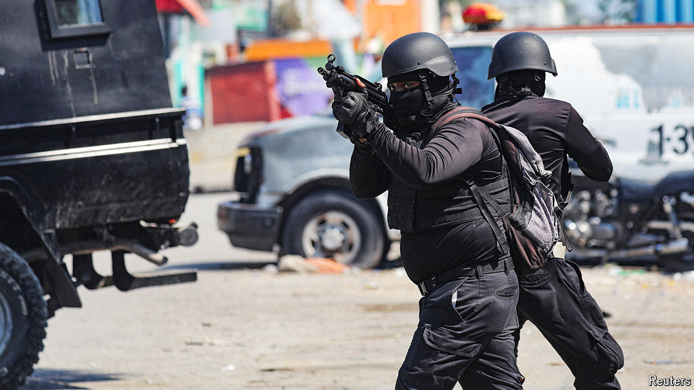

###### Hanging by a thread

# Can Haiti’s police hold on? 

##### Help is taking time to arrive, as politics delays an international security mission 

 

> Mar 27th 2024 

Haiti is waiting. Gangs control large parts of the capital, Port-au-Prince. The government of Kenya, which has proposed leading a UN-approved mission to secure Haiti, has said it will not send any forces until a transitional government is in place to take over from Ariel Henry, the exiled prime minister. More than two weeks after Mr Henry said he would step down, a newly formed transitional council has not been able to agree on who would lead it in order to form that government. Two of its members have already dropped out. 

Although an outside force could be decisive in the struggle against the gangs, the politics of its arrangement are made fraught by Haiti’s unhappy history of external intervention. In the meantime it is left to Haiti’s ragtag police force to prevent gangs taking complete control of the country. That is not going well. The main port is all but closed, as is the capital’s airport. Aid agencies say that no food has arrived for two weeks. Fuel is running low. 

Gangs have spread into the wealthy suburb of Pétion-Ville, perched in the hills overlooking the capital. Its residents now wake up to the sound of gunfire and find dead bodies lying in the streets. One of the country’s most prominent journalists, Lucien Jura, a former presidential spokesman, was kidnapped on March 18th by armed men who broke into his house (he has since been released). 

Residents in many parts of the country have taken matters into their own hands, barricading streets and setting up patrols. In a number of cases they have lynched suspected gang members. “The situation is evolving in the wrong direction,” says Arnaud Royer, who runs the UN’s human-rights office in Haiti. “It’s nearly over for the police. They are on the edge.”

Most of the international efforts to date have focused on the evacuation of foreign citizens and non-essential diplomatic personnel. But many Haitians are calling on the United States to do more. “Instead of addressing the situation, we are seeing embassies evacuate people,” says Reginald Delva, a Haitian security consultant and former interior minister.

“There are things that could be done tomorrow to strengthen the police,” says Jake Johnston of the Centre for Economic and Policy Research, a think-tank based in Washington. “But instead we’re talking about this Kenya-led multi-national security mission.” 

All is not lost. The US State Department says it has provided support, equipment, ammunition and training to the Haitian National Police’s SWAT units, in which it has embedded a number of advisers. “The specialised units are very effective,” says an official. “They’re well trained, they have better esprit de corps and they are able to take on the gangs.” 

Those specialised police units have killed at least five gang members in gun battles over the past week, including Ernst Julme, a prominent gang leader known as “Ti Greg”, an associate of the warlord Jimmy “Barbeque” Cherizier.

Even with these pockets of training and resources, Haiti’s police remain woefully outmatched by the gangs overall. The UN estimates that only 600-700 officers are working in Port-au-Prince. Nationwide police numbers have dwindled to around 9,000, which amounts to one officer for every 1,250 inhabitants. That is about a third the level recommended by the UN.

It does not help that the Haitian police are widely distrusted, thanks to their corruption and the fact that gang members sometimes wear their uniforms. They communicate little with the public. After the house of the police chief, Frantz Elbé, was attacked and burned on March 14th, he issued a brief statement, claiming several successful operations against the gangs and declaring the police “the last rampart against anarchy”.

Mr Elbé’s statement is true. But his personal circumstances demonstrate what a weak rampart Haiti’s police make. “Clearly if the house of a police chief can’t be protected, there is nobody who can be protected any more,” says Mr Royer. “There is nobody who is safe now in this city.” ■


