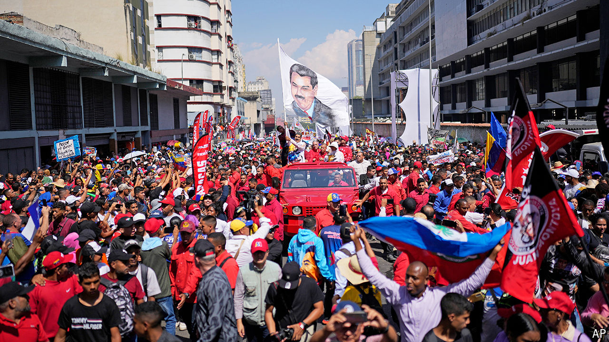

###### Not another one

# Nicolás Maduro’s sham election: the sequel 

##### Venezuela’s unpopular president is reusing a familiar script 

 

> Mar 27th 2024 

For those few who did not know, it was a convincing show. On March 25th President Nicolás Maduro appeared jubilant at the headquarters of the national electoral council in Caracas to present himself as a candidate for Venezuela’s presidential elections, which are scheduled for July 28th. 

Outside, a large, purportedly spontaneous crowd of supporters gathered—the convoy of buses that brought them into the city was hidden from the state-run television broadcast. Inside, , in a white tracksuit top bearing the colours of the Venezuelan flag, greeted beaming election officials before delivering a fiery speech, portraying his opposition as a group of nepotistic oligarchs. His wife and son, both influential politicians, sat in the front row. “The people have the power!” declared the president.

They do not. If they did Mr Maduro would be out of office. The unpopular autocrat has overseen a disastrous recession that has led to the emigration of around a quarter of the population over the past decade. His rule continues only because he has trampled over Venezuela’s democracy. His previous re-election, in 2018, was a sham, central to which was barring many opposition leaders from running. This year’s contest will be a repeat.

In a fair fight, the president would be facing María Corina Machado. A conservative and a long-standing critic of the government, she won an overwhelming 93% of the votes in opposition primaries in October. One poll last year showed 70% support for her, to Mr Maduro’s 8.3%. But Ms Machado has been banned from political office for 15 years by the Supreme Court, which is controlled by the regime. To overcome that obstacle, on March 22nd the former congresswoman and the coalition of parties backing her put forward an alternative candidate to stand in her place. 

Their nominee was Corina Yoris, 80, a distinguished professor of philosophy. A grandmother of seven, with three emigrant children, her story could resonate with almost everyone in the country. And there was another reason why she seemed an inspired choice: surely even the Maduro regime, with its reputation for cruelty, would hesitate to jail an affable grandmother?

Instead, it blocked Mrs Yoris by preventing the political parties that backed her from registering her candidacy on the electoral council’s computer before midnight on March 25th—the same day that Mr Maduro celebrated his effortless inscription. The following day the electoral authority confirmed the registration of 12 other candidates. Most can be categorised either as loyal to the regime or entirely non-threatening faux opposition. 

The only person with the faintest chance of mounting a challenge and who—perhaps suspiciously—did manage to register minutes before the deadline expired, is the governor of the state of Zulia, Manuel Rosales. He had previously stood for the presidency in 2006 and lost to the late Hugo Chávez. This time he did not even take part in the opposition primaries. His party describes him as a “man of dialogue”. Plenty in the opposition fear he might be a stooge, sneaked in to lend a veneer of legitimacy to a rigged election which Mr Maduro will clearly win. “He dropped his trousers ages ago,” says one Zulia resident. Mrs Yoris calls him a “Judas”. Ms Machado is declining to back him. “The regime has chosen its candidates,” was her response.

The real opposition does seem to have managed to register one candidate, despite Mrs Yoris being blocked. Edmundo González, a former ambassador, is reportedly a placeholder candidate, who can be substituted for someone else up until April 20th. 

Amid this chaos, some weary Venezuelans are resorting to sardonic humour. After the initial list of candidates, all male, was released, an image appeared on social media in which they all sported identical, Maduro-like moustaches. But for those in the vanguard of the resistance against a regime that is in the process of consolidating its dictatorial power, the events of recent months are no joke. 

On March 20th the attorney-general issued arrest warrants for Ms Machado’s campaign manager and eight other members of her team. One, a political adviser named Dignora Hernández, was filmed screaming “Help! Please, no!” as she was forced into the back of a car by state-security police in Caracas. She has not been heard from since. Many staffers who have not yet been arrested are understood to be seeking refuge in the Argentine embassy. On March 26th the regime cut power to the ambassador’s residence, prompting Argentina to lodge an official complaint. 

Mr Maduro’s pretended belief in democracy is becoming more preposterous by the day. He hailed the election victory of Vladimir Putin, Russia’s president, as “a flawless electoral process” that “demonstrated democracy in an exemplary manner”. Mr Maduro’s authoritarianism has even drawn rebukes from the usually sympathetic left-wing governments of Brazil and Colombia. On March 26th Colombia’s foreign ministry expressed concern about “difficulties faced by majority opposition sectors” when registering candidates. Brazil said it was following the electoral process with concern. The regime swiftly accused both governments of “gross interference” in Venezuelan affairs.

The enduring problem is that, for Mr Maduro, the price of losing power is too high for him to risk an even remotely fair election. One of his key preoccupations is the International Criminal Court, which is looking into human-rights abuses in Venezuela. But abandoning democracy is not without its costs either. 

Last October Mr Maduro’s representatives and the main opposition alliance signed an agreement designed to pave the way for competitive elections this year. The deal covered issues such as media access and guaranteeing that any prospective presidential candidates can stand for office if legally entitled to do so. The day after that deal was agreed, and alongside the release of some prisoners held in Venezuela, the United States government agreed to a temporary lifting of its sanctions on much of the Venezuelan oil, mining and financial sectors for six months. The date for renewal of the lift, or reimposition of the sanctions, is April 18th.

Without sanctions, Venezuela’s oil profits surged: on course for $20bn this year, up from $12bn in 2023, according to Ecoanalítica, a Caracas-based consultancy. All that is now at risk. On March 22nd the White House’s national-security communications adviser, John Kirby, said the arrests of those on Ms Machado’s campaign team “give us pause to think about how serious” the regime is about its commitments. Mr Kirby added that his government was “still willing to consider sanctions relief” if the regime changes its tune. After the past week, that seems less likely than ever. Mr Maduro appears ready to be president until 2031, at least. ■


