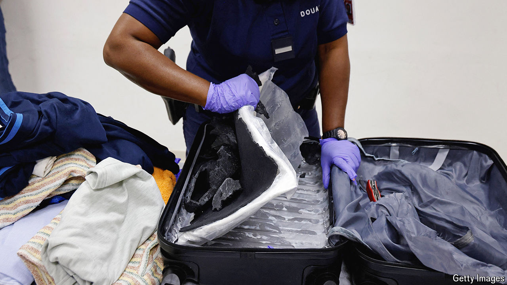
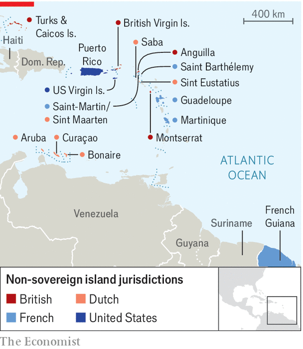

###### Keeping it in the family

# The cocaine trade is booming in Europe’s Caribbean territories 

##### The overseas possessions provide an easy route into the EU 

 

> Mar 27th 2024 

Back when the United States was the world’s hottest market for cocaine, the drug was flown into places like Puerto Rico and the Bahamas, then taken to Florida by boat. Today the fiercest demand for cocaine comes from Europe, where its wholesale price is some 40% higher than in the United States. To meet this demand, smugglers have woven a different set of Caribbean islands into their supply chains: Europe’s overseas territories.

The French departments of Martinique, Guadeloupe and French Guiana are particularly useful because they are part of the European Union, thus easing access to Europe. Getting into them, particularly French Guiana, is easy too. Smugglers passing through Suriname, a former Dutch colony, can bypass corrupt police at the Maroni river on the border with French Guiana, according to InSight Crime, an investigative outfit in Washington. 

Finding mules to take cocaine on to Europe is not hard either. French Guiana is poor compared with metropolitan France. Bagging €7,000 ($7,600) for a 17-hour round trip is tempting, even though the odds of detection are fairly high. French police denied boarding to almost 10,000 passengers suspected of being mules in the year to November 2023.

 


But most of Europe’s cocaine comes by sea. A seizure on March 18th by authorities at the French port of Le Havre—2.7 tonnes of cocaine shipped from Guadeloupe—was typical. Over half the cocaine seized in metropolitan France in 2022 came from its Caribbean territories.

The picture is similar in other European territories. Britain’s Caribbean possessions, including the British Virgin Islands (BVI), are a launchpad for coke-laden yachts heading to both sides of the Atlantic. Arrivals from Curaçao, a poor island in the Dutch Caribbean, and Suriname, whose Dutch community makes up roughly half the population, accounted for 63% of all cocaine seized from passengers at Amsterdam’s Schiphol airport in 2023. The Dutch authorities will spend €61m this year patrolling their Caribbean territories. 

This growing trade has had dire consequences. The prison population in France’s overseas territories rose by 47% between 2013 and 2023, in part because of drug arrests. The Caribbean now has one of the world’s highest proportions of people in drug treatment from cocaine use. Several mules have died after ingested cocaine pellets burst in their guts. Drug-related violence troubles weak island states. Drugs feed corruption, too. In February a court in Miami found a former premier of the BVI guilty of drug trafficking. 

What to do? Efforts to boost port security can go only so far without hurting commerce, says David Caunter of Interpol. Less than 2% of shipping containers worldwide are inspected. Identity checks on travellers from French Guiana have reduced the amount of cocaine reaching mainland France, but they have also raised concerns about racial profiling. In any case, traffickers tend merely to shift traffic to Martinique and Guadeloupe. That is not surprising. French Guiana’s mule traffic took off only after the Dutch tightened screening procedures for passengers travelling from Suriname to Amsterdam, says Thierry Nicolas of the University of French Guiana.

The United States is by far the most powerful drug-buster in the Caribbean, but the European territories lack muscle. CARICOM-IMPACS, a regional security body, struggles to get funds. Limited co-operation from poor Caribbean states weakens international security operations. “It is extremely difficult to get help and accurate facts in investigations from other Caribbean states,” Clarisse Taron, the public prosecutor at Martinique’s main port, told the French Senate in December.

European countries where most of the cocaine ends up could benefit from putting more resources into the region. The EU is estimated to spend only around a third as much as the United States on supply-side reduction. During his visit to French Guiana on March 25th, his first in more than six years, Emmanuel Macron, France’s president, faced renewed criticism for his government’s insufficient funding of security. 

At the same time European governments must tread carefully. Their directives can seem arrogant to their Caribbean residents. Local premiers expressed “alarm” in January when the unelected representative of the British government in the BVI sought extended powers in order to implement governance reforms. Yet without Europe’s help the Caribbean will continue to suffer the consequences of being a conduit for the world’s most voracious cocaine market. ■


