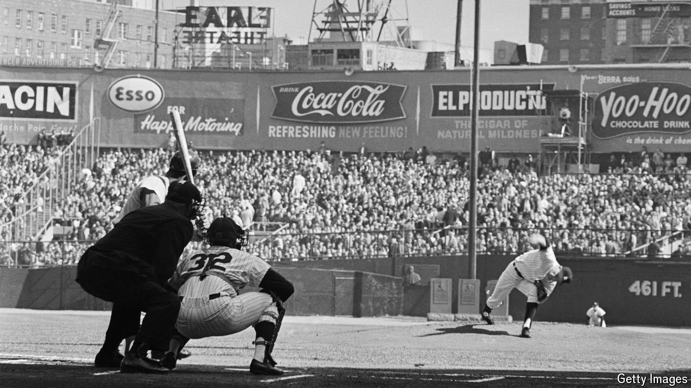

###### The Economist reads

# Six great books about baseball 

##### The sport inspires great literature. Here is some of the best 

 

> Mar 27th 2024 

MANY SPORTS can make plausible claims to be the world’s best pastime. But when it comes to spawning great literature, baseball stands alone. American libraries dedicate shelves upon shelves to the cerebral, languidly paced sport. The volumes they hold range from the earliest memoirs by players, like Christy Mathewson’s “Pitching in a Pinch” in 1912, to works by renowned novelists reporting on real games (John Updike’s essay “Hub Fans Bid Kid Adieu”) or reimagining them (Don DeLillo’s novel of 1997, “Underworld”). Baseball has also been a consistent harbinger of social changes. Its racial integration foreshadowed the civil-rights movement; the rise of multimillion-dollar salaries for free agents anticipated the “greed-is-good” economy of the 1980s. These six books about baseball not only provide an enjoyable immersion in the sport but also illuminate some broader aspects of societies—America is not the only one—enraptured by it.

 By Edward Achorn. 

Baseball-history buffs can reel off the accomplishments and statistics of hundreds of former stars. But only a tiny fraction of them have heard of the player responsible for the greatest season in the sport’s history: Charles “Old Hoss” Radbourn, the ace pitcher on the first-place Providence Grays of 1884. Radbourn started and finished 73 of the team’s 114 games. Official scorers gave him credit for 59 of the Grays’ 84 victories (he was posthumously assigned a 60th win in 2019). To be sure, the sport back then was in its adolescence: Radbourn threw underhand, the fielders behind him had no gloves and home runs were rare, sometimes resulting from oddities like an outfielder refusing to retrieve a ball from under a spectator’s horse for fear of being kicked. But the chief delight of Edward Achorn’s vivid and thoroughly researched account of Radbourn’s magical year is its demonstration that, although Gilded Age America seems unrecognisably distant, baseball’s plotlines and joys remain largely the same today.

 By Eliot Asinof.

The Jazz Age in America began with the Black Sox scandal, in which players from the Chicago White Sox conspired with gamblers to lose the World Series of 1919 to the Cincinnati Reds. Eliot Asinof’s account in 1963 of the match-fixing machinations and ensuing trial, later turned into a film starring John Cusack, is not a scholarly history. It includes fictional characters, events that never occurred and made-up dialogue and interior monologues. It is a work of literature based on a true story. And it ranks among the most gripping examples of baseball writing ever produced.

 By Brad Snyder. 

Ever since baseball became a professional sport, its economics have revolved around the tension between players seeking to sell their services for as much money as possible and team owners seeking to keep salaries in check. For most of the 20th century players were bound by a wage-suppressing “reserve clause”, which let teams renew their contracts indefinitely at the previous year’s salary and trade them without their consent. In “A Well-Paid Slave” Brad Snyder recounts the sad saga of Curt Flood (the batter pictured above), a black outfielder who sacrificed his career to win players their freedom. When the St Louis Cardinals traded him to the Philadelphia Phillies in 1969, Flood refused to join a team in a city with notoriously racist fans. He wrote to the sport’s commissioner saying that he was not “a piece of property to be bought and sold irrespective of my wishes”. Flood took his case all the way to the Supreme Court, whose decision in 1972 in favour of the owners is widely regarded as one of its worst rulings. The baseball players’ union managed to overturn through arbitration the reserve clause four years later, but Flood never played again.

By Robert Whiting. 

America may regard baseball as its “national pastime”, but in that country it lags far behind gridiron football in popularity. By contrast, the game reigns supreme in much of East Asia and parts of Latin America. Nowhere has it succeeded more than in Japan, which has won the World Baseball Classic three of the five times the tournament has been played and is the home of Ohtani Shohei, now of the Los Angeles Dodgers. He is the only player in history to star as both a pitcher and a hitter at the same time. (Babe Ruth was also great in both roles, but not simultaneously.) For readers familiar only with America’s major leagues, Robert Whiting’s lively journey through the differences between Japanese and Western baseball culture is a welcome corrective. As mainly a sequence of one-on-one confrontations between a hitter and a pitcher, baseball is among the most individualised team sports. But Japan has built its success at both developing star players and winning international titles on the concept of , usually translated as “harmony”, achieved through rigorous training. American players who move there to play are more individualistic. They think it’s up to them to decide how much to train. They are bewildered by the idea of  and its demands for self-denying behaviour both on and off the field. Mr Whiting describes the culture clash with elegance and verve. 

By Michael Lewis. 

Even before the film version starring Brad Pitt came out in 2011, “Moneyball” had a strong case to be the most influential baseball book ever written. The story of how the small-market Oakland Athletics used statistical analysis to build a winning team with undervalued players has become so well known that its title is now synonymous with out-of-the-box intelligence: there’s “Moneyball for government”, “Moneyball for lawyers”, “Moneyball for AgTech innovation”, even “Moneyball for the wildland fire system” (google it). Knowledgeable fans might dispute how much credit the number-crunchers really deserve for the Athletics’ success, and for that matter how successful the team really was: in the past 30 years it has won a grand total of one series in the post-season tournament that crowns baseball’s champion. But such quibbles are easy to ignore thanks to Michael Lewis’s compelling psychological portrait of Billy Beane, the team’s general manager, whose faith in statisticians stemmed from his own failure to succeed as a player even though he had the physical attributes that scouts crave.

 By Jim Bouton. 

In an era when every star player’s off-field foibles are tabloid fodder, it is hard to imagine a time when unflattering information about celebrities was kept under wraps. But until Jim Bouton (the pitcher pictured above) wrote this laugh-out-loud, tell-all diary of his 1969 season, the public had no idea that Mickey Mantle, the New York Yankees’ revered centre-fielder, was a heavy drinker who hit many of his home runs hung over, or that players routinely popped amphetamines (“greenies”), devised schemes to look up the skirts of attractive female spectators (“beaver-shooting”) and rampantly engaged in extramarital affairs on road trips. (Asked what was the hardest part of being a ballplayer, Mike Hegan quipped, “Explaining to your wife why she needs to take penicillin for your kidney infection.”) Major League Baseball was outraged. Its commissioner, Bowie Kuhn, tried unsuccessfully to get Bouton to sign a statement that its contents were pure fiction, and Bouton’s revelations made him a pariah among his former teammates. Whenever Pete Rose, a star who was later  for gambling, played against Bouton, he yelled “Fuck you, Shakespeare!” from the dugout.

Also try

Our Lexington columnist wrote about baseball and . Many fans thought the sport was getting too languid. Rule changes in 2023 . Our  wrote about how Mr Ohtani’s feats in America are inspiring admiration and emulation in Asia. His combination of pitching and batting prowess is highly unusual, but even he does not play professionally in two sports at once, as Deion Sanders did in the 1990s. Our sports column explains  manage to do that. 

