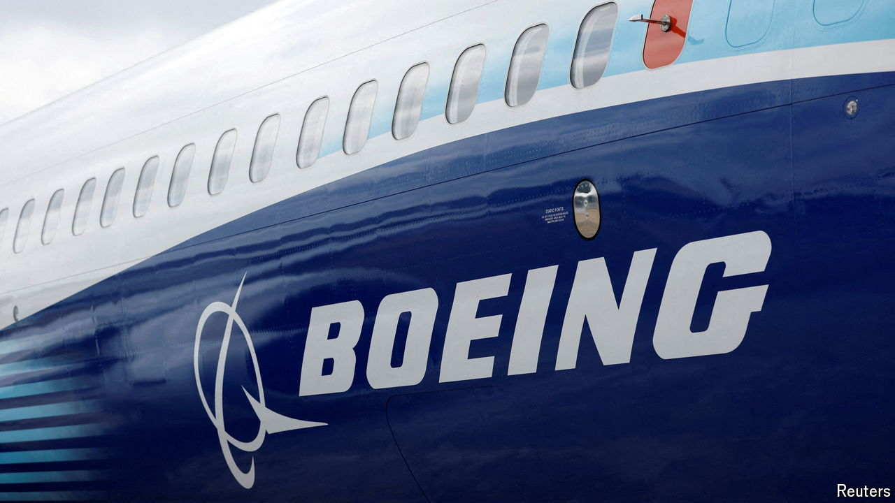
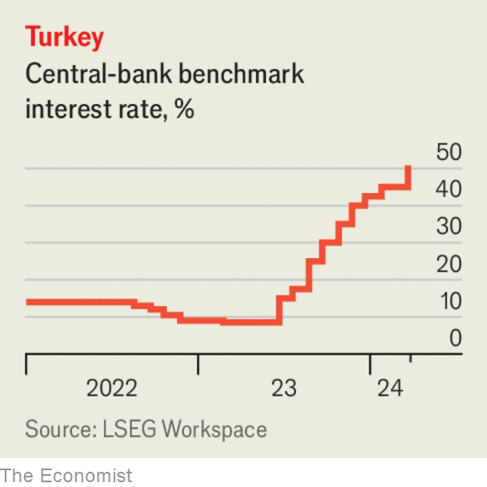

###### The world this week

# Business 

#####  

 

> Mar 27th 2024 

The top ranks of management were overhauled amid investor unease about safety checks on its airliners. In January a panel fell from a 737 Max 9 passenger jet soon after take-off. Several incidents have been reported since then, including a 777 that lost a landing-gear tyre when it was taking off. Boeing safety has become a meme on TikTok. Dave Calhoun is to step down as chief executive by the end of the year and Larry Kellner departs as chairman. The head of the commercial-aircraft division has been replaced with immediate effect. 

America’s Justice Department lodged an antitrust lawsuit against , accusing the tech giant of making it harder for customers to switch phones, undermining innovation in apps, and imposing “extraordinary costs” on developers, businesses and consumers. The complaint in effect attempts to stop Apple locking users into its ecosystem. Apple said the suit “threatens who we are” as a company and sets “a dangerous precedent, empowering government to take a heavy hand in designing people’s technology”. The case will take years to wind its way through the courts. 

Meanwhile, the European Union opened investigations into Alphabet and Apple over competition practices at their app stores, and Meta over its use of personal information in advertising. It is the first official scrutiny of tech companies under the EU’s new . Had the issues been resolved with the companies by “mere discussion, they would have been solved by now”, said the EU’s antitrust commissioner. 

 abandoned a planned IPO for its logistics division, instead offering to buy out minority shareholders in the business. A year ago the Chinese tech giant announced its intention to split into six parts, with the potential for each to pursue a stockmarket listing. But the plan hasn’t excited investors. Late last year Alibaba decided not to spin off its cloud unit and suspended the IPO of its supermarket arm. 

 share price held on to most of the gains reaped from its successful flotation on the New York Stock Exchange. The social-media platform’s stock soared by 48% on the first day of trading. 

The  fell to a 34-year low against the dollar, triggering warnings from Japanese officials that they might intervene in the currency markets. The Bank of Japan raised interest rates recently for the first time since 2007, which would normally cause the yen to strengthen, but its monetary policy remains comparatively loose. 

Trussed up in debt

The director of the nonpartisan Congressional Budget Office in Washington repeated his warning that America faced a looming crisis on its , which stood at $26trn, or 97% of GDP, at the end of 2023. Phillip Swagel raised the possibility that markets could lose confidence in America’s ability to repay debt, similar to the situation that the government of Liz Truss faced in Britain in October 2022. Earlier this year Mr Swagel said that America had entered “a slow spiral” of rising debt and concurrent debt payments.

 


 central bank surprised markets by lifting its main interest rate by five percentage points, to 50%. The rate was 8.5% a year ago. With inflation nearing 70% on an annual basis, the bank said it would retain a tight monetary policy until a “significant and sustained decline” in price rises was observed. 

The British government is no longer the controlling shareholder in NatWest Group, having reduced its stake to just below the 30% threshold that would define it as such. During the financial crisis of 2008 the government bailed out  to save it from collapse. In 2020 RBS was renamed NatWest Group (providing retail banking under the RBS and NatWest brands). Sixteen years after the crisis, the government still doesn’t expect NatWest Group to be fully private until 2026. 

 and  agreed to cap credit-card swipe fees in America, ending a two-decade battle with retailers and potentially saving merchants $30bn over five years. The deal also allows retailers to charge customers for using the credit cards at tills while guiding them towards cheaper options. 

Free-speech advocate

A judge threw out a lawsuit brought by X against the Centre for Countering Digital Hate for allegedly conducting a campaign to drive advertisers away from the platform. CCDH published a report purporting to show a rise in , as it then was, which Elon Musk, its owner, described as scaremongering. But in a scathing decision, the judge found that the case had been all about “punishing the defendants for their speech”. 

