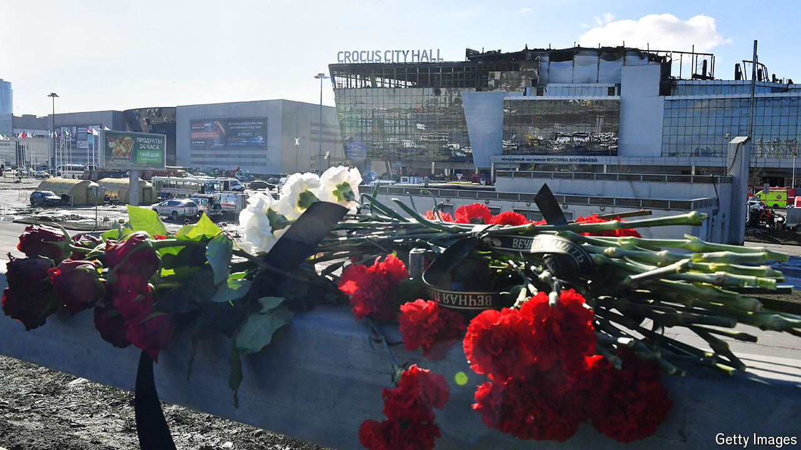
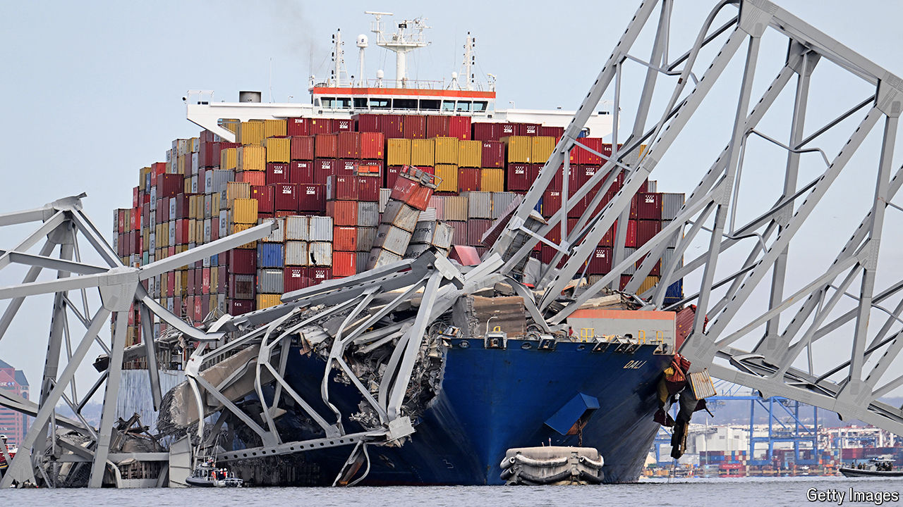

###### The world this week

# Politics 

#####  

 

> Mar 27th 2024 

Gunmen attacked , killing at least 139 people. It was  deadliest terrorist incident since the Beslan school siege in 2004. An affiliate of Islamic State in Central Asia claimed responsibility. Four of the alleged attackers appeared in court, severely bruised and beaten, to face charges of terrorism. The authorities say the men are from Tajikistan. The American embassy in Moscow had warned of an attack in early March, telling its citizens to avoid large gatherings. Russia ignored the warning. Vladimir Putin and Russian media have instead brazenly tried to link the attack to Ukraine. One television channel aired fake video clips of a Ukrainian official crowing over the incident. 

Russia intensified its drone and missile assaults on , stepping them up shortly before the IS attack in Moscow. Kyiv, the capital, was hit and energy infrastructure targeted across the country. Poland scrambled fighter jets when a Russian missile strayed into its air space. 

 seemed to be heading towards another election, its sixth in three years, as the country’s political parties failed to agree on a “unity” government, threatening Bulgaria’s attempt to adopt the euro as its currency in early 2025. Far-right and pro-Russian parties are gaining ground. 

Simon Harris was chosen as the new leader of Fine Gael in  and is set to become the country’s prime minister following the resignation of Leo Varadkar. Aged 37, Mr Harris will be the youngest person to hold the position. 

It’s all about the symbolism

The UN Security Council passed a resolution demanding a temporary ceasefire between  and Hamas for the remainder of Ramadan, aided by the abstention of America, which had used its veto to block three earlier resolutions calling for a halt to the fighting in Gaza. Angered by America’s abstention, Israel cancelled a planned visit by a delegation to Washington and said it would not halt operations while Hamas still holds Israeli hostages.

Voters in  turned out in large numbers to elect Bassirou Diomaye Faye, the opposition candidate, as president. Macky Sall, the outgoing president, had tried to postpone the election, causing a protracted constitutional crisis.

A court in  ruled that a party backed by Jacob Zuma, a former president, can be on the ballot in the general election scheduled for the end of May. The uMkhonto we Sizwe party may get more than 10% of the vote, according to recent polls, which could push the ruling African National Congress to around 40%, forcing it to seek a coalition if it wishes to form a government.

America, Britain and New Zealand blamed China for a  aimed at a variety of targets, including Britain’s Electoral Commission, New Zealand’s Parliament and critics of the Chinese Communist Party. America and Britain placed sanctions on an alleged front company for one group of Chinese hackers. They also placed sanctions on two alleged members of the group, while America brought criminal charges against them and five other men.

The High Court in Britain gave  more time to fight against his extradition to America to face espionage charges, ruling that the American government had to provide more assurances about the fairness of a trial there, among other things. Mr Assange leaked a trove of classified information on his WikiLeaks site that the Americans say put lives in danger. 

The candidate of main opposition coalition was blocked from registering for July’s presidential election and missed the deadline. Corina Yoris, an 80-year-old philosopher, had been drafted in at the last minute following the arrest of senior opposition figures. María Corina Machado won the opposition primary last year by a landslide, but was prohibited from running by the Supreme Court. 

America’s State Department said it was tracking legal developments in  after the arrest of , the chief minister of Delhi and a senior opposition politician. Mr Kejriwal’s arrest comes just weeks before the start of a general election. He was taken into custody for questioning over a corruption case relating to Delhi’s alcohol policy, which he says is “fabricated”. 

America and  are preparing to strengthen their military alliance, the details of which will be announced when Kishida Fumio, Japan’s prime minister, visits the White House on April 10th. The plan includes a restructuring of the command chain that will smooth defence planning. Meanwhile, the Japanese cabinet sealed a deal to sell fighter jets that are being developed with Britain and Italy to other countries, further eroding Japan’s pacifist stance. 

The lower house of  parliament voted overwhelmingly to legalise same-sex marriage and equalise rights on inheritance and so on. The bill is a priority for the government. If, as expected, the upper house and the king approve the law it will come into force by the end of the year, making Thailand the first country in South-East Asia to legalise gay nuptials. 

Joe Biden signed a $1.2trn package of  into law, after Republicans and Democrats yet again reached a last-minute deal to avoid a government shutdown. The legislation should have been passed six months ago. Rebellious Republicans in the House of Representatives yet again raised the possibility of ousting the speaker. 

 


The Francis Scott Key Bridge in  collapsed after a container ship collided with one of its support columns. Six workers who were on the bridge died after falling into the water below. The port of Baltimore, a hub for trade on America’s east coast, will be disrupted for months. 

Even a cat has only nine lives

An appeals court agreed to  request to pay just a portion of the $454m penalty awarded against him in a civil fraud trial. The court told Mr Trump he could post a bond of $175m while he appeals against the original judgment. Mr Trump’s relief was short-lived, however. Soon after, a judge denied his plea to delay his criminal trial over hush-money payments to a porn star. The trial starts on April 15th. 

Mr Trump may be able to scrape some cash from the sale of stock in his social-media company on the Nasdaq exchange.  share price rose by 16% on its first day of trading, making Mr Trump’s stake worth around $4.6bn.

