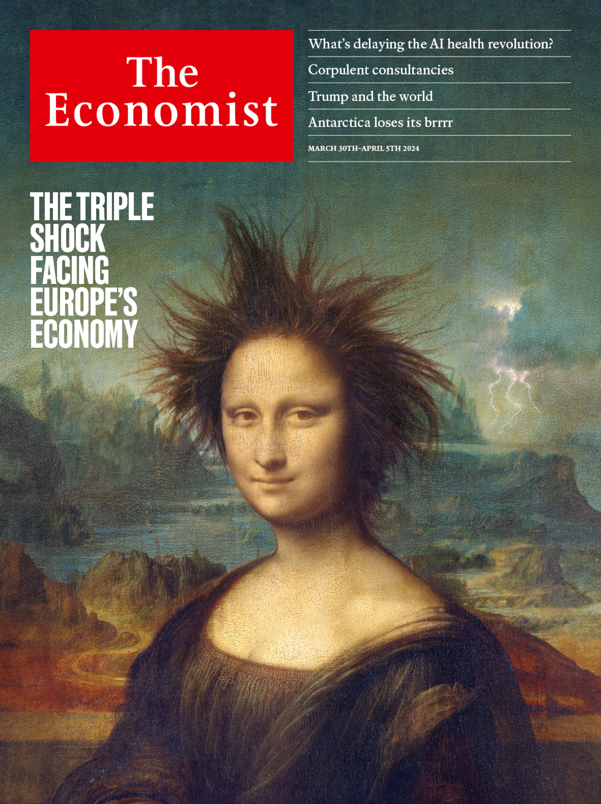

###### The Economist

# This week’s covers 

##### How we saw the world 

> Mar 27th 2024 

Can artificial intelligence transform health care? That is the question at the heart of this week’s , written by our health editor, Natasha Loder, and which we featured on our cover in America and Asia. 

Our first idea was to illustrate the Vitruvian man with a chip in the background. As you can see, Leonardo da Vinci is all over this week’s paper: he was also the hand behind the Mona Lisa.

We thought that our cover should refer to the TQ. Artificial intelligence is generating excitement and hyperbole everywhere, but in health care it has the potential to be transformational. As the TQ describes, it promises better diagnoses, personalised support for patients, faster drug discovery and greater efficiency. In Europe analysts predict that it could save hundreds of thousands of lives each year. 


There is already evidence that AI systems can enhance diagnostic accuracy and disease tracking, improve the prediction of patients’ outcomes and suggest better treatments. It can also boost efficiency in hospitals and surgeries by taking on tasks such as medical transcription and monitoring patients, and by streamlining administration. 


Unfortunately, integration has been slow and the results have often been mediocre. Our editorial focused on why that is and what to do about it.


Our covers played on a stock medical phrase, “the doctor will see you now”. Putting “soon” as the last word was ambiguous—it’s later than now, but not very far off. To be clearer, we settled on “eventually”. 

Health care desperately needs the AI treatment, but its introduction will not be painless. As the doctor says: “This is going to hurt.”

 


 


On our cover in Europe this week we looked at three severe shocks, actual and potential, to the continent’s economy. Partly because of the jump in energy prices that followed Russia’s invasion of Ukraine, the European Union’s GDP has grown by only 4% this decade, compared with 8% in America. As if that were not bad enough, Europe faces a surge of cheap imports from China. And within a year Donald Trump could be back in the White House, slapping huge tariffs on Europe’s exports. 

Our first idea was to illustrate the impending blight with a flower with rotting blue petals and a euro coin. Europe’s misfortune is particularly ill-timed. American support for Ukraine has dried up and the energy transition has much further to run. A fast-ageing population, overbearing regulators and inadequate market integration continue to hold back growth. Disillusioned European voters are increasingly liable to support hard-right parties such as the Alternative for Germany.

But the image implies that we are writing about the 20 countries in the single currency. In reality, the shocks threaten the entire continent—including Britain.

How about our second idea, a crumpled euro note? Somehow, the image is not limited to the currency union. Instead it hints at a fourth danger that we wanted to be a central part of our leader. Although the shocks facing Europe are outside its control, errors from Europe’s own policymakers could greatly aggravate the damage.

We also thought about a classical allusion—a sculpture of a man with a red arrow wrapped around it, pointing downwards—because those errors stem partly from Europe’s understandable but backward-looking urge to preserve industries and jobs.

One error would be to fight the previous war against inflation by keeping economic policy too tight at a moment of vulnerability. It will be easier to cope with disruption from outside if central banks keep the economy out of a slump that would stop displaced workers finding new jobs.

Another error would be to copy America’s and China’s protectionism by giving vast subsidies to favoured industries. China’s recent economic woes demonstrate the flaws, not the virtues, of excessive government planning.

Unfortunately, it looked as if the sculpture was grappling with red tape. Classical imagery was good, but we wanted something more precise.

When we saw the image of Mona Lisa, we knew we had what we were after. She has not only received a nasty shock; she’s also gone punk. And that nods towards Europe’s need to junk the past and forge its own, up-to-the-moment economic policy.

Even as America showers industry with public money, Europe should instead spend on infrastructure, education, and research and development. Rather than emulate China’s interventionism, Europe should note the benefit Chinese firms derive from a vast domestic market. Integrating Europe’s market for services, where trade remains difficult, would help firms grow, reward innovation and replace some lost manufacturing jobs.

The hair-raising cover was almost ready, but some of us wanted to tie in the triple shock with our modern Mona Lisa. So our designers came up with some firebolts over her left shoulder. They say lightning never strikes twice. It threatens to strike Europe three times.

 


