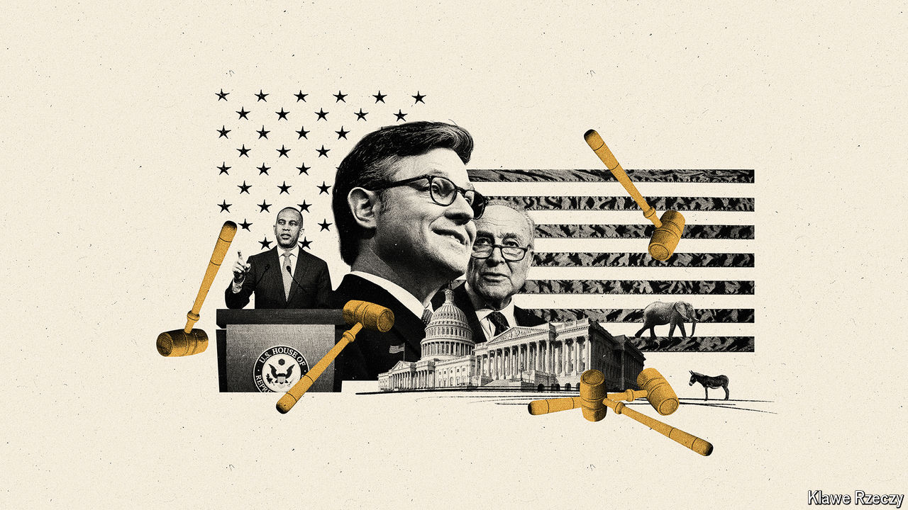
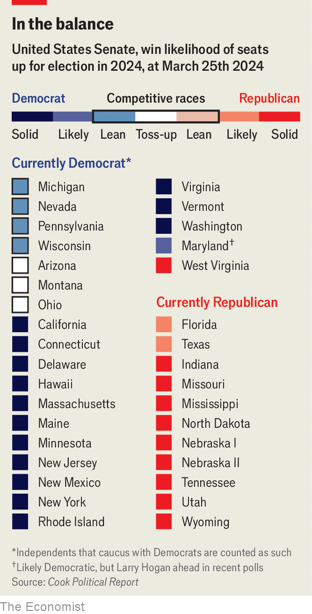
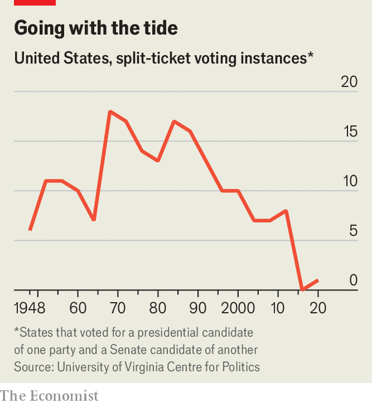

###### Double flip-flopping

# Both chambers of America’s Congress may flip in November 

##### A historic first is in the offing—with big consequences 

 

> Mar 24th 2024 

AMERICANS WILL elect 471 federal officials in November: 435 members of the House of Representatives, 34 senators, a vice-president and a president. These contests are overshadowed by the  between President Joe Biden and Donald Trump, his predecessor, which will be pitched as a struggle between democracy and autocracy (and amplified by a projected $3bn in campaign spending). Seven months of this promises to be wearing. 

Cast your eye down the ballot, however, and something exotic is in the offing. At the moment, Washington is divided by the thinnest of margins. Democrats control the Senate by just two seats out of 100. Republicans control the House of Representatives by five out of 435 (a margin that will shrink to four once Mike Gallagher of Wisconsin retires next month). 


After the election, control of both chambers could flip. In the Senate, the seats contested this year are in extremely favourable states for Republicans. In the House, by contrast, Democrats campaigning against the chaos of Republican leadership may wrest back control. A double flip would be quite a feat of political gymnastics: it has never happened before.

Senate terms last six years, and only one-third are contested every two years. The mix this year is unkind to Democrats. Joe Manchin, the West Virginia senator who managed to remain the Democratic representative of his Trump-loving state, is retiring. His seat will almost certainly be filled by a Republican, leaving the starting-point for the race at, in essence, 50-50. 

Of the seven competitive Senate races this cycle, all are now held by Democrats. Five are in presidential battleground states (Arizona, Michigan, Nevada, Pennsylvania and Wisconsin). They are winnable by Democrats, but none comfortably (see chart). In Montana and Ohio Mr Biden is likely to lose, but the incumbent Democratic senators, Jon Tester and Sherrod Brown, must prevail if the party is to retain control of the chamber. They are the last remaining Democrats holding statewide office in their respective states. Adding to the Democrats’ headaches, Larry Hogan, a popular Republican ex-governor of ordinarily deep-Democratic Maryland, plans to run for its Senate seat. 

 


Republican incumbents, meanwhile, look comfortable. The two that Democrats have the slightest chance of upsetting are Ted Cruz of Texas and Rick Scott of Florida—neither of whom represents states that Mr Biden will be seriously contesting. Overall, then, the maths look troubling for Democrats. They will need to play perfect defence to get to a 50-50 Senate (and hope that Kamala Harris remains vice-president to break ties in their favour). 

True, the Democrats managed this feat in the midterms of 2022 (actually gaining one seat, in Pennsylvania). They expect to retain their fundraising advantages. And the candidate-quality issues that hurt Republicans in previous elections may recur. In Arizona, for example, Kari Lake, an election-denying demagogue who in 2022 lost her bid for governor against a weak Democratic challenger, will probably be the party’s Senate candidate. In Pennsylvania Dave McCormick, the presumptive Republican nominee who lost an expensive Senate primary in 2022 to a celebrity doctor, Mehmet Oz, is dogged by allegations of carpet-bagging over his private-jet travel to his mansion in Connecticut.

The House elections are not so tilted against the Republicans as the Senate elections are against the Democrats. But Democrats have a more credible case for taking the chamber than the Republicans do for keeping it, for a number of reasons.

First, Republican stewardship of the House has been chaotic, even by the low standards of Congress. Last year, for the first time in American history, Republican hardliners deposed their speaker. Last week one of their ranks, Marjorie Taylor Greene, introduced a motion to depose the current speaker. More ordinary forces also militate against Republicans. Democrats are expected to outspend them. And there are over a dozen Republicans in districts that voted for Mr Biden; there are only five Democrats in Trump-friendly districts.

 


The possible flip-flopping of the chambers may seem odd when American politics are so nationalised and polarised. Split-ticket voting—in which people vote for presidential candidates of one party and congressional candidates of another—has gone from common to exceptional. In roughly one-third of the Senate races held in the presidential-election years of 1992, 1996 and 2000, voters opted for a presidential candidate of one party and a senator of the other. In 2016 there were no such cases. And in the 33 elections held in 2020 the sole exception was in Maine. 

Split congressional districts have also declined precipitously. Before 2000 well over 100 districts typically had representatives belonging to a different party from the voters’ presidential preference. By 2020 this had declined to a record low of 16.

But as American politics have calcified into two mutually loathing teams of nearly equal size, legislative majorities that were once enduring have become narrow and unstable. Between 1932 and 1994, Democrats controlled the House for all but four years. Since then the chamber has flipped party control five times. Minor fluctuations—small shifts in turnout, the entry of a —can be decisive.

A double flip would matter for more than just novelty. Republican control of the Senate would mean that Mr Trump, if he regains the White House, would have a far easier time confirming his most outlandish potential nominees. Mr Biden, if re-elected, could find that his nominees to fill judicial vacancies were refused. 

Republican senators are, for the moment, more  than their House colleagues, so aid for Ukraine could pass through a differently divided government. But on the whole, divided government tends to be inimical to serious legislating—as experienced in the tug-of-war between President Barack Obama and the Republican-controlled Senate after 2015.

The competition for Capitol Hill has not yet attracted a great deal of public interest. Perhaps it should. For all the attention that Americans pay to the question of their next president, they devote surprisingly little to whether or not he will be able to do much from his perch. ■

