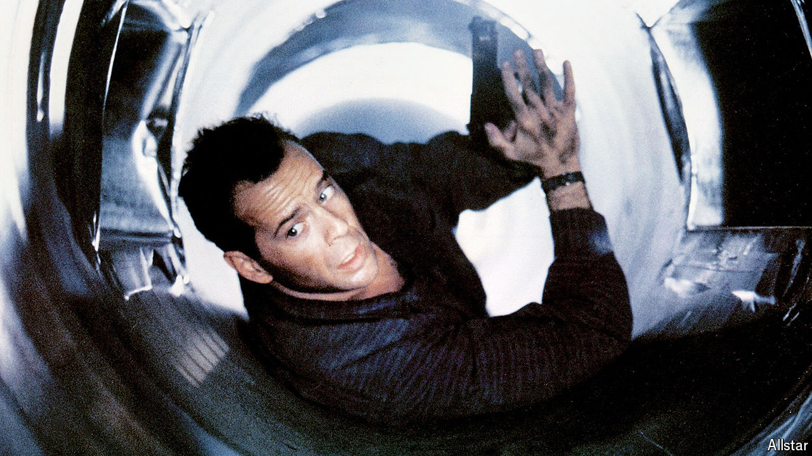

###### Glock, stock and barrel

# Chicago wants to stop Glock pistols being turned into machineguns 

##### The city is suing the manufacturer 

 

> Mar 27th 2024 

“THAT PUNK pulled a Glock,” says Bruce Willis’s character in the action-packed 1990s Christmas classic “Die Hard 2”. “You know what that is?” You may well do. That gun on the hip of a police officer? It’s probably a pistol made by Glock, an Austrian manufacturer. That weapon in John Wick’s hands during a heart-thumping scene? One of them is definitely a Glock. From law enforcement to Hollywood lawbreakers, Glocks are everywhere in pop culture. They are also the gun of choice for real-life criminals. Which makes the fact that they can so easily be turned into machineguns that much more worrying.

On March 19th the city of Chicago filed a lawsuit against Glock. Using cheap add-ons, criminals are transforming Glock pistols into machineguns. The illegal device is called an auto sear, but it is also known as a “Glock switch”, though Glock does not make them. They are the size of a large coin, and they can be bought for less than a hardback book, or made at home by anyone with a 3D printer for much less.

The lawsuit, filed together with Everytown Law, a group of litigators specialising in gun reform, claims that Glock knows about the problem but has failed to prevent it anyway. “No other pistol design is so easily converted to a machinegun,” says Eric Tirschwell, the executive director of Everytown Law. “So why haven’t they fixed theirs?”

Chicago is notorious for its street violence, and the pandemic only made things worse. Though shootings fell by 13% in 2023 compared with 2022, the city is still facing a wave of gun violence. Last year more than 600 people were murdered, though not all by guns, and there were over 2,400 non-fatal shootings. The city of Chicago claims that Glock is making a bad situation worse. The lawsuit states that between 2021 and 2023, 1,100 modified Glocks were recovered by Chicago’s police. 

The National Rifle Association, America’s gun lobby, disagrees with blaming Glock. “Chicago’s focus ought to be on the criminals,” says Andrew Arulanandam, the group’s interim CEO. “Without criminals, there is less crime.”

The Windy City is not alone in facing a barrage of bullets. The District of Columbia and others have also reported problems with these illegal add-ons. Chicago is the first city to sue over the devices. The lawsuit is made possible by the Illinois Firearms Industry Responsibility Act, a state law passed last year that allows gun manufacturers to be sued for public harm, but it also rests on a federal law prohibiting machineguns. This suit may be the first of its kind, but it probably won’t be the last. ■


