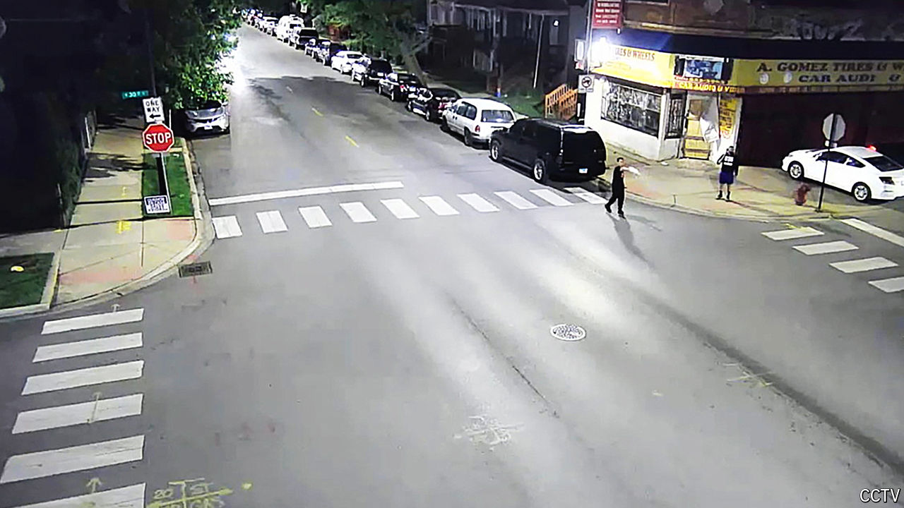

###### Grin and bear it

# Do undocumented immigrants have the right to own guns? 

##### A federal court in Chicago decides that some do. Republicans are outraged 

 

> Mar 27th 2024 

The night of June 1st 2020 was a chaotic one in Chicago. A week earlier, George Floyd had been murdered by a Minneapolis police officer, and protests against police brutality had spread all over the world. A day before, the then mayor, Lori Lightfoot, had requested help from the National Guard for the first time since the riots of 1968. Such was the situation when Heriberto Carbajal-Flores, a then-28-year-old carpenter, borrowed a gun and joined a group of men defending a tyre shop in Little Village, a Mexican neighbourhood, from would-be looters. At around 11pm, in full view of a camera, Mr Carbajal-Flores shot seven times in the direction of a white car that was speeding past. Forty minutes later, he was arrested.

So far, just another story of madness on that hot summer night. But Mr Carbajal-Flores’s rather reckless defence of property may yet change America. In early March the last of the charges originally filed against him was dismissed by a federal judge in Chicago. Mr Carbajal-Flores, a Mexican citizen who arrived illegally in America as a child, was accused of breaking the federal law which bans undocumented immigrants (as well as foreigners on temporary visas) from owning guns. The judge, Sharon Johnson Coleman, ruled that, as applied to him, the law was unconstitutional. Citing cases of former British loyalists in the revolutionary war who were allowed guns, she argued that Mr Carbajal-Flores was entitled to an “individualised assessment” about whether he had a right to own a gun; and in his case, he did.

In effect, Ms Coleman ruled that some undocumented immigrants are allowed to have guns. Though it will almost certainly be appealed, the ruling has already set off a storm among Republicans. Marco Rubio, a Republican senator from Florida, wondered if the ruling was “being done to sort of mock both gun laws and also the whole…understanding of the value of being a citizen of the United States”. It shows how one conservative priority, the right to gun ownership with few restrictions, may be about to crash into another: a strong dislike of undocumented migrants.

A generation ago the idea that a Mexican illegally in America could have a constitutional right to carry a gun would have been considered absurd. Yet the question has arisen thanks to conservative rulings at the Supreme Court that have widened the scope of the Second Amendment, which gives Americans the right to bear arms. 

First, in 2008 there was , which ruled that a ban on handguns in the nation’s capital was unconstitutional. Then, in 2022, came which ruled that requiring individuals to show “proper cause” to get a  was also unconstitutional, along with any gun-control law lacking an analogue in 1791. Now the Second Amendment is, in the words of Justice Clarence Thomas, no longer “a second-class right” to be given at the discretion of officials. Rather, it is comparable to, say, the First Amendment, which protects freedom of speech and religion.

Yet the constitution says that the right to bear arms is held by “the people”, and not merely by citizens. Mr Carbajal-Flores’s lawyers argue that their client is a member of “the people” by virtue of his ties to the United States. Though he entered America illegally, he is eligible for protection from deportation under daca, an executive order signed into effect by Barack Obama. The weekend after he was arrested he got married to his longtime girlfriend, who is an American citizen. His children are citizens. They also argue that his specific use of a weapon, to deter looters, was exactly the sort of behaviour that many conservatives admire. Mr Carbajal-Flores says he was instructed by the police to go armed, and the shots he fired were warning shots. “Our client is a legitimate hero,” says Ross Cassingham, one of Mr Carbajal-Flores’s lawyers. “He’s the proverbial good guy with a gun.”

At appeal the government’s lawyers are likely to say otherwise. In their response to the defence’s first motion to dismiss, they noted that Mr Carbajal-Flores armed himself before he even spoke to the police and suggested his gunfire was not obviously intended only to warn, so he was not acting in legitimate self-defence. They also argued that the law banning undocumented migrants from owning guns is constitutional, on the basis that the decision still allowed the government to restrict classes of people from owning firearms. And they contended that restrictions on non-citizens are legitimate, on the basis that people who have already broken the law in moving to the country cannot be trusted with firearms. That argument was initially accepted.

But that came before , which in effect established a test that gun laws must be in line with the laws of the early republic. Hence Judge Coleman’s consideration of how British loyalists were treated after the revolutionary war. In the late 18th century, notes Adam Winkler, of the University of California, Los Angeles, School of Law, the concept of illegal immigration hardly existed, and so “the people” included everybody inside the United States. “It is clear that undocumented immigrants have a right to free speech and free religion,” says Mr Winkler. “So for purposes of consistency, one would imagine they would have Second Amendment rights.”

What happens next? Another  will soon decide whether domestic abusers under restraining orders can be restricted from owning guns; that may give some hints as to how the Carbajal-Flores case could be resolved. A final decision could have big implications. At the moment, for example, the state of Illinois requires anyone who wants a gun to apply for a licence, and bans foreigners without green cards from applying. If upheld, this ruling could force the state to consider almost anyone. Hence the outrage of people like Mr Rubio.

Yet as Mr Winkler notes, there is an irony to the backlash. Conservatives usually argue that gun-control laws do not stop criminals from buying guns anyway. But then conservatives have not always been so keen on widespread gun rights—at least when people they dislike start exercising them. In 1967 California banned the carrying of loaded guns, in an attempt to disarm the rifle-carrying Black Panther Party. The governor who signed the law was none other than Ronald Reagan. Views on guns can change, even among Republicans. ■


