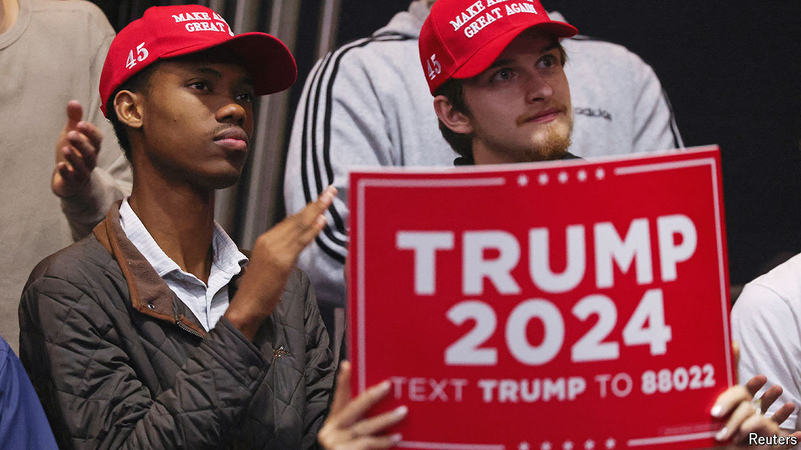

###### Biden’s blacklash

# Georgia’s black Republicans have a battle plan for 2024 

##### Joe Biden will have to work harder to win the state’s black voters this year 

 

> Mar 27th 2024 

On the last Sunday of Black History Month there was real energy in Atlanta’s Ebenezer Baptist Church. Between gospel songs that made even your agnostic correspondent feel something spiritual, a trio of children reminded the congregation of the church’s political prominence. Martin Luther King junior was baptised there and preached there until he died. Over the years church members became lawmakers, and today a little girl told parishioners, with a grin, that Georgia’s first black senator is their pastor. Sitting behind her , one of two Peach State Democrats who helped flip control of the Senate in early 2021, reached out for a fist-bump as cheers erupted in the pews. 

The night before a very different set of black Georgians had come together. In a converted downtown warehouse the Georgia Black Republican Council held its first-ever masquerade ball. Ranchers and representatives took to the stage to give Trumpian speeches. Women dressed in red sequinned gowns and fur stoles nibbled at fried chicken while chatting about their plans to get friends to break with tradition and vote Republican in November. 


At roughly 30%, Georgia has the highest share of black voters of any battleground state. Over the past two decades an influx of black people into metro-Atlanta made Georgia the only Deep South state that Democrats can compete in. In 2020 Joe Biden became the first Democratic presidential candidate to win there since 1992. But with a Biden-Trump rematch looming, Democrats fear they are  with their most loyal voting bloc.

In the decade to 2023 the share of black men who identified as Democrats fell from 80% to 62% nationwide. For women it dropped from 84% to 74%. Black youngsters are particularly unenthused about Mr Biden. Republicans in Georgia see an opportunity. The governor’s race in 2022 was the first time that both candidates actively chased black voters. Stacey Abrams spent $100m courting them while Brian Kemp, who ultimately beat her, deployed black surrogates, campaigned at black-owned businesses and stressed his record of appointing black judges. In December a group of Democratic strategists published a report warning that even the slightest drop in black turnout this year could hand Donald Trump a victory in the state. 

Georgia’s black Republicans think three issues can sway their brethren: education, crime and immigration. Mesha Mainor, a state representative who left the Democratic Party in July to become a Republican, says that black pupils suffer disproportionately from failing public schools. Last year Atlanta’s white high-school graduation rate was 12 percentage points above the black one. On March 20th the state Senate passed a bill to give families $6,500 vouchers for private-school tuition. She thinks Republicans’ crusade for school choice should help them pick up voters of all political stripes.

Angry about the border

On crime black communities tend not to favour liberal policies—and Georgia Republicans plan to capitalise on that. For the past year Atlanta has been divided over a plan to build a $90m police-training facility dubbed “cop city” by protesters. Notably, a black councilwoman proposed it, the city’s black mayor has endorsed it and an Emory University survey from last year found that a minority of black residents opposed it. Jalen Johnson, a deputy sheriff and city commissioner in Albany, Georgia, says he can’t remember a single time he has delivered a death notification to a white family. Republican tough-on-crime policies, he says, resonate more when it’s always “black boys getting shot”. He notes that during Mr Trump’s presidency there was also real progress on prison reform.

Days after a Venezuelan immigrant was arrested for killing a nursing student in Athens in late February, Kelly Loeffler, who lost her Senate seat to Mr Warnock three years ago, convened a meeting at a renowned Atlanta soul-food restaurant. Over dinner black panellists spoke about how resentful they feel about  towards people who cross the southern border illegally. Black Georgians have watched loved ones go to jail for dealing marijuana, one said, while migrants who break the law by sneaking into America walk free and are even rewarded with government and non-profit aid. They hope to drum up that same anger in black Democrats in this cycle. 

The swing state’s black electorate still leans overwhelmingly left. But the young black Georgians who have converted to the conservative cause are bent on evangelising. A band of college women at the masquerade ball said they will no longer tolerate candidates taking their votes for granted. For some it was Ms Abrams, a prominent black Democrat who ran for Georgia’s governor twice, who taught them that they, too, have a voice in politics. When they thought about it, they realised they were being played by their party. 

“A lot of times it started with a brother,” says Michaelah Montgomery, a 25-year-old who grew up during Barack Obama’s presidency and now runs the Atlanta chapter of an organisation called BLEXIT. “We all trusted him because he looked like us and spoke at our church.” But that is no longer enough. If there is one thing that she and the Democratic strategists worried about losing Georgia can agree on, it is that Mr Biden will have to spend bigger and work harder to get the black vote this year. The days of the token fish fry are over. ■

