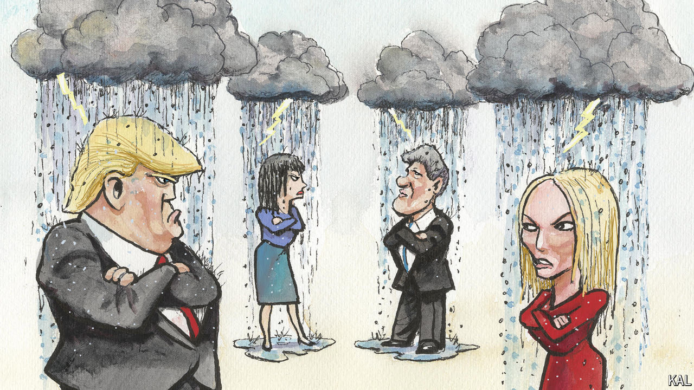

###### Lexington

# The case of Stormy Daniels echoes past scandals 

##### It should make all involved check their righteousness 

 

> Mar 27th 2024 

Almost 30 years ago, in May 1994, a former Arkansas state clerk, Paula Jones, filed a sexual-harassment suit against President Bill Clinton. She said that in 1991, as governor of Arkansas, he lured her to a hotel room in Little Rock, pushed down his trousers and urged her to perform a sex act, but she rebuffed him. 

Mr Clinton denied the story, and his lawyers said he was immune to civil litigation while in office. A federal judge eventually threw out Ms Jones’s claim, but not before the Supreme Court rejected Mr Clinton’s argument about immunity, finding—hilariously—that the suit would be a minimal distraction. In fact, information was secretly passing between the investigation by Ken Starr, the independent counsel in the ever-branching inquiry known as Whitewater, and Ms Jones’s lawyers. 

Those lawyers asked during Mr Clinton’s deposition in the Jones case whether he had been involved with a White House intern, Monica Lewinsky, and his denial led to the charges of perjury and obstruction for which the Republican House of Representatives impeached him. The Senate acquitted him in 1999 in a bipartisan vote. For anyone, like Lexington, who slogged through the sexual, political and legal muck of those years, then looked up on the bright clear morning of September 11th 2001 to wonder if they had always had their priorities just right, it is hard not to watch a new documentary about Stephanie Clifford, “Stormy”, without some sense of déjà vu. 

Ms Clifford, who performed under the name Stormy Daniels as a stripper and porn actress, has said Donald Trump had sex with her during a celebrity golf tournament in 2006. On the eve of the presidential election in 2016 Mr Trump’s lawyer, Michael Cohen, paid Ms Clifford $130,000 to sign a non-disclosure agreement. Mr Trump has denied Ms Clifford’s story but acknowledged he reimbursed Mr Cohen, to stifle her “false and extortionist accusations”. That reimbursement is the basis for what will be the  of an American president, if it starts as scheduled next month. The Manhattan district attorney, Alvin Bragg, has accused Mr Trump of falsifying business records in order to commit another crime he has not specified, but which appears to be violating federal election law.

Probably because this episode involves Mr Trump and has played out in the social-media era, the drama seems even tawdrier and the price paid by the woman at the centre seems even greater than in the saga of Ms Jones. Ms Clifford now owes Mr Trump more than $600,000 because she lost a defamation suit against him and is liable for his lawyer’s fees. She has said her lawyer filed the suit against her wishes. 

Like Ms Jones, Ms Clifford, who grew up poor in Baton Rouge, Louisiana, was assailed as trailer trash, a gold-digger and a slut. Like Ms Jones, Ms Clifford, a registered Republican, said she had no political agenda. Both were exploited by some seeming allies. Also like Ms Jones, Ms Clifford was buoyed by (and attacked for) her new celebrity. After the revealed her claims about Mr Trump in January 2018, she embarked on a “Making America Horny Again” strip tour and discovered older women and gay men crowding her venues. “This is going to be the best day of my life,” she says in “Stormy”, with touching sincerity, as she prepares to appear on “Saturday Night Live”.

But the picture, never bright, steadily darkens during the documentary. Ms Clifford stays on the road not only to pay her bills but to protect her daughter from the uproar. Her marriage disintegrates. The lawyer who filed the defamation suit, Michael Avenatti, turns out to have embezzled from her (he is serving 19 years for crimes against her and other clients). Her book royalties dry up as fans realise their money might go to Mr Trump. Then Mr Bragg files his charges, and the insults on social media turn to death threats. Ms Clifford is shown, near tears, reading some aloud: “Kill yourself” and “You just signed your death warrant.” 

Not just for the right but for the left it can seem as if history started anew with Mr Trump. In the documentary the precedent of the Clinton era goes unexplored. It ought to make just about everyone squirm. The establishment news media was less fascinated by Ms Jones at first than it was by Ms Clifford. Back then it was Republicans who were scandalised by the president, while Democrats, including many feminists, were scandalised by the women who accused him. Then it was a conservative prosecutor who seemed determined to whipsaw a civil complaint into criminal charges; now it is a progressive prosecutor electing to test a novel legal theory against a former president, after federal prosecutors chose not to pursue a similar case. Back then the accused claimed to be the victim and turned the prosecutor’s choice to his political advantage. So far that history is repeating itself.

Eye of the Stormy

Poignantly, the one person in “Stormy” heard questioning their choices is Ms Clifford. She has said she is not a victim, and that when Mr Trump surprised her by seeking sex during what she thought was an appointment for dinner, she complied. She says Mr Trump “wasn’t wrong” when he was overheard saying, on the infamous “Access Hollywood” tape, that women would let him do what he wanted. “The hardest part about all of this is I feel like I’m partially responsible for every woman that could have come after me,” she says, in an act of brutal self-examination one longs for others in this sad story to perform instead.

Even allowing for the documentary’s sympathetic viewpoint, Ms Clifford’s courage is unmistakable. She says she will not give up “because I’m telling the truth”. But she offers a devastating coda for the furore that has consumed her life. “This is just pointless,” she says. “I have no hope at all, any more.” ■


