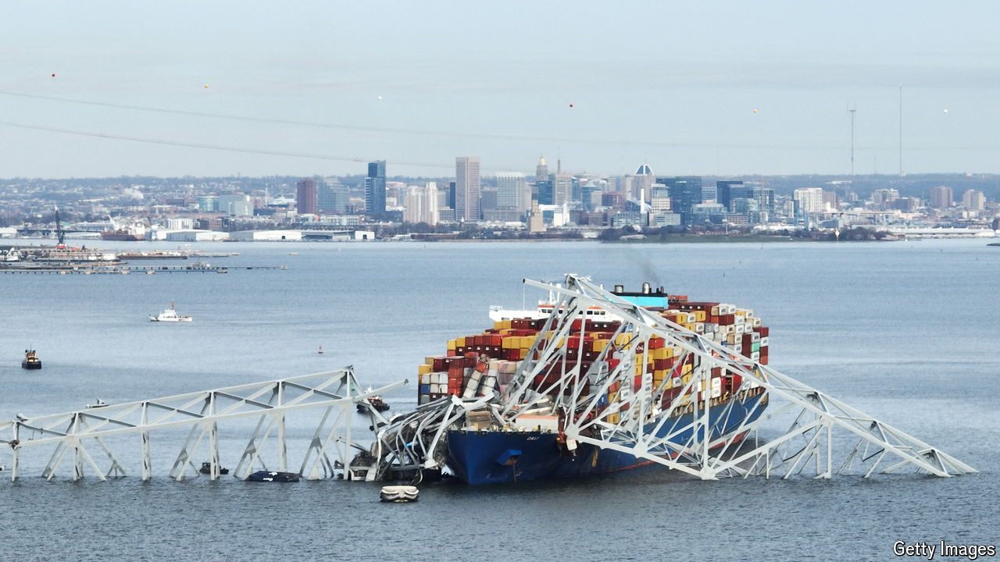

###### O say can you see

# The impact of the Baltimore bridge disaster 

##### The collapse of the Francis Scott Key Bridge will hurt the city, but highlight its resilience, too 

 

> Mar 26th 2024 


THE VIDEO footage of the collapse of Baltimore’s Francis Scott Key Bridge was shocking. At around 1.30am on March 26th, when a container ship rammed into one of its support columns, the central section of the 1.6-mile (2.6km) structure collapsed into the Patapsco river below, sending people and vehicles into the water. Workers repairing potholes were on the bridge at the time. “Never would you think that you would see…the Key Bridge tumble down like that,” Baltimore’s mayor, Brandon Scott, told reporters. “It looked like something out of an action movie.”


Maryland’s governor declared a state of emergency. Six people are thought to have drowned. Beyond the human toll, the immediate questions concerned the causes and consequences of the disaster—one of the most significant in America for decades, according to Jerry Hajjar, president of the Structural Engineering Institute of the American Society of Civil Engineers (ASCE). The FBI has said that terrorism was unlikely to have been behind it.

The 300-metre-long ship, the , was heading from Baltimore to Colombo, in Sri Lanka, when it “lost propulsion”, according to an unclassified Cybersecurity and Infrastructure Security Agency report. The crew reportedly notified officials that a bridge collision was likely. Eyewitnesses say the ship’s lights flickered just before impact. Locals heard a loud thunder-like rumble in the middle of the night. “The house started shaking,” says Cyrus Gilbert, a resident of Locust Point, directly across the harbour. 

Investigators will want to know why the  lost control. Nada Sanders of Northeastern University, an expert on the global supply chain, says that the ship had an inspection issue last June. According to Equasis, a shipping database, Chilean authorities gave it a “deficiency” for propulsion and auxiliary machinery (though no deficiencies were recorded in a follow-up inspection in New York). 

The bridge could have been structurally sound. A report by the ASCE gave Maryland a B for its bridges and a B- for ports in 2020. “Bridges are not designed to withstand lateral loads from ships on their columns,” said Masoud Hayatdavoodi, of the University of Dundee’s School of Science and Engineering. “There is no question that the bridge would collapse due to the impact on the columns.”

President Joe Biden promises to foot the bill to get the bridge rebuilt as soon as possible. But the impact on the city is already being felt. The port is closed until further notice, causing ripples beyond the harbour. The port supports over 15,000 direct jobs, and roughly 140,000 jobs are linked to it in some way. Daraius Irani, of the Regional Economic Studies Institute at Maryland’s Towson University, says the port closure alone will probably cost roughly $50m a day in lost activity. 

The harbour is an important link in America’s supply chain. More than 50 ocean carriers make nearly 1,800 annual visits. It is especially important in the automotive world. Its private and public terminals handled nearly 850,000 cars and light trucks in 2023, the most of any American port. It also ranked first in the country in handling farm and construction machinery, as well as imported sugar and gypsum, and ranks second for coal exports. 

If another port experienced a hiccup (because of labour disputes, say, or cyber-attacks), the toll on the American economy could be severe. For now, though, the national impact is likely to be limited. Other ports, such as New York-New Jersey and Virginia, should be able to pick up the slack. Mark Zandi, chief economist at Moody’s, a ratings agency, says the national economy will be OK, but Baltimore will suffer. Commuters and lorry drivers will face disruption. Last year the bridge served 34,000 commercial and passenger vehicles a day, about 15% of traffic in the area.

The harbour has long been a symbol of resilience. In the war of 1812 against the British, the Americans successfully defended Fort McHenry in Baltimore Harbour, an event immortalised by Francis Scott Key in his 19th-century poem that became the national anthem. The tragedy will give the city and port time to implement upgrades that would be harder when the port is active. Baltimore may emerge with a better bridge and harbour. ■


