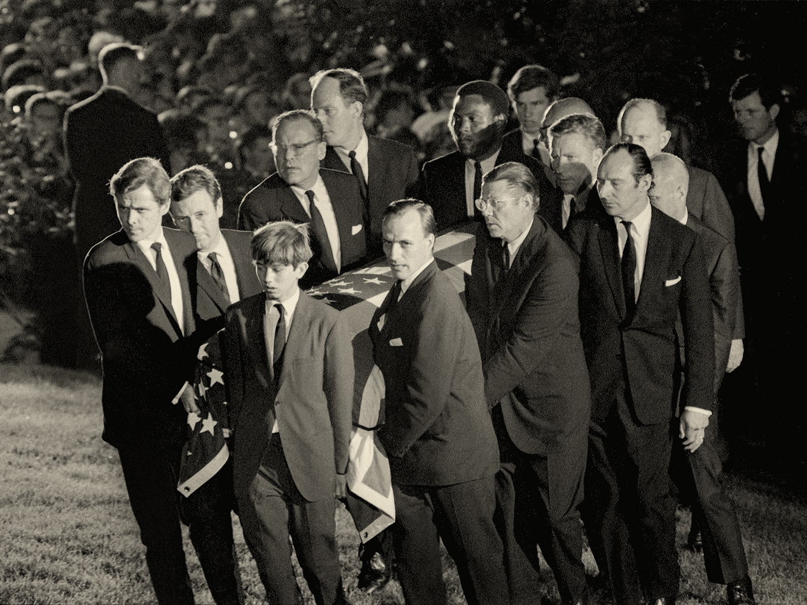

###### Election 2024

# Robert F. Kennedy junior doesn’t care if he condemns America to Trump 

##### He’s a tree-hugging conspiracy theorist – and he’s running for president 

 

> Apr 10th 2024 

The first thing you notice, on entering ’s office at his home in Los Angeles, is a stuffed tiger. It was shot by Sukarno, the first president of Indonesia, whom the CIA reputedly tried to assassinate. As Kennedy tells it, his uncle, President , on learning that Sukarno was anti-American, said, “I’d be anti-American too, if the CIA tried to kill me.” Hearing of this, Sukarno “fell in love” with JFK and invited him to visit Indonesia. Kennedy’s father, , who in the early 1960s was the attorney-general in his brother’s administration, went instead and brought back the gift of the tiger. Soon afterwards Sukarno sent two live Komodo dragons that Bobby junior had requested (they wound up in a zoo). 

Today Kennedy keeps the animal in his outside office because his wife, Cheryl Hines, an actor best known for her turn in “Curb Your Enthusiasm”, “won’t allow it in the house”. The trophy keeps company with a stuffed bat given to Kennedy by Glenn Close, who is godmother to one of his two daughters, and a red-tailed hawk which, as a novice falconer, he trapped in Virginia when he was 15. He took up falconry after reading about its role in King Arthur’s Camelot (which is also the nickname applied to JFK’s glamorous, ostensibly idealistic court). 

This menagerie says a lot about Kennedy’s life, with its mix of tragedy and privilege, celebrity and eccentricity. There is the overlap of politics, showbiz and money that has characterised the Kennedys for several generations. There is a reverence, bordering on ancestor-worship, for Kennedy’s father and uncle, whose assassinations traumatised both America and him. And there is the environmentalism that dates to Kennedy’s troubled childhood, becoming a lifeline in his even more troubled early adulthood. In time his devotion to the natural world would reinforce the conspiracist outlook that was part of his inheritance. Later that mindset re-emerged as scepticism about vaccines – a cause that gained unprecedented salience during the pandemic, boosting Kennedy’s profile and, it seems, finally kindling his political ambitions. 


Now he is running for president, like JFK, RFK senior and another uncle, Ted Kennedy, before him. Kennedy has a condition of the larynx that lends his voice a kind of vatic frailty, making it seem, on the stump, that he is articulating hard-earned truths. But, unlike his presidential rivals, he is physically trim and buff, and looks younger than the 70-year-old he is. Rather than having the sort of tan that is sprayed out of a bottle, his skin is the deep bronze of someone who spends a lot of time outdoors. It contrasts sharply with his aqueous blue eyes – distinctly the eyes of a Kennedy. 

His campaign, however, is not like his predecessors’. After an abortive bid to challenge Joe Biden for the Democratic nomination, he is standing as an independent. For all his inherited privilege, he is championing the many Americans who want to tear the system down. Nothing in his intermittently scandalous life has suggested he is destined to end up in the White House. Yet Kennedy still believes he might. 

Kennedy was born in 1954, the third of 11 children that his mother, Ethel, had with Bobby senior. He grew up in what was, in effect, America’s royal family. “When I was a kid,” he says, there was “an absolute adulation” for the Kennedys. He describes the expectations of this high-achieving milieu at the start of “American Values”, a memoir published in 2018: “From my youngest days I always had the feeling that we were all involved in some great crusade, that the world was a battleground for good and evil, and that our lives would be consumed in that conflict. It would be my good fortune if I could play an important or heroic role.” 

 


 


 


The ideas and values of that era, Kennedy tells me, inform his platform today. He remembers his father taking him to Harlem, Appalachia, the Mississippi Delta and Native American reservations, and telling Bobby junior, “These are Kennedy people.” You can draw a line between the patrician concern for the poor that RFK senior developed and Kennedy’s avowed aim to help hard-up Americans now. 

His views on foreign policy, and specifically the war in Ukraine, have roots in his childhood, too. The Cuban missile crisis of 1962, when he was eight, is a “touchstone” for him. His father, Kennedy recalls, didn’t want the family to go to the government shelter, lest that incited panic, and asked him to “be a good soldier”. The lesson he draws from the crisis is that, “If you want peace, you have to be able to put yourself in the other guy’s shoes,” as he believes JFK did with the Soviet leader Nikita Khrushchev. The modern corollary is that the West should have been more sensitive to Vladimir Putin’s security concerns: by expanding NATO eastwards and proposing to take in Ukraine, Kennedy thinks America provoked Russia’s invasion in 2022. (The only moral war America has fought since 1865, Kennedy reckons, was the second world war.) 

This take on Ukraine, common to the “America First” right and anti-war left, is jarring in Kennedy’s case because one of his four sons, Conor, fought on the Ukrainian side in the summer of 2022. Despite his reservations about the war Kennedy says “I’m proud of Conor,” adding, “I’m also very happy that he’s home.” As it happens, Conor Kennedy – who in 2012, when he was 18, briefly dated Taylor Swift – is in the house and drops in to say hello. We have a short exchange about Ukraine, which I once covered as a foreign correspondent. “Go easy on him,” Conor says as he leaves. I ask which of us he is talking to. “Both of you,” he calls back. 


As you might expect, the aspect of his childhood that most shaped Kennedy is the assassinations – JFK’s in Dallas in 1963, when Kennedy was nine; five years later Bobby senior’s in Los Angeles on the night of his victory in the California Democratic primary. He speaks frequently of the people he saw lining the railway tracks when his father’s coffin was taken from New York to Washington to be buried; a group of nuns, standing and waving from the bed of a yellow pick-up truck, made a particular impression on his young Catholic mind. He served as a pallbearer at the funeral. These were seismic events in American history and hinges in Kennedy’s life. Through his candidacy, they are reverberating again. 

Kennedy believes the CIA was involved in his uncle’s assassination, “and continues to be involved in the cover-up”. The evidence, in his view, “is pretty definitive”. The agency, he thinks, was in cahoots with the mob. They were united, in this interpretation, by anger with JFK over his failure to overthrow Fidel Castro, the communist leader of Cuba, where the mobsters had lost casinos after the revolution of 1959. Proof of a CIA hand in Bobby senior’s death is “more circumstantial”, but Kennedy is convinced his father was not slain by Sirhan Sirhan, the man imprisoned for the crime. The fatal shots were instead fired by a security guard. (Kennedy thinks Sirhan should be paroled; his mother Ethel Kennedy, now 95, disagrees.) 

JFK’s killing is the font and wellspring of modern American conspiracism. The “paranoid style in American politics”, as Richard Hofstadter termed it in a famous essay of 1964, long predates the Kennedys, but the assassinations revived it. Kennedy says the events naturally “left a mark on me”. You do not need to be a psychoanalyst to connect them to the ultra-scepticism, verging on paranoia, which colours Kennedy’s outlook on many issues today. Alan Dershowitz, a prominent lawyer and long-term friend of the Kennedys, describes his operating principle as, “Prove it to me. Show me.” 

 


This sort of disputation with the facts may seem a familiar stage of grief, albeit in sensationalised form – as if, were you to show where the doctors or investigators went wrong, you could somehow beat death on a technicality and turn back time. As conspiracists are wont to do, Kennedy bolsters his view of the assassinations with a torrent of expertise, or what appears to be expertise, about bullet trajectories, the “carbon tattoos” left on his father’s body, the clip-on tie he is clutching in photos taken at the scene. 

Kennedy had always been a difficult child who did badly at school. After his father’s death, he went off the rails. Launching his presidential campaign in April 2023, then as a Democrat, Kennedy joked that “I’ve got so many skeletons in my closet that if they could vote, I could be king of the world.” (His “rambunctious youth”, he added, “lasted until my early 60s.”) Kennedy got into fist-fights and was expelled from several schools. “You dragged the family name through mud,” he recalled his mother telling him when, in the summer of 1970, he was arrested for possessing drugs for the first time but not the last. (Notwithstanding his problems, he studied at Harvard, the London School of Economics and the University of Virginia’s law school.) 


“The curse of the Kennedys” is a tabloid truism, a reference not only to the assassinations but to the litany of overdoses, skiing and aviation accidents, car crashes, sex scandals and criminal prosecutions that the clan has endured, to say nothing of the virulent strain of adultery among its men. Kennedy’s life has contributed to the dismal legend. His second wife, Mary Richardson, from whom he was estranged, died by suicide in 2012. (He married Hines in 2014.) And, in his teens and 20s, he was a drug addict for 14 years. He survived and recovered, he recounts, in part by rediscovering the Catholic faith he had imbibed as a child. 

Like the distracted schoolboy he once was, Kennedy fidgets or jiggles a leg for stretches of our interview. Often his posture is defensive, arms crossed over his chest, or hands clinging to his seat as if he were riding a rollercoaster. When he senses a trap, he can be curt. But when he talks about the natural world, or about religion – and how he climbed out of the pit of addiction on a ladder of faith – his answers are elegant and expansive, and his body relaxes. 

“I didn’t want to be white-knuckling my drug addiction,” Kennedy remembers; rather he craved a “fundamental spiritual alignment”, an epiphany of the kind experienced by St Paul, St Augustine and St Francis. The psychoanalyst Carl Jung, he read, thought religious belief aided his patients’ recovery. So in his late 20s Kennedy decided to believe – a therapeutic version of Pascal’s wager. If you choose to have faith in God, and He exists, you win everything; and if He doesn’t, you lose nothing. Kennedy resolved to “fake it til you make it”. Before long, “That pit of anxiety that I was born with disappears from my gut.” 

American political biographies often feature a redemption arc, whereby, in owning and overcoming their failings, the politician becomes a hero not in spite of past sins, but because of them. “Almost everybody has had a journey. And Bobby Kennedy’s journey is a hero’s journey,” says Tony Lyons, who is both the boss of Skyhorse Publishing, which puts out some of Kennedy’s books, and co-founder of a super PAC supporting his candidacy (called “American Values 2024”). 

 


 


 


Environmentalism is another legacy of his upbringing that, like his faith, was key to his recovery. In 1983 he was arrested for possessing heroin, and the resulting community service brought him into contact with an environmental watchdog in the Hudson Valley. He was hired as the lawyer for Riverkeeper, as the outfit came to be known, and represented it in suits against polluters. 

This was the start of a long career in environmental law, in the course of which Kennedy helped win big settlements from chemical firms including DuPont and Monsanto, and represented minority and indigenous groups in America and elsewhere. Riverkeeper inspired an international coalition called the Waterkeeper Alliance, and Kennedy served as its president for 20 years. In 2000 he set up a law firm with Kevin Madonna, another environmental lawyer. In his frenetic career, directorships, consultancies and paid speeches – the sort of opportunities that come your way if your last name is Kennedy – have buoyed his income. 

Perhaps because Kennedy is spiky and self-important as well as dogged and intelligent, aspersions have been cast on his environmentalism and its motives. There was a bizarre, divisive episode when Kennedy was determined to hire a scientist for Riverkeeper who had served time in prison for smuggling cockatoo eggs. It is not hard to find dissatisfied former clients. Kennedy and Madonna represented the Ramapough people of New Jersey in a long battle with Ford over the dumping of toxic waste on tribal land. They helped win a payout, a renewed clean-up of the site and publicity for the Ramapoughs’ plight. Yet “In the end, I just felt so let down,” laments Wayne Mann, one of the plaintiffs. “The law firms did much better than the people did.” 


People who worked with Kennedy in these years defend his record. “I never got the impression he was in it for himself,” recalls John Humbach, formerly associate dean at Pace University, where Kennedy taught environmental law. Madonna, his law partner, describes Kennedy as a talented orator. He is “able to take very complicated ideas and synthesise them down to explain to a jury or the public.” Kennedy, adds Madonna, is “probably the most loyal friend I’d ever had.” 

“He redeemed himself,” says Dershowitz of Kennedy’s environmental work. You can chart the turnaround in his life through the grounds for his arrests. Instead of being pinched for drug offences, Kennedy was arrested several times at environmental protests. In 2001 he spent a month in prison for civil disobedience on Vieques, an island that is part of Puerto Rico, which the US navy was using for artillery practice. His youngest son, Aidan, was born while he was inside; Kennedy met him for the first time on visiting day. 

If Kennedy had stuck to environmentalism, he might have achieved the “heroic role” he craved as a child. His hard-wired scepticism had found a benign outlet in taking on derelict firms and regulators. But the instinct had a logic and momentum of its own. Suspicion of the CIA seems to have cross-pollinated with a distrust of government agencies fostered by his fights over pipelines, fracking, factory farms and nuclear-power stations. Kennedy, as Dershowitz puts it, is “someone who sometimes takes good ideas to an illogical conclusion”. 

 


He is not alone among environmentalists in developing a wider aversion to government. That tendency is one factor in the horseshoe phenomenon of modern Western politics – in which people on the green-tinged left and disgruntled right agree on the perfidy of the state. In Kennedy’s case, the next focus of his scepticism was vaccines. The thread between the issues was mercury: Kennedy was exercised by its presence in fish and was troubled by the stories he heard from anguished mothers about its past use in childhood vaccines. In 2005 he published an article in  and which alleged that its use in a preservative was linked to an “epidemic of childhood neurological disorders”. The piece was denounced and discredited by scientists and eventually withdrawn. 

In 2015 Kennedy got involved with the World Mercury Project, which subsequently became Children’s Health Defence (CHD), an organisation of which he is still chairman. He and the group have peddled the discredited myth that vaccines may cause autism. Among other theories, Kennedy has suggested links between school shootings and the use of antidepressants; between chemicals in drinking water and gender dysphoria; and between “cell-phone radiation” and cancer. He is not convinced that HIV is the sole cause of AIDS. The result has been disgrace for Kennedy among people who had respected him – in 2019 several relatives denounced him for helping “spread dangerous misinformation” – and, say his critics, his words have put other people in peril. 

“I look at evidence,” Kennedy insists. “I don’t speculate.” As for the charge that he is a conspiracist: “I’m perfectly willing to question government pronouncements. And that’s a threat to people, and the way that they deal with that threat is they say that you’re a conspiracy theorist.” The questioning, and the denunciations, peaked after covid-19 struck in 2020. Amid unprecedented interest in vaccines, Kennedy’s social-media following ballooned; at the same time, some of his posts, and the CHD’s, were removed and his accounts were temporarily suspended. In March 2021, the Centre for Countering Digital Hate, a watchdog, included Kennedy in its “disinformation dozen” – 12 social-media posters who, it calculated, were responsible for two-thirds of anti-vaccine content posted on Facebook and Twitter. 


Some of his opinions on the pandemic are unremarkable. He is right that the closure of schools was damaging, and that lockdowns disproportionately hurt the poor. At the same time, he sees malevolent machinations and power grabs where there was only confusion and human error. In “The Real Anthony Fauci”, a book he published at the end of 2021, Kennedy alleges that Fauci – the infectious-disease expert who shaped the White House’s response to the coronavirus – was involved in a “historic coup d’état against Western democracy”. The media, big tech, big pharma and others were in on the heist. But it was Fauci, “the most powerful – and despotic – doctor in human history”, who was the “ringmaster in the engineered demolition of America’s economy”. In a book as much about AIDS as covid-19, the other horseman of the apocalypse turns out to be Bill Gates. Over decades, Kennedy writes, Gates, Fauci and their co-conspirators promoted “weaponised pandemics and vaccines”, with “catastrophic consequences for humanity and democracy”. 

Elsewhere Kennedy has invoked Nazism and the Holocaust when talking about vaccines and lockdowns. “Even in Hitler’s Germany, you could cross the Alps to Switzerland,” he said at a rally in 2022. “You could hide in an attic like Anne Frank did.” Once again he was criticised publicly by several other Kennedys, and even by Hines, his wife. (Kennedy apologised.) Charitably, you might see in his calumnies and distortions a quest for adversaries grand enough to let him fulfil his heroic role. Making a splash on social media – the invigorating feeling of having done something and won something to acclaim – can validate this sense of mission. 

 


 


 


With a hauteur that perhaps only a Kennedy could muster, he tells me that in 2009 he was offered and declined Hillary Clinton’s seat in the Senate. After a certain age, he figures, becoming a senator is pointless because “You don’t really do anything when you first get in there.” Now, at 70, he is chasing the grandest prize of all. 

Kennedy is drawn to the central story in the “Bhagavad Gita”, a Hindu scripture, which tells of Arjuna, a young prince who finds himself in a civil war. Seeing his family arrayed against him, he wavers. Krishna, his charioteer and an avatar of the god Vishnu, spurs him on. “Your duty on this Earth is to do one thing, and you do it well, which is to fight,” Kennedy recounts Krishna saying. 

Squint, and you can see a parable of Kennedy’s decision to run against the Democrats, the party of his family going back to his great-grandfather. Duty is his professed reason for challenging Biden for the Democratic nomination and then launching his independent candidacy last October. (His path to the ticket was unfairly blocked by the DNC, he alleges.) “I never intended to run for president,” Kennedy avers. But he “saw things happening to my party and my country that made me frightened about the world that my children are going to grow up in”. 

Under Biden, Kennedy now says, the Democrats are a corrupt party of war, corporate control and censorship. The censorship he is talking about is partly of him: he alleges that Biden was personally responsible for some of his social-media suspensions. He claims that the prospect of four more years of Biden, who keeps a bust of Kennedy’s father in the Oval Office, worries him as much as a second term for Donald Trump. JFK and Bobby senior “would have walked away” from today’s Democratic Party, he believes. In a public statement last October, four of his siblings disagreed forcefully. 


His country needed him, his conscience compelled him: in other words, the usual. But his run can also be seen as simply the sort of thing the Kennedys do. It is not a new form of dynastic decadence, or a betrayal of family tradition; rather, it is a continuation of both. 

The Kennedys have always been opportunists, says Thomas Whalen, a historian at Boston University. It isn’t just that JFK became president at 43. RFK senior challenged a Democratic incumbent, Lyndon Johnson, in 1968 (Johnson later withdrew). In 1980 Ted Kennedy challenged Jimmy Carter, another sitting Democratic president. The Kennedys, Whalen says, “don’t like to wait in line”. 

In this spirit, you can see why Kennedy thinks 2024 is his moment. Both the main candidates are unpopular. Both are associated with pandemic-era measures that were widely disliked and are fresh in the memory, and which he has a record of opposing. Both are old enough to make him look relatively youthful and vigorous. The misbehaviour of his youth is now decades in the past; his children are adults and his marriage to Hines is stable. He has probably never had, and will almost certainly never get, a better shot at that “heroic role”. And it is clear he thinks he can win. Not for him the cabinet job in someone else’s administration, the gig on a cable-news channel, or the other baubles that are the consolation prizes of most longshot campaigns. He is, after all, a Kennedy. 

 


This leap for the White House as an independent, in what he calls a “crusade for unity”, involves some wobbly intellectual contortions. When we met Kennedy had been flirting with the Libertarian Party, which will pick its presidential candidate in May. Joining the Libertarian ticket would let him swerve the onerous and expensive process in many states for getting on the ballot as an independent. Yet his policies call for higher spending to help struggling Americans, paid for by steeper corporate taxes. I put it to him that he is not, in fact, a libertarian. “I do think that the government has a role in taking care of the poor,” he concedes, “But, you know, on many other issues I’m a libertarian.” 

The most glaring tension in Kennedy’s platform is simpler: he is running as both a dynast and an outsider. Kennedy’s name and background are not incidental to his pitch: in large measure they are his pitch. Marketing messages exhort supporters to “put a Kennedy back in the White House”. A campaign advert that aired during the Super Bowl, paid for by the super PAC, was a remake of an ad of JFK’s from 1960, this time using Bobby junior’s image. (Once again, other Kennedys took umbrage; again Kennedy apologised.) Yet this man who, even as a child, hobnobbed with world leaders, poses as an avenging tribune of the people. “We’re all going to go over the castle walls together,” he vowed when declaring his independent candidacy, an improbable mission for someone who grew up in Camelot. 


Whalen, the historian, thinks the ancestor Kennedy most resembles is his grandpa Joe, a financier, movie mogul, ambassador and isolationist. “There’s an ugly, reactionary part of the whole Camelot story,” he says, and Kennedy is “dredging that up”. But the loudest echo of his campaign is with Donald Trump, another politician born to privilege, albeit in a less illustrious niche in America’s upper classes. Like Kennedy, he is an insider-outsider and self-styled martyr; Trump likewise rose to notoriety on a famous name and a conspiracy theory, in his case birtherism. (This is the magic of conspiracy theories – they can make an outsider of an insider, and, by inducting the humble into secret knowledge, vice versa.) Both Trump and Kennedy make inflammatory comments that they try to pass off as mere hypothesising; “I don’t necessarily believe…” is Kennedy’s version of Trump’s “A lot of people are saying…” Both invoke the principle of free speech in defence of madcap views. Both prophesy dreadful upheavals should things not go their way: Kennedy speculates about popular anger erupting in a “really dark revolution”. 

You can see how a guy like Kennedy might figure that, if a guy like Trump can be president, he can too. Kennedy is far better informed than Trump and a more coherent orator. He is capable of penetrating moral reflection, including on his years as an addict, that seems beyond Trump. He is bracingly frank about America’s slipping international status. “I don’t think it is an exemplary nation any more,” he says baldly. 

He has another asset that Trump does not enjoy: Trump is running against Biden, but Kennedy is running against both of them. Large numbers of Americans tell pollsters that they would rather not choose between the previous president and the current one. Kennedy frequently scores in the low teens in national polls, impressive for any third-party candidate. His platform offers something to refugees from both big parties. His economic policies are much more left-wing than Trump’s: his proposals include cheap mortgages backed by government bonds, a higher minimum wage, free child care for millions and zero-interest student loans. But alongside this leftish version of populism are positions more likely to appeal to exasperated Republicans. Like Trump, Kennedy pledges to fix the border and renegotiate trade deals. Both support gun rights and denounce the mainstream media. Both are foreign-policy isolationists. 

 


 


 


Kennedy’s emerging coalition also takes in opponents of lockdowns and mask mandates and sceptics of big pharma. Maybe because he knows his stance on vaccines could alienate some voters, it is not at the forefront of his pitch – but anti-vaxxers know he is their man. Surprisingly, younger voters are keener on him than older ones: Kennedy points to polls showing that, in a three-way match-up, he is leading among Americans under 35, perhaps because they are less resigned to the two-party duopoly. 

Attendees at a recent rally in West Virginia praised him for talking about issues that the other candidates are ignoring” and for his physical condition, an advantage in a gerontocratic field, and a draw for wellness devotees and health faddists. (“He’s 70 and he’s like Schwarzenegger!”) “A lot of people think he’s a kook,” conceded one enthusiast, but her own research suggested otherwise. If, in 2016, Trump successfully channelled American rage with conventional politics, Kennedy’s candidacy is a symptom of a grave disenchantment, perhaps even despair. 

Along with these rank-and-file supporters, he has a roster of contrarian backers from tech and finance. On March 26th he announced, as his vice-presidential pick, Nicole Shanahan, a deep-pocketed lawyer, entrepreneur and philanthropist. Thirty-eight years old and a novice politician, Shanahan is part of a peculiar Californian ecosystem that mixes tech, megabucks and moonshot health research. Formerly married to Sergey Brin, co-founder of Google, she may help Kennedy meet the costs of getting on the ballot. 

“This is a three-man race,” he declares. He is almost certainly wrong. Putting a Kennedy back in the White House is unlikely to have as widespread an appeal as Bobby junior hopes. In any case, the barriers to victory for a third-party candidate are probably insuperable. None has even carried a state since George Wallace in 1968. And history suggests that support for third-party wannabes declines as election day approaches and the futility of voting for them sinks in. 


Still, his run is much more than an excuse for journalists to use the word “scion”, and for opponents to reprise the bullseye line first used in a debate in 1988: “You’re no Jack Kennedy.” He claims he is galvanising supporters who would not otherwise vote, and perhaps he is. As for the rest of the electorate, Kennedy says his own polling shows that he’s “drawing evenly…from Trump and Biden”. Whichever of them he takes more votes from may well lose. 

For now, his candidacy is worrying Democrats more than it is troubling Republicans. Some recent polls have Kennedy in double digits in the key states of Arizona, Georgia, Michigan, Nevada, Pennsylvania and Wisconsin – with Trump winning all of them. If he does throw the vote to Trump, the election of 2024 will form a surprise coda to the psycho-saga of the Kennedys and American politics. You might trace the outcome to the night in 1968 when Bobby senior was shot, bequeathing to his son a gnawing mistrust and grandiose expectations. 

When our interview ends, a colleague who accompanied me says that Kennedy reminded her of another resident of California with a persecution complex: Prince Harry. I can see what she means: the combination of authentic suffering and engrained privilege, albeit the sort of privilege which you would not want to have, and the kind of suffering with which it is not always easy to sympathise. As we leave, Kennedy retreats into his garden and begins cawing at the ravens, apparently a habit of his. In that moment he seems, once again, a wounded boy, turning back to nature for refuge from the world. ■

 is special correspondent of and the author of several books including “Snowdrops” and “Independence Square”

PORTRAITS: 

ADDITIONAL IMAGES: GETTY IMAGES

