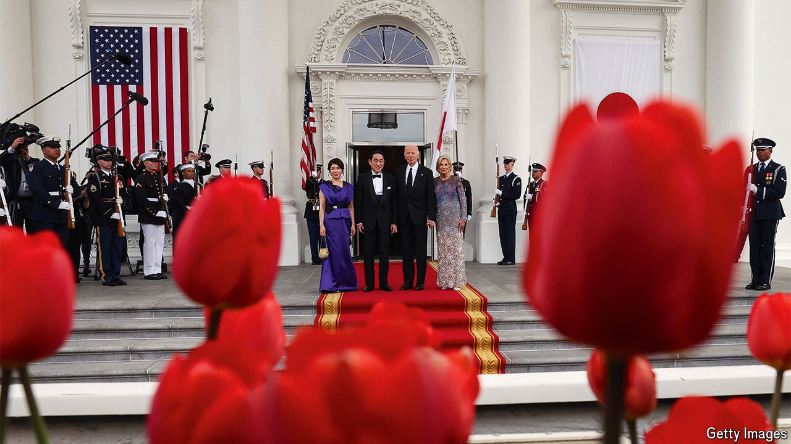
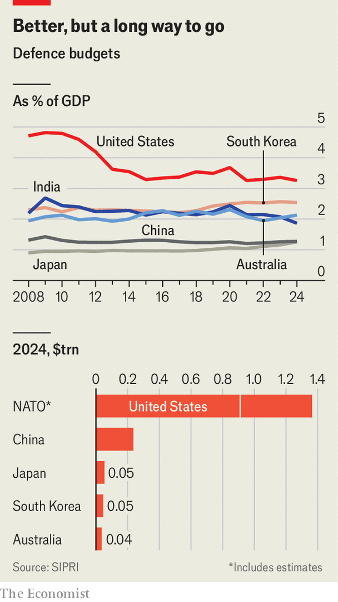

###### Indo-Pacific statecraft

# America’s Asian allies are trying to Trump-proof their policies 

##### Kishida Fumio meets Joe Biden in Washington, DC, to shore up deterrence 

 

> Apr 9th 2024 

The prime minister of Japan, Kishida Fumio, is keeping a laser-like eye on conflicts around the world—and the implications for his country’s security. If Russia is allowed to prevail in Ukraine, “it will send the wrong signal to Asia,” Mr Kishida told  and other reporters in a wood-panelled room at the Kantei, the prime minister’s office, on April 5th. The desire to strengthen Japan’s security alliance explains why he went to the White House on April 10th for a state dinner with Joe Biden, America’s president. The two leaders announced a host of measures to deepen defence and security co-operation between their countries. 

Ferdinand “Bongbong” Marcos, president of the Philippines, another ally, was due to join Mr Biden and Mr Kishida the following day. American officials tout the gatherings as evidence that its Asian alliances are evolving. What they do not say, but is implied, is that they are also trying to protect the relationships from the damage Donald Trump could do if he wins again. 

America’s alliances in Asia have helped keep the peace in the region for decades. In contrast to Europe, where NATO binds dozens of nations into a mutual defence pact, America has discrete bilateral treaties with Japan, South Korea, Australia, the Philippines and Thailand, in a “hub-and-spokes” system. Under Mr Biden, America has sought to foster links between the spokes in the hope of countering China’s rise. America’s allies have largely embraced the effort—especially Japan. 

Working together with “like-minded countries” on security issues “will lead to the establishment of a multilayered network, and by expanding that we can improve deterrence”, says Mr Kishida. Hewing closely to prepared notes, he appeared solemn in his interview as he spoke of his belief that the world is at a “historic turning-point” and faces a “very complex and challenging security environment”.

What lies behind such talk of a “network” is a collection of smaller groupings that collaborate on security. America, Japan and South Korea now hold regular high-level meetings in a trilateral format; so too do America, Japan and the Philippines. AUKUS, a defence pact signed in 2021, brings together America, Australia and Britain. On April 8th the three countries’ defence ministers announced they are “considering co-operation” with Japan through AUKUS. 

 


The result is greater integration between armed forces across the region. In recent years joint exercises have expanded to include a wider range of partners. America, Japan, Australia and the Philippines trained together for the first time in the South China Sea on April 7th, amid continuing Chinese provocations there. Intelligence-sharing is expanding, too: America, Japan and South Korea now share data in real time when North Korea launches missiles (which is happening more often). Mr Biden and Mr Kishida announced a new air-defence initiative between America, Australia and Japan. 

Talk of a more multilateral approach to Asian security long predates Mr Biden. In the early 1950s, America mooted a NATO-esque “Pacific Pact”, but encountered resistance, both from Japan, which wanted to focus on its post-war recovery, and from Japan’s neighbours, which harboured deep concerns about its rearmament. 

The current context is different. Many in Asia now worry more about Chinese aggression. Under Abe Shinzo, Japan’s prime minister from 2012 to 2020, the country loosened its constitutional restrictions on the use of force and expanded defence spending. Mr Kishida has accelerated that approach: Japan’s defence budget grew by 50% between 2022 and this year. The country aims to nearly double spending on defence activities to 2% of GDP by 2027, up from 1.2% in 2022. 

Defensive postures

Yet for all of these developments, the only formal treaties that exist are still those each country has with America itself. The distinction is meaningful. As the war in Ukraine shows, there is a stark difference between the kind of support given to treaty allies and to a wider category of “partners”. Although Taiwan is the most dangerous regional flashpoint, it has no guarantees of security assistance. It has small training exchanges with America’s forces but no joint exercises with any country in the region. America has promised to help Taiwan defend itself but has no legal obligation to fight on Taiwan’s behalf.

There are limits to how deep the ties between America’s allies in Asia can become. “There’s not going to be an Asian NATO,” says one official from an allied nation. Domestic political realities create barriers. In Japan, for example, a pacifist constitution still makes it difficult to enter into new treaty alliances with mutual defence requirements (its pact with America requires America to come to its defence, but not the other way around). 

And Japan looks unlikely to formally join AUKUS anytime soon. Shortly after the defence ministers’ statement on April 8th, Anthony Albanese, Australia’s prime minister, clarified there were no plans to add new members to the pact. Mr Kishida reiterated this on April 10th. Australia worries about Japan’s ability to protect sensitive information and technology; unlike the current members of AUKUS, Japan does not belong to the Five Eyes intelligence-sharing pact. Japan is wary of provoking China, its biggest trade partner. 

Another problem is that some allies, such as Thailand, are glaringly absent from the picture. The current governments of South Korea and the Philippines are largely of like minds with those of America, Australia and Japan. But under different leaders, they could again diverge. 

The biggest potential problem, however, surrounds American leadership. Mr Trump’s first term shook allies’ confidence in America’s reliability. While Mr Biden has done much to repair the security relationships, he has continued his predecessor’s protectionist, anti-trade ways, much to his Asian allies’ dismay—as with his decision to oppose the takeover of US Steel, an American firm, by Nippon Steel, a Japanese one. America’s deep internal divisions raise questions about its ability to maintain its global obligations in the long run. “It all depends on America, on whether they want to continue playing that role,” says a senior official from another ally. If Mr Trump is re-elected, those worries would become more acute. 

In Japan, the fears are captured in the phrase , an abbreviation that means “What if Trump?”, or its more fretful variants,  (“probably Trump”) and  (“already Trump”). Some are optimistic that even if Mr Trump returns, America’s allies in Asia will face fewer problems than those in Europe. They point to the fact that America First types see China as a key adversary. There will be “continuity” in how the Biden and Trump administrations see the situation in the Indo-Pacific, Alexander Gray, who served on Mr Trump’s National Security Council, told a recent conference in Tokyo.

Even so, America’s allies are bracing themselves. Diplomats are scrambling to make inroads with Mr Trump’s current crop of advisers. Politicians are working to reinforce relationships on Capitol Hill and in state governments. Mr Kishida was due to address a joint session of Congress on April 11th and visit a Toyota factory in North Carolina on April 12th to highlight Japanese investment into America. 

Officials in Asia have several sets of fears. For one thing, if Mr Trump abandons Ukraine, it matters to the Indo-Pacific too. Newer multilateral initiatives in Asia may wither under Mr Trump. In Australia some sceptics worry that Mr Trump would refuse to sell submarines to Australia on the basis that America is not producing enough for its own needs, which could undermine AUKUS. 

Trade tensions will rise alongside American tariffs. Mr Trump will probably put pressure on allies to spend even more on defence than they already do. In particular Mr Trump may demand more of Taiwan, which raised defence spending from 1.8% of GDP in 2016 to 2.5% in 2024, but has yet to reach a target of 3%. At the same time, he may also be less careful about keeping America’s military support for Taiwan quiet, raising the chances of a confrontation over the island. 

Exit America

Among America’s formal allies in Asia, South Korea probably faces the most danger. During his previous term, Mr Trump halted large-scale military exercises as a gesture of good faith during negotiations with Kim Jong Un, North Korea’s leader. Former advisers say he was fixated on drawing down America’s 28,500 troops on the peninsula. Christopher Miller, a former acting secretary of defence, recently spoke about reducing America’s troop levels in an interview with a Korean newspaper. That might prompt South Korea to pursue its own nuclear deterrent, a step that over 70% of the public already supports.

While the chances of Mr Trump retreating from Asia may be lower than the chances of him abandoning Europe, allies in Asia would be in a weaker position if he did. Even if America left NATO, the other 31 members could remain, including France and Britain, which have nuclear arsenals themselves. Asian allies would be on their own, and face nuclear-backed threats from China and North Korea. The combined GDP of the remaining NATO members is equivalent to ten times that of Russia; the combined GDP of America’s Asian allies is roughly half the size of China’s. “They cannot balance Chinese power without America in the mix,” says Richard Samuels of the Massachusetts Institute of Technology. In short, spokes without a hub still cannot get very far. ■

