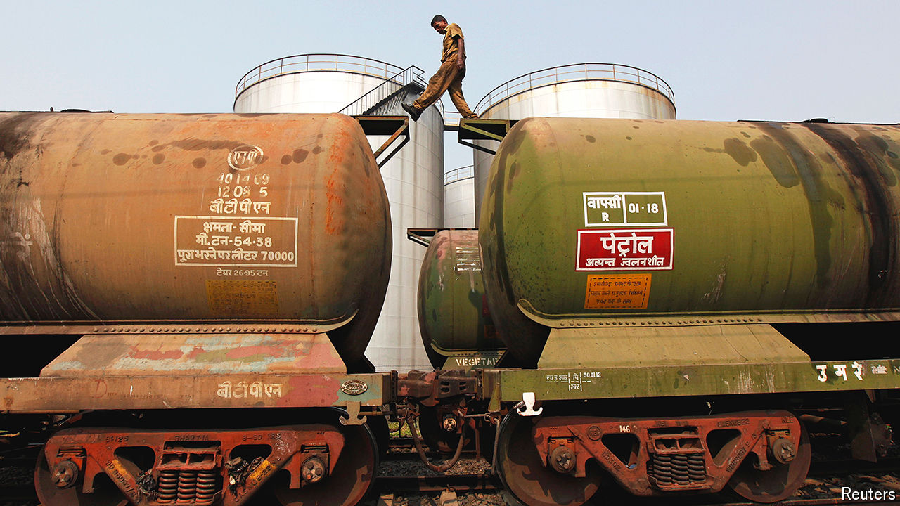
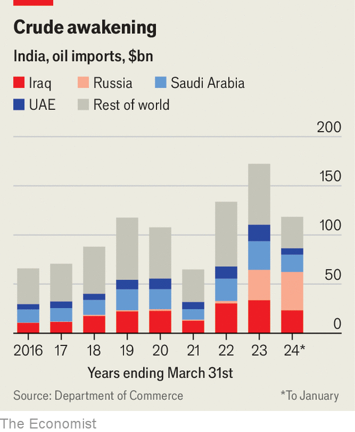

###### Usefully oleaginous

# How India’s imports of Russian oil have lubricated global markets 

##### But as the country’s importance in the global oil market grows, risks loom 

 

> Apr 11th 2024 

In February america slapped new sanctions on Sovcomflot, a Russian state-owned shipping firm responsible for carrying around 15% of Russian oil exports to India. Almost immediately, Indian importers stopped taking shipments from Sovcomflot tankers. But that did little to stem the flow of Russian crude to India, the world’s third-biggest consumer of oil. Deliveries increased by 6% in March, compared with February. Exporters arranged alternative transport to India—probably through the shadow fleet that helps them bypass sanctions. India has also bought Russian crude at prices below the $60-per-barrel price cap imposed by the West. Taken together, these purchases have helped make India the second-biggest importer of Russian oil, behind China.

The immediate impact has been to help India to meet demand at a lower cost. In 2023 nearly 90% of India’s oil consumption was sourced from abroad. Roughly 34% of those imports came from Russia. The discount on Russian crude has narrowed over time, from 20% at the start of last year to around 5% in December, but it still yields significant savings on India’s oil imports, which were worth $181bn last year, around 27% of the country’s total import bill. 

 


Cheaper imports have helped India’s Bharatiya Janata Party (BJP) government. On the government’s instructions, oil firms kept the prices of petrol and diesel unchanged in 2022, even as global oil prices surged in the aftermath of Russia’s invasion of Ukraine. The price freeze helped insulate India from the type of fuel inflation that ravaged neighbouring Pakistan and Sri Lanka. Last month, with an eye on the upcoming general election, retailers cut petrol and diesel prices for the first time since the war began. Less costly oil has also given the BJP more fiscal room by shrinking the fuel-subsidy bill. That has helped it extend a popular subsidy for liquefied petroleum gas by a year. 

Globally, Indian buying of Russian oil has been important. It has helped prevent a supply crunch. India’s petroleum ministry claims that global oil prices could have shot up by about $30-40 per barrel were it not for India’s trade with Russia. On April 4th an American official visiting Delhi encouraged India’s imports of discounted Russian oil, as it was important to “keep oil supply on the market” while ensuring the Kremlin’s profits were being hit. 

India has also rewired energy markets by processing Russian crude and shipping it back to the West. European countries have led the enforcement of sanctions on Russia, but remain connected to Russian oil. In 2023 they imported roughly 225,000 barrels per day (b/d) of Indian petrol and diesel products, up from an average of 120,000 b/d in the previous five years, according to the International Energy Agency (IEA). These exports have boosted India’s trade balance and are another illustration of India’s growing clout in the market. In 2023 oil-related exports were worth $85bn, around 60% more than in 2021. 

India’s influence on global oil markets will only increase. The IEA expects India to be the single largest source of growth in global demand between 2023 and 2030. Growth and urbanisation are expected to drive oil consumption up by 20% by 2030, to roughly 1.2m barrels per day, accounting for more than a third of the projected global increase. To meet the boom in demand, Indian refineries are expected to increase processing capacity faster than any country in the world besides China. 

Much of the oil will have to come from abroad. Production from Indian oil reserves is declining. It accounted for just 13% of the country’s supply in 2023. An import-dependent strategy is always vulnerable to risks, such as a wider conflict in the Middle East. 

Ultimately, the most powerful way to reduce India’s oil imports is to reduce demand for the stuff itself. In last year’s budget India allocated $2.6bn towards programmes in green sectors. But that is a trifle compared with the $20bn annually that the Council of Energy, Environment and Water, a think-tank, estimates is needed for India to reach net-zero emissions by 2070, as it has promised to do. ■


