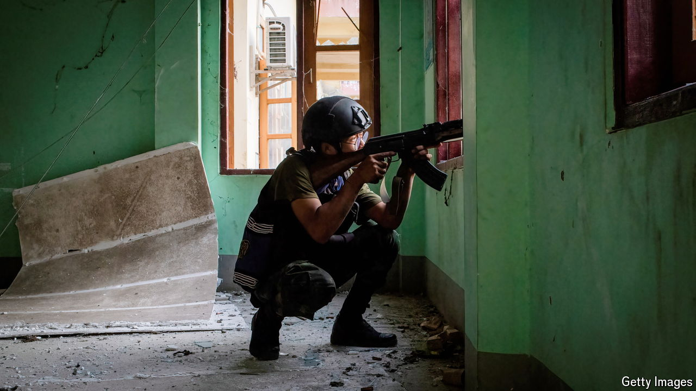
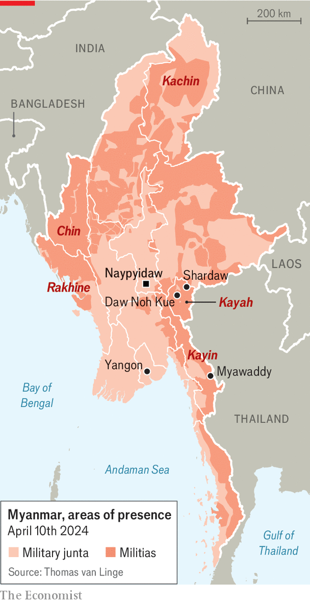

###### After the fight, then what?

# Myanmar’s junta is losing ever more ground 

##### Our correspondent spent three days with one rebel group 

 

> Apr 11th 2024 

Across Myanmar, the three-year war to overthrow the military junta that seized power in a coup in 2021 is far from won. But the popular uprising the coup provoked has attracted a new generation of fighters, who are making ground throughout the country. The junta has reportedly lost control of another part of its border with Thailand to armed rebels. The checkpoint at Myawaddy, an important land crossing, is thought to have fallen into the hands of Kayin (also known as Karen) militias. This is a setback for the regime as it is close to Yangon, the economic capital. 

In the west, Rakhine and Chin militias control a key border trade-post with India and a checkpoint with Bangladesh, while in the north Kachin soldiers are getting close to capturing the last major land crossing with China. Your correspondent spent three days with the Karenni Army (KA) in a remote part of Kayah state in eastern Myanmar. It was clear that these forces are now thinking beyond the battlefield, to what happens if, improbable as it may seem, they win. 

Rugged and landlocked, and with a population of just 300,000, Kayah (also known as Karenni) is the smallest and least developed of Myanmar’s seven ethnic states. The Kayah are used to war. They have been fighting for the right to self-determination ever since Myanmar’s independence from Britain in 1948. The Kayah launched their latest campaign on November 11th. Since then they boast of having captured 65 Myanmar army posts. 

 


“Our army now controls more than 70% of Karenni state,” says Major-General Aung Mynt. He is in charge of the KA and the Karenni National Defence Force (KNDF), a 10,000-strong combined force formed after the coup. Recently they captured Shardaw, a strategic township on the Thai frontier. They now control the border. 

The war has taken its toll on the population. Hundreds of civilians, mainly women and children, have been killed. Airstrikes and shelling by the armed forces have displaced more than 80% of Kayah’s population. Many people have sought refuge in Shan state or in nearby forests. Some make the four-day hike to Daw Noh Kue, a village near the Thai border which has become a refugee camp for thousands of displaced people. The camp is run by the Karenni National Progressive Party, the KA’s political wing.

Despite the hardship that comes with war, tiny Kayah is ahead of the curve not only militarily, but also in preparing for the future. It was the first state in Myanmar to establish an Interim Executive Council (IEC). Made up of political, civil-society and militia leaders, the IEC aspires to join a democratic federal union to be set up as soon as the military regime is toppled. In the meantime it is co-ordinating and organising civil administration for the townships conquered by the KA and its allies.

“We are well aware that the international community may worry about a power vacuum and warlordism,” says Khu Tor Reh Est, who heads the IEC’s justice department. He says the council is making preparations to forge “a federal army” out of the myriad armed groups now active in Kayah and “to offer education opportunities to the youth who have joined the fight and choose to return to civilian life”. 

This drive by armed rebels to future-proof their territorial gains could be glimpsed in a dusty field in Kayah, where 40 young men and women took part in drills such as push-ups and planks. They were training not for the battlefield, but for the courtroom. After breakfast the students trooped into a hall where a judge from neighbouring Shan state taught them about marriage law. Once they pass their exams, these students will hike back over the mountains to take up their new jobs as lawyers and judges—in what they hope could soon be a free country. ■

