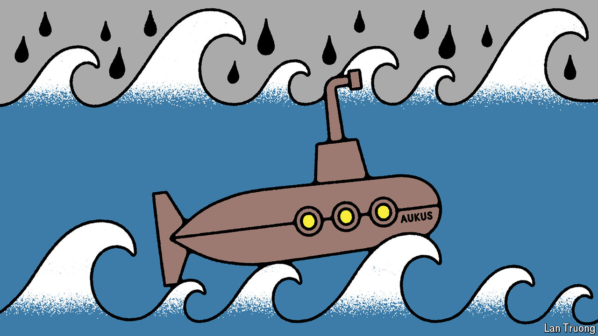

###### Banyan

# Some Australians are increasingly sceptical of AUKUS 

##### The government needs to sell its ground-breaking security pact much harder 

 

> Apr 11th 2024 

THE DEFENCE pact known as AUKUS and reached in September 2021 between Australia, America and Britain is a huge project. But it is intended to counter an even bigger one. China is bent on reshaping the Indo-Pacific region on its own terms, using force if necessary, notably against Taiwan. 

At the pact’s heart is a promise to help Australia build at least eight nuclear-powered attack submarines using British designs and American technology. These will start to come into service after 2040. As a stop-gap, from around 2027 America will rotate up to four of its Virginia-class submarines through HMAS Stirling, a naval base in Western Australia. Australia itself will buy three to five Virginia-class subs in the early 2030s. Fast and stealthy, they will project power far from Australia’s shores. However, the deal is not only about subs, but also collaboration on technology such as quantum sensing and hypersonic missiles.

A decades-long commitment, then, with a big price tag—the subs alone are expected to cost Australia up to $368bn. In return, AUKUS ties Australia’s security more closely to America’s and, Australia hopes, ties America more securely into the Indo-Pacific region. On April 8th the defence ministers of the three countries released a cautious statement saying they were “considering co-operation” with Japan, too.

Not everyone in Australia is pleased. Indeed an AUKUS awkward squad, with varied political persuasions and an assortment of not always cohering grievances, is dropping what one AUKUS backer calls “depth charges of dissent”. The critics include Paul Keating and Malcolm Turnbull, two former prime ministers, Gareth Evans, a former foreign minister, and Hugh White, a strategist. 

Criticisms start with practicalities—above all, whether America can deliver the Virginia-class subs. It is struggling to ramp up production, and in March the Pentagon asked Congress to fund just one new sub rather than an expected two. Mr Turnbull says Australia may see no Virginias “simply because the US Navy won’t be able to spare them”. That would leave Australia less secure, not more.

Others question reliance on Britain’s defence capacity, with its underwhelming record for delivering on time, at cost or up to standard. Meanwhile, Mr White contends, Australia will get suckered into subsidising the other two members’ defence industries. For all the talk of defence integration among the three countries, he says, in the politicised world of defence procurement integration American and British contractors are more likely to benefit than Australian ones. 

Add to that the risk of Donald Trump’s possible return to the White House. If Mr Trump saw America as spending money on Australian interests, Mr Evans argues, he could nix the whole thing. Australia, he points out, has no plan B. But the strongest criticisms of AUKUS have to do with a loss of sovereign agency—hitching Australia’s fortunes to an ever-less dependable superpower, as Mr Turnbull sees it, or one liable, as Mr Evans argues, to drag Australia into a war over Taiwan that is counter to Australia’s interests.

For now bipartisan support for AUKUS remains strong. Yet the pact will have few concrete results to show for years to come. The risk is that all the griping will start to erode public confidence. From the start AUKUS’s backers have not made a frank enough case for it. The deal was negotiated in secrecy. Anthony Albanese, then leader of the opposition, was given only hours to throw his support behind it. Now prime minister, he paints AUKUS chiefly as a jobs scheme rather than as a project of vital deterrence.

Rather, Labor and the conservative opposition should better highlight the progress made so far. This includes making HMAS Stirling a useful pit-stop for friendly subs, and new American and Australian money being allocated to building up a submarine industrial base. 

Above all, they should talk of the challenge posed by Chinese ambitions. They should be clearer about the importance of Australia’s contribution to deterrence. And they should be upfront both about the financial costs and, more grimly, the human ones. 

If Australia’s politicians do not come clean and seek support for AUKUS on honest terms, the sceptics may well erode the consensus for it. That also poses grave consequences for Australia’s own security. For if the point of deterrence is to prevent a war, then you have to be seen to be ready to fight one. ■


