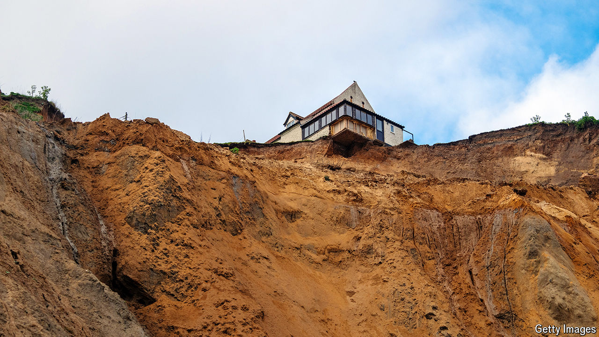

###### Risk of subsidence

# Homeowners face a $25trn bill from climate change 

##### Property, the world’s biggest asset class, is also its most vulnerable 

 

> Apr 11th 2024 

THE residentS of northern Italy had never seen anything like the thunderstorm that mauled their region last summer. Hailstones as big as 19cm across pummelled Milan, Parma, Turin and Venice. Windows were broken, solar panels smashed, tiles cracked and cars dented. The episode cost the insurance industry $4.8bn, making it the most expensive natural disaster in the world from July to September (the figures exclude America, which collates such data separately).

Yet insurance executives, although smarting, were not surprised. Climate change is making such incidents much more common. In the decade from 2000 to 2009 only three thunderstorms cost the industry more than $1bn at current prices. From 2010 to 2019 there were ten. Since 2020 there have already been six. Such storms now account for more than a quarter of the costs to the insurance industry from natural disasters, according to Swiss Re, a reinsurance firm. In Europe, not known for extreme weather, losses have topped $5bn a year for the past three years.

Climate change is doing vast damage to property all around the world, and not always in the places or the ways that people imagine. Hurricanes, wildfires and floods are becoming more common and more severe—but so are more mundane banes. In London, for instance, the drying of the clay on which most of the city stands during summer heatwaves is causing unexpected subsidence, landing homeowners with big bills. A similar problem afflicts Amsterdam, where many older buildings are built on wooden piles inserted into the boggy soil in lieu of conventional foundations. Extended dry spells in summer are lowering the water table, drying out the piles and exposing them to the air. This allows the piles to rot, prompting the buildings above to sag. Unlucky homeowners can be saddled with bills of €100,000 ($108,000) or more for remedial work. And on top of the expensive repairs climate change is foisting on homeowners comes the likelihood that governments will oblige them to install low-carbon heating and cooling, or improve their homes’ energy efficiency, adding yet more to their costs.

Money pit

The upshot is an enormous bill for property-owners. Estimates are necessarily vague, given the uncertainties not just of the climate but also of government policy. But MSCI, which compiles financial indices, thinks that over the next 25 years the costs of climate change, in terms both of damage to property and of investments to reduce emissions, may amount to almost a tenth of the value of the housing in institutional investors’ portfolios. If the same holds true of housing in general, the world is facing roughly a $25trn hit.

The impending bill is so huge, in fact, that it will have grim implications not just for personal prosperity, but also for the financial system. Property is the world’s most important asset class, accounting for an estimated two-thirds of global wealth. Homes are at the heart of many of the world’s most important financial markets, with mortgages serving as collateral in money markets and shoring up the balance-sheets of banks. If the size of the risk suddenly sinks in, and borrowers and lenders alike realise the collateral underpinning so many transactions is not worth as much as they thought, a wave of re-pricing will reverberate through financial markets. Government finances, too, will be affected, as homeowners clamour for expensive bail-outs. Climate change, in short, could prompt the next global property crash.

At present the risks of climate change are not properly reflected in house prices. A study in , a journal, finds that if the expected losses from increased flooding alone were taken into account, the value of American homes would fall by $121bn-237bn. Many buyers and sellers are simply unaware of the risks. When these are brought home, prices change. A study published in 2018 in the  found a persistent 8% drop in the price of homes built on flood plains in New York following Hurricane Sandy, which caused widespread flooding in 2012. Properties just inside zones in California where sellers are required to disclose the risk of wildfires cost about 4% less than houses just outside such zones.

In many cases, the risks climate change poses to property are only slowly becoming apparent—as with London’s geology. The distinctive yellowish bricks with which many houses in the city are built are made from the clay on which the houses stand. It is good to build with, but recently has proved not so good to build on. During the now-milder winters, there is higher rainfall, since warmer air can hold more moisture. As the clay absorbs the rain, it expands. Warmer summers then dry it out again, causing the ground to contract. That would not be a problem if the expansion and contraction were uniform, says Owen Brooker, a structural engineer. But they are not, owing to trees, which suck up moisture in their vicinity. The resulting variation in the accordion effect causes the ground to buckle and twist in places, and the houses above to list and crack.

 


Two-fifths of London’s housing stock, 1.8m homes, will be susceptible to subsidence by 2030, according to the British Geological Survey. Other nearby cities, such as Oxford and Cambridge, are also at risk (see map). Remediation, often by installing concrete underpinning, typically costs around £10,000 ($12,500) but can be much more. PwC, a consultancy, estimates that British home insurers will be paying out £1.9bn a year on subsidence claims by 2030. “To be honest the insurance companies would do themselves a good service by making people aware,” says Mr Brooker. 

Analysts call the direct impacts of climate change, such as this “shrink-swell” effect, physical risks. Some, like shrink-swell, are chronic. Others are acute, such as hurricanes, floods and wildfires. In either case, not only can a house be completely destroyed, but the ongoing risk of further such calamities can make it hazardous to rebuild in the same place. Even the simplest of changes in the weather can make houses uninhabitable: only a small minority of Indian homes have air conditioning, so if the temperature rises much, many become unbearably hot.

 


Physical risks are growing everywhere (see chart 1). The problem is not limited to dry, thundery summers in Europe. According to the National Centres for Environmental Information, a government agency, America suffered 28 natural disasters that did more than $1bn of damage last year, exceeding the previous record of 22 in 2020. Meanwhile Typhoon Doksuri, which hit the Philippines and then southern China last year, was the most costly typhoon in history.

The risks are not spread evenly, however. Research conducted by the Bank of England in 2022 found that just 10% of postcode districts, each roughly the size of a small town, would account for 45% of the mortgages that would be impaired if average global temperatures reached 3.3°C above pre-industrial levels, largely because of the increased risk of flooding in those places. For similar reasons, a back-of-the-envelope calculation suggests that roughly 40% of the value of property in Amsterdam could be wiped out by physical risks compared with just 7% for Tokyo. 

Data are scarcest for the impact on poorer countries, but many of the world’s most populated cities are coastal. A study published in 2017 by Christian Aid, a charity, suggests that in terms of population Kolkata and Mumbai in India and Dhaka in Bangladesh are the most exposed to rising sea levels. In terms of the value of property at risk, the most vulnerable are Miami, Guangzhou and New York.

Tokyo rose

But the risks are not fixed. They can be reduced, most obviously through private and public efforts to improve preparedness. Part of the reason that the risks to Tokyo are low is that it dramatically improved drainage and flood defences after Typhoon Kit hit in 1966, flooding 42,000 buildings. When Typhoon Lan brought similar amounts of rain in 2017, only 35 buildings were swamped.

In theory, house and insurance prices should provide a clear market signal about the risks of climate-related harm to any given property. But even in places obviously in harm’s way, such as Miami, the signal is often distorted. For one thing, it was only in March that Florida’s legislature approved a bill requiring those selling a property to disclose if it had previously flooded. Worse, there is good reason to think that home insurance in Florida is underpriced. Most Floridians would gasp at such a notion: according to Insurify, an insurance company, the average annual premium for a typical single-family home in the state is likely to hit $11,759 this year. Yet even with such swingeing rates, several private home insurers have gone bust or withdrawn from Florida in recent years.

 


The state government, however, shields homeowners from the market through a state-owned insurer of last resort, which provides policies to homes that private insurers will not cover. Citizens Property Insurance Corporation has become Florida’s largest home insurer (see chart 2). Its exposure is now $423bn, much more than the state’s public debt—and all on houses that, by definition, other insurers deem too risky to cover. This suggests that Citizens has been providing a big subsidy to homeowners from taxpayers. Flood insurance underwritten by the federal government suffers from similar flaws. First Street Foundation, which aims to track the threats to American property from climate change, calculates that home values in West Palm Beach, a glitzy city up the coast from Miami, would fall by 40% if owners had to pay the true cost of insuring against hurricanes and floods. That would wipe out many homeowners’ equity and leave lots of mortgages without adequate collateral. 

Yet Miami’s property market is booming. A forest of apartment buildings is rising around the city. Over the past five years house prices have leapt by 79%, according to the Case-Shiller index. If the market is sending any signal about the risks of climate change to property, it is to relax.

To make matters even worse, physical risks are not the only peril climate change presents to property-owners. There is also “transition risk”, which refers to the possibility that governments may oblige homeowners to renovate in ways that reduce the carbon footprint of their properties. Such policies can lead to substantial costs. Germany’s coalition government, for example, had planned to ban new gas boilers from the beginning of this year, which would have landed lots of homeowners with costs of €15,000 or more, even after subsidies. (The policy caused such an uproar that the changes were watered down and delayed last year.)

If governments stick to their emissions targets, costly mandates will return. Buildings account for 18% of the world’s energy-related emissions, largely through heating in winter and cooling in summer. The International Energy Agency, a watchdog, estimates that annual investment of $574bn will be needed for energy efficiency and clean technologies in building by 2030, more than double the $250bn invested in 2023. Environmental policies can also raise electricity bills, increasing homeowners’ costs in a different way.

 


Quantifying transition risks is tricky. It is hard to know how much residential property there is in the world, says Bryan Reid of MSCI, let alone how green policies may affect its value. His firm’s modelling suggests that, if governments imposed policies intended to limit the rise in temperatures above the long-term average to 1.5°C, the costs would amount to 3.4% of the value of housing held in investment portfolios. That is lower than the 6% toll that MSCI’s modelling suggests physical risks will take, but still substantial. 

The more serious governments become about curbing emissions, the greater the transition risks (although in the long run, such policies should reduce physical risks). At the climate summit in Dubai last year Emmanuel Macron, France’s president, called for the European Central Bank to introduce two separate interest rates, one for “brown lending” for investments in fossil fuels and one for “green lending”. Banks that have committed to reducing the emissions associated with their lending will need to ensure that their portfolio of mortgages aligns with their targets. Draughty, natural-gas-guzzling homes could face a higher cost of finance than greener ones and consequently sell for a discount. 

In the long run there is a good chance that both physical and transition risks will land with governments. Carolyn Sousky, of the Environmental Defense Fund, a pressure group, imagines a scenario in which multiple natural disasters strike different parts of America at the same time. That could lead to a sudden increase in insurance prices across much of the country and a slide in property values. Homeowners unwilling to pay a fortune to keep living in a disaster zone might simply hand the keys to their houses back to their mortgage-providers, which could in turn face losses owing to the fall in prices.

America’s state-backed mortgage giants, Fannie Mae and Freddie Mac, require borrowers to have home insurance. If their customers cannot afford it, the pair could suffer a wave of defaults. “We’re acutely aware of it,” says Dan Coates, the acting chief of staff at the Federal Housing Finance Agency, which oversees Fannie and Freddie. “There are plenty of stopgaps in place to keep that cascade of bad events from having the consequences that we all worry about,” he adds, pointing to federal disaster-relief payments and a potential repeat of the forbearance that Fannie and Freddie offered homeowners during the covid-19 pandemic. But such measures would in effect transfer risks from homeowners to the federal government.

Mortgaging the future

In democracies where most voters own their homes, politicians have an incentive to shield homeowners from the bill from climate change for as long as possible. Germany’s coalition government, which has struggled to recover from the row over gas boilers, is considered a cautionary tale. Procrastination is also a reflection of the global logic of climate change: even if a government introduces stringent measures to cut emissions in its own country, that does not necessarily reduce global emissions and therefore physical risks. No amount of investment in energy efficiency in German homes, for instance, would have prevented the floods in 2021 that caused more than $40bn of damage. 

Yet the longer governments protect homeowners from the risks the larger they become. Vulnerable places like Miami grow even as climate change intensifies, with new arrivals assuming that taxpayers will defray the ballooning future costs. At some point, that assumption will become untenable, with unpredictable consequences. Climate change is often cast as something happening to other people, in faraway places and in desperate circumstances. But for much of the rich world, the costs are starting to come home. ■


