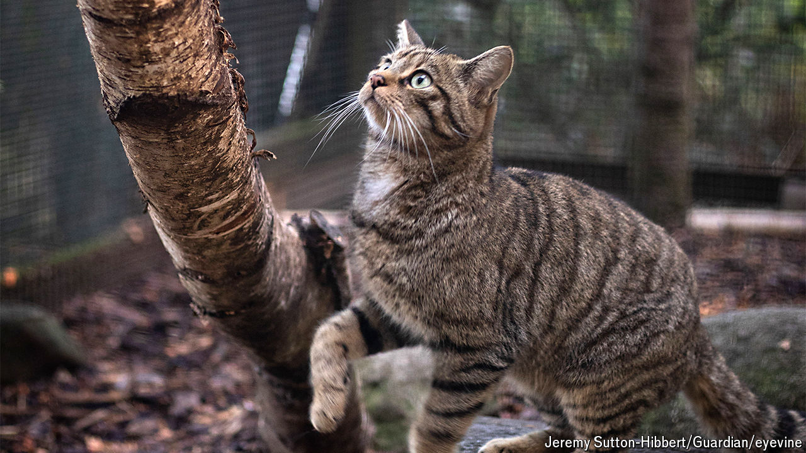

###### A Tale of Two Kitties

# A story of Scottish wildcats 

##### For some cats this is the best of times. For others, arguably a bit less good 

 

> Apr 11th 2024 

For cats in the Cairngorms there is some good news and some arguably less good news. For Scottish wildcats, a species that has been on the brink of extinction, these may turn out to be the best of times. A rising number of them—19 last year, another 20 this year if all goes to plan—are being released into the Cairngorms National Park, Britain’s largest. A number of Scottish wildcats have since been caught on camera stalking, chasing and generally looking cute and furry. 

For other cats, there is less to celebrate. The greatest threat to Scottish wildcats is not that they will be destroyed by violent altercations with wolves or hunters. It is that they will be seduced by the amorous approaches of other, less wild cats. “The biggest threat is… hybridisation,” says Dr Jo Howard-McCombe, a researcher at the Royal Zoological Society of Scotland. Wildcats and domestic cats are different species but they are capable of interbreeding. Even those wildcats that have been released in the Cairngorms are not wholly wild: their genomes show clear signs of mating with domestic cats. 

To prevent more of this kind of shenanigans, campaigners are encouraging locals to neuter all other cats. Such action is, they say, necessary and urgent. A concatenation of events, from habitat loss to hunting, has led to near-total population collapse of Scottish wildcats. Estimates are hard to make but the total population may be below 100. (Its very name indicates how rare it is across Britain: the only reason the animal is known as the “Scottish” wildcat is that it is extinct in England and Wales.) 

Conservationists are turning to rewilding as a result. This practice has recently been successfully used to restore populations of dormice, beavers and red kites in Britain. It has also proved helpful to that other endangered species, the English nobility: obsequious commoners now fork out hefty fees to wander around the estates of aristocrats who don’t mow their lawns.

But rewilding can cause problems. Species can move unexpectedly (beavers recently turned up in Helman Tor, in Cornwall) and reintroduced species can cause stress to those that are already there. Such as, for example, by causing them to be castrated. Conservationists are clear: humanely done, neutering is not harmful to the cat and is essential to stopping interbreeding. What the cats themselves think of this is less clear. 

In 1974 the philosopher Thomas Nagel wrote an essay titled “What Is It Like to Be a Bat?”. No one has yet written a paper called “What Is It Like to Be a Castrated Cat?” but the question is an interesting one, says Peter Pongracz, an expert in animal behaviour at Eotvos Lorand University in Hungary. Though he adds that the answer would probably be “fine”. Cats, he says, do not tend to suffer from existential angst over whether or not they will reproduce. Scotland is not going to become “the land of a bunch of sad cats”. Even if that were a risk, given the state of the wildcat population, neutering remains a far, far better thing to do now. ■


