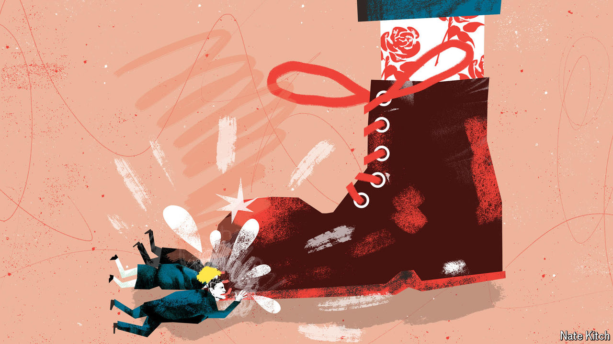

###### Bagehot

# Bootlicking: a guide to pre-election British politics 

##### Labour is not yet in power. But the honeymoon has already begun 

 

> Apr 10th 2024 

Daytime television is a surprisingly dangerous place for a politician. During the 2019 general-election campaign, Boris Johnson was chased into an industrial fridge by an intrepid reporter from “Good Morning Britain”, a chatty breakfast show. In 2012, during a live interview on “This Morning”, a usually lightweight late-morning show, a presenter handed David Cameron, then the prime minister, a list of politicians suspected of paedophilia.

No wonder Sir Keir Starmer looked apprehensive before a recent grilling from Lorraine Kelly, a daytime-TV host. He should not have been. Ms Kelly gushed about the Labour leader’s working-class roots for ten minutes. Rather than a list of predators, Ms Kelly produced only a mug with a young Sir Keir’s face on it as a reminder that he was—according to internet lore, if not to Helen Fielding, the actual author—the inspiration for Mark Darcy, the awkward but handsome lawyer from “Bridget Jones’s Diary”. 


Simpering television interviews with the man likely to be prime minister within a few months are now commonplace. Coverage of the shadow cabinet is similarly adulatory. Simply by mentioning the word “reform”, Wes Streeting, the shadow health secretary, is guaranteed a glowing write-up and a picture of him looking stern. Rachel Reeves, the shadow chancellor, gets the same treatment by praising Margaret Thatcher’s means, if not her ends. It does not stop there. One newspaper published a 2,000-word interview with Sir Keir about the virtue of learning the flute. It can mean only one thing: bootlicking season is upon us.

An assumption exists in Westminster that polls will narrow and scrutiny of Labour will increase as the election nears. So far, the direct opposite has happened. Labour’s polling lead remains a sturdy 20 percentage points, according to our . Sycophancy, not scrutiny, has been the order of the day as journalists, wonks and lobbyists scramble to win favour with the future government.

Glowing profiles of people who may prove useful sources at some point—“beat-sweeteners”, in the trade—come thick and fast. Sue Gray, Sir Keir’s chief of staff, has been lauded. Her flaws as a civil servant, such as a near-sociopathic desire for secrecy, are brushed over, and minor talents are hailed. “She’s pretty ruthless at timekeeping,” noted one portrait. Often the tone is of a primary-school teacher sending a report to a parent: “One Labour figure said Gray had been a good listener.” 

Everything turns upside down in bootlicking season. Flaws become strengths. Ms Reeves set out her view of the British economy in a lecture in March. “Its very dullness is rather exciting,” suggested one commentator. Others applauded the shadow chancellor for a “serious” intervention, as if the former Bank of England economist did well to resist the urge to start juggling. Vices become virtues. Sir Keir promising a bunch of left-wing policies to Labour members and then ditching them is commended as a leader of the opposition doing his “homework” rather than the usual term: lying. Even suggesting that Labour’s lead is fragile is a subtle means of sucking up—it is the message that Sir Keir’s advisers, who are paranoid about blowing their advantage, want to spread. 

The chin of the right-wing press is also smeared with boot polish. Almost every Labour leader has endured a mauling from , which prides itself on being Britain’s most pugnacious tabloid. Only Sir Tony Blair avoided such attacks. And that took years of effort and a 22-hour flight to Australia to win over Rupert Murdoch, the media mogul who owns it. By contrast Sir Keir spent a significant amount of his time as director of public prosecutions trying to jail Mr Murdoch’s journalists for phone-hacking.

If the  is still upset about that, it has a peculiar way of showing it. The newspaper recently painted Ms Reeves as a Thatcher-aping “iron chancellor”. When Sir Keir turned up for an interview on the’s new YouTube channel, he endured an entertainingly awkward few minutes being asked whether he had taken drugs while he was a lawyer. But the itself splashed on Sir Keir’s tabloid-friendly argument that Nike has been wrong to tamper with the flag on England’s new football kit. Perhaps bygones are bygones in bootlicking season. 

When it comes to business, the boot is supposedly on the other foot: it is Labour that is trying to woo business via a “smoked salmon offensive” led by Ms Reeves. This has it backwards. A government can tax, regulate and fine, squishing fat margins with a few strokes of a minister’s pen. The best a firm can manage is a threat to close a factory in a marginal seat and to sign a letter to the . So when Labour hosted a £1,000 ($1,270)-per-person business event at the Oval cricket ground in February, the place was full of public-affairs types with a taste for leather. 

We’re gonna need a bigger boot

Bootlicking always comes to an end. People cheer politicians on the way up and boo them on the way down. Mr Johnson was a unique asset before he became a unique liability. Theresa May went from a Brexit Boudica to the Maybot, a malfunctioning droid, in a few months. Rishi Sunak was once “Dishy Rishi”, the most popular politician in Britain, dazzling journalists with his ability to make a pivot table in Excel. The Excel skills remain elevated; the personal ratings do not. 

What is sometimes ascribed to a bias towards the Conservatives is often simply a bias towards power. Britain is so centralised that a competent government can bend political reality to its will, whether it be spending plans (which are treated as reality, no matter how absurd) or the news agenda (which is still driven by whatever announcements Downing Street makes). The Conservative government is in such a dire spot, however, that this magic has faded. Labour is not yet in power. But the honeymoon has already started. Tongue will meet leather for some time yet. ■


