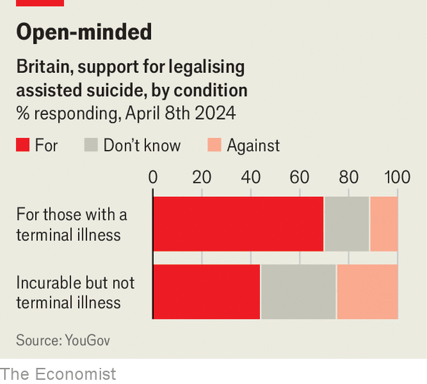

###### All things must pass

# Britain is moving towards assisted dying 

##### The public is already supportive. Now the politicians are catching up 

 

> Apr 11th 2024 

IN 2015 the Conservative party conference hosted a fringe meeting on assisted dying. There were, recalls Kit Malthouse, a Tory MP, three people in the audience—one of whom was his aide. Despondent, Mr Malthouse turned to a colleague and told him their prospects looked dreadful. “No,” the colleague replied, undaunted. “This is how gay marriage started.”

Assisted dying, though still controversial, is no longer a fringe issue in Britain. Bills that would allow it are already moving forward in Jersey, the Isle of Man and Scotland. The leader of the Labour Party, Sir Keir Starmer, openly supports a change in the law. He has promised a free vote (in which MPs are not pressed to follow a party line) on the issue in Parliament if, as expected, his party wins the next election. Rishi Sunak, the prime minister, is less effusive but has indicated he would allow time for a bill, too. Britain may be on the verge of its next big social reform.

 


That is not because of any big recent shift in public opinion, which was already supportive. According to YouGov, a pollster, over two-thirds of Britons support changing the law to allow someone to assist in the suicide of someone with a terminal illness (see chart). 

But there is a growing body of international evidence to point to. In recent years  have been passed in countries such as Australia and New Zealand; similar bills are set to be introduced in Ireland and France. Medical opinion is shifting. Following a survey of its membership in 2021 the British Medical Association, the largest doctors’ union, changed its stance from opposition to neutrality.

Politicians have taken note. The last time assisted-dying bills were debated in Westminster and in the Scottish Parliament at Holyrood, in 2015, both were soundly defeated. But now “it does feel like more and more colleagues are looking for reasons to support rather than excuses to oppose,” says Liam McCarthur, who introduced the new Scottish bill in March. The bill could become law there in 2025. 

It is hard to predict the outcome of a vote in Westminster, not least because the election will mean a big new intake of MPs. But the last time a vote was held, a smaller number of Labour MPs than of Tory MPs opposed assisted dying. In March Dignity in Dying, a campaign group, released polling which suggested majority support for the issue in every constituency. MPs may want to be on the “right side of history”, suggests Sarah Wootton, the group’s boss. 

That does not mean debate over the issue will be easy or comfortable. Many oppose assisted dying on principle, because they consider life sacred. Plenty more question how a law would ever be able to fully protect the most vulnerable patients. 

The Scottish bill, for example, proposes that an adult would need to be terminally ill and of sound mind to be eligible for an assisted death. Although in theory safeguards exist against the risk of coercion, there would be little to stop a patient choosing death because they feel like a burden, says Dr Matthew Doré of the Association of Palliative Medicine, a body of doctors that opposes assisted dying. They would have to reflect on their decision for 14 days before proceeding. “You get a longer warranty for your fridge freezer.”

Proponents of assisted dying argue that such concerns remain hypothetical. In Oregon, which legalised assisted dying in 1997, disability-rights groups have never received any complaints about coercion. Only two-thirds of those who receive medication there ever actually take it. Within the first year of a law being introduced  in 2016, a fifth of patients who applied for assisted dying could not proceed because they became too ill or died unassisted; a cooling-off period was later reduced from 15 days to two. 

Opponents also worry that the risks of abuse are greater in Britain given the strains afflicting the National Health Service. They point to the quality of end-of-life care, which is often patchwork and underfunded, and to stories of people in Canada given help to die because they are too poor or otherwise unable to get proper support. “We should be fixing the system, not introducing the idea that this is the way out,” argues Alistair Thompson of Care Not Killing, a campaign group. 

But again there are good counterarguments. In Australia assisted-dying laws were passed on the understanding that funding would also be increased for palliative care. Canadians who choose an assisted death are typically richer; and more than three-quarters of them receive palliative care. And one of the most compelling arguments for introducing assisted dying in Britain is that it is currently an option only for those rich and mobile enough to pay £15,000 ($19,000) for an assisted suicide in Switzerland.

Indeed, the worry for some proponents is that new laws will be drawn too tightly, not too loosely. When he was director of public prosecutions, Sir Keir was moved by the case of Daniel James, a young man who became quadriplegic following a rugby accident and whose parents faced prosecution for accompanying him to Switzerland. But under the proposed Scottish law, James would not have been eligible for an assisted death since his condition was not terminal. Owing to concerns about euthanasia, most conservative laws require that medications are self-administered. 

Jean Eveleigh suffers from Ehlers-Danlos syndrome, a degenerative disease, for which she has to take a colossal number of painkillers. She would support any bill to legalise assisted dying, but worries she would not qualify should her suffering ever get too much. “There would be nothing I could do: I can’t afford to go to Switzerland,” she says. The only jurisdiction in Britain considering assisted death for people with unbearable suffering is Jersey, after a citizen’s assembly there recommended in its favour. 

Legislators will also need to consider the likelihood that different parts of the British Isles will end up with different laws. On the Isle of Man, for example, a committee recently concluded that its residency requirement should be increased from one year to five, to deter people from other jurisdictions from flooding in. 

For all these complexities, a proper debate about assisted dying is long overdue. When assisted-dying laws are finally introduced “we will wonder what took so long,” says Mr McArthur. On that day, some will be fearful. Many others will be relieved. ■


