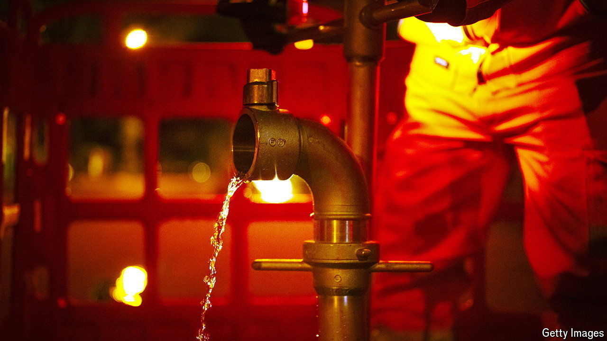

###### Pipe dreams

# How not to run a water utility 

##### Let Thames Water go into administration. But after that, water bills need to rise 

 

> Apr 9th 2024 

Clashes over the water supply turned deadly in “Chinatown”, a 1970s film set in Depression-era Los Angeles. “Middle of a drought, and the water commissioner drowns,” one character marvels. The casualties in Britain’s latest water-based drama are corporate. On April 5th the parent company of Thames Water, Britain’s largest water company, defaulted on £1.4bn ($1.7bn) of debt. An elaborate and protracted restructuring looms.

The list of culprits is long. One is the company’s heavily indebted financial structure. Its debt-to-equity ratio is 78%; the industry average is 68% and Ofwat, the regulator, suggests 55%. That debt is dispersed across a Byzantine corporate structure. Significantly, much of it is inflation-linked. In theory that shouldn’t be a problem; although inflation is up, water bills—the firm’s main source of revenue—are also inflation-linked. The problem is that debt payments are linked to the retail-prices index, which since 2020 has risen by ten percentage points more than CPIH, the inflation measure to which water bills are linked. Some of Thames Water’s bonds are pricing in a near-wipeout.

Next, mismanagement. Thames Water languishes near the bottom of Ofwat’s efficiency rankings. Sarah Bentley resigned as CEO in June, two years into an eight-year turnaround plan. Environmental fines have worsened the squeeze: the utility’s record on sewage overflows is pretty unsightly. Ofwat shares the blame for this: through most of its three-decade existence, the regulator has focused single-mindedly on keeping bills in check. That has sometimes come at the expense of maintaining and improving water infrastructure. A  hasn’t helped: the last major water-supply reservoir in England was completed in 1991.

Thames Water has lobbied Ofwat for special treatment: to pare back its fines and approve a large increase in bills. Letting shareholders off the hook in this way would be a mistake. If they don’t stump up more money, Thames Water should be put into special administration, a form of insolvency that keeps the utility running until new owners are found. As in a corporate bankruptcy, equity-holders would be wiped out and debt-holders would take a hefty hit. New owners could then take over the underlying assets without inheriting a crippling debt burden. 

Going into special administration would be a chance to make bigger changes, too. Sir Dieter Helm, a professor at the University of Oxford, has argued that Thames Water is unmanageably large. He suggests splitting out the jobs of water provision and sewage, as well as separating London from the rest of the Thames Basin.

But if Thames Water is an outlier, other water utilities share many of its problems. The crux of the issue is the . Water provision is a quintessential natural monopoly. Since competition between utilities is impossible, the government keeps privatised water companies on a tight regulatory leash. Ofwat sets the bills that companies can charge, determines what investments they can make and picks their rate of return.

 


These determinations are made every five years. The next review, covering the period from 2025 to the end of 2029, is set to conclude in December. Past iterations have been contentious. In 2019 Ofwat vetoed 30% of the investment on asset improvements proposed by the industry, saying the plans lacked a clear rationale and were not good value for money. Now Ofwat says its thinking has shifted and that it wants a step-change in investment. That means a commensurate step up in water bills to fund it, though by less than the companies’ opening bid of 31% in real terms (see chart).

The change of tone is welcome. But whether Ofwat will shift by enough is an open question. One bellwether will be the allowed rate of return, critical for attracting much-needed foreign capital. Ofwat has pencilled in 3.29% plus inflation (measured by CPIH). That is almost certainly too low given the rising risks in the sector and higher risk-free interest rates across the economy. After the difficulties of the past few years, investors will not be lured into the water by middling returns.

“Chinatown” ends in an expansion of Los Angeles’s water supply (as well as violence). Britain’s creaking water infrastructure needs an upgrade, too, given the pressures of population growth and climate change. That entails a lot more investment. The right ending to the Thames Water saga would involve pain for current shareholders and for future bill payers. ■


