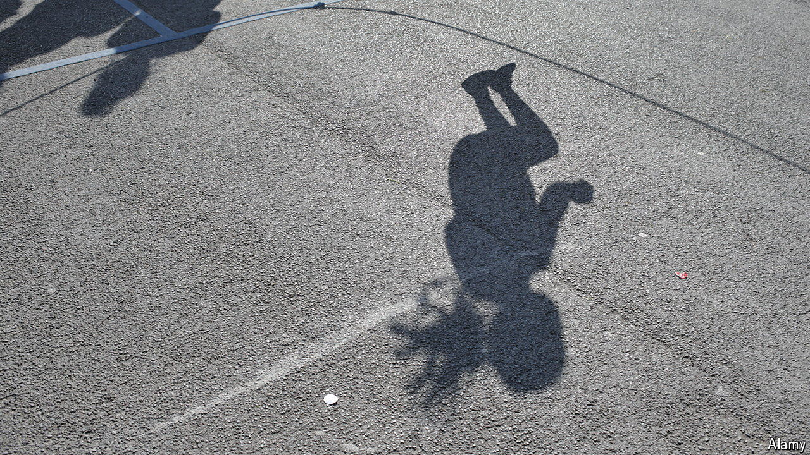
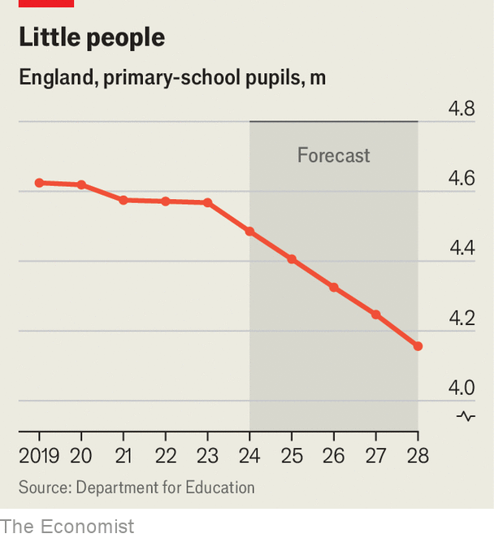

###### Playtime’s over

# Primary schools in Britain are beginning to close 

##### A baby bust is starting to work its way through the system 

 

> Apr 11th 2024 

The playground at Randal Cremer primary school in Hackney used to be boisterous. Now it feels like a “ghost town”, according to Jo Riley, the head teacher. Just 120 pupils play in an area made for three times that number. The school will close its gates for good later this year because it cannot attract enough children. Some parents have already moved their nippers elsewhere in anticipation of that day. 

Randal Cremer is one of four primary schools in Hackney that will shut or be merged due to low demand. Councils in other inner London boroughs, and a handful of other places, have announced similar plans. This is partly a familiar story of young families being priced out of certain areas by unaffordable housing. But shrinking school rolls are also an early symptom of a much deeper demographic trend. 

The birth rate in Britain has been in decline since 2010. It has fallen steeply in the past six years. In 2018 each woman in England and Wales had, on average, 1.65 children. By 2022 the figure was 1.49, the lowest on record. There is some variation but the rate has fallen significantly almost everywhere—from inner cities to suburbs, towns to villages—and seems to stem from changing social attitudes as well as less certainty around housing and employment. Demographers see little prospect of it bouncing back quickly, says John Ermisch of Nuffield College, Oxford. 

 


The is now starting to show up in schools. In the past five years the primary-school population in England has shrunk modestly, by around 1.2%. In the next five it will sink by 7.3%, according to the Department for Education (see chart). Like Randal Cremer, many schools will face questions about their viability. 

Schools receive nearly all of their funding on a per-pupil basis, but their main costs are relatively fixed. Fewer children can lead to some efficiencies. But the same room and teacher are needed whether there are 30 in a class or 25. Some local authorities will see their funding for primary education fall by more than a fifth in the next six years, calculates Robbie Cruikshanks of the Education Policy Institute (EPI), a think-tank. The risk is that smaller schools with less money will struggle to maintain educational quality. 

Some will not survive at all, a process that will be bumpy for a couple of reasons. The first is that councils find it difficult to make plans. Two decades of education reforms in England have notched up notable successes but also left a muddled landscape: some schools are accountable to local councils but newer academies and free schools are overseen by the education department. In England this second group accounts for around 40% of primary schools and 80% of secondary schools. 

Councils are responsible for managing changes in pupil demand across schools in their area. But academies and free schools do not have to co-operate with them by, for instance, taking on more or fewer pupils. Ms Riley points out that a new free school opened just half a mile away from her one in 2015, despite falling demand and Randal Cremer being rated “good”. In Islington, another borough in north London, the council has been forced to consider closing a school rated “good” after a half-empty one rated “inadequate” managed to turn itself into an academy. 

The second issue is that closures are rarely popular. Parents are often attached to the idea of a local school. They like the sound of smaller classes, even though the evidence suggests that reducing class sizes a bit does not make much difference to learning (cutting them down to around 15 pupils does, but that tends to be unrealistic in the state sector). In both Hackney and Islington, they have mounted campaigns to preserve undersubscribed schools. The dispute in Islington went to court, a strain on threadbare council finances. 

The EPI argues that the education department must force different types of schools to work together on strategies to manage falling demand. That may include giving councils more powers over local planning. This will become even more important as the baby bust reaches secondary schools. Politicians in Westminster will also face hard choices about where to put scarce resources: there are already calls to offset some of the reduction in school budgets with higher per-pupil funding. The baby bust may be making playgrounds quieter. But it will cause plenty of noise. ■ 


