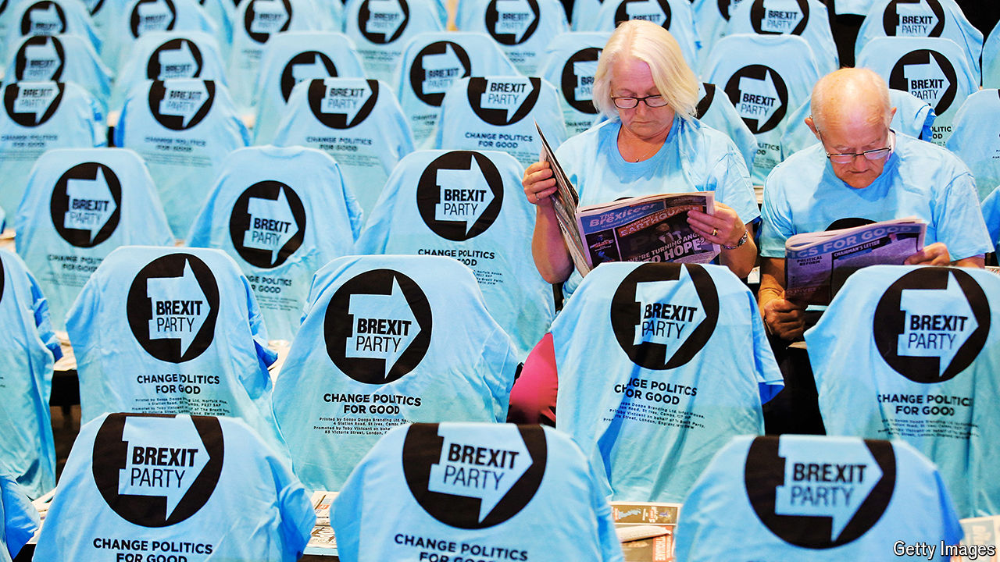

###### Je regrette quite a lot

# Why most people regret Brexit 

##### A majority of British voters now believe the split was a mistake 

 

> Apr 11th 2024 

IT IS RARE for voters to change their minds soon after referendums. Experience from Canada to Scotland, from Norway to Switzerland, suggests rather that opinions tend to move in favour of a referendum result more than they swing against it. But Brexit seems to be an exception. Since the 52-48% vote in favour of leaving the European Union in June 2016, the majority view among Britons has shifted, and especially so in the past two years, towards the conclusion that the decision was wrong (see chart). 

 


One way to take the temperature is to visit two English towns called Richmond which voted in very different ways in 2016. In Richmond-upon-Thames in London, which voted 69-31% to remain in the EU, opinion has hardened. Gareth Roberts, the Liberal Democrat council leader, notes that post-Brexit niggles such as longer border delays and more intrusive passport controls have helped to solidify local opposition. A Leave voter sitting by the river says he has not changed his mind, but that he is disappointed by the Tories’ failure to strike big trade deals outside the EU. 

The other Richmond, in north Yorkshire, voted 57-43% for Brexit. One Leaver in the market square echoes his southern counterpart by insisting that he still supports Brexit but he complains that it has not been properly done and that immigration has surged despite repeated Tory promises to reduce it. A local bartender says that she voted instinctively to leave but that, were the referendum re-run, she would work harder to understand what it would really mean. Stuart Parsons, a former mayor of Richmond, claims that several friends have changed their minds, especially small farmers who feel betrayed by the Conservatives and now fret about future lost public subsidies.

Such anecdotes chime with polls across the country. Research by UK in a Changing Europe (UKiCE), a think-tank, finds that most voters have not in fact changed their minds since 2016. But because as many as 16-20% of those who voted to leave have switched sides, compared with only 6% of those who voted to remain, the balance has swung against Brexit. The passage of time is also having its inevitable effect: older voters were overwhelmingly keen to leave the EU and younger ones were fiercely opposed to the idea. Don’t-knows and those who did not vote in 2016 now tend to break strongly against Brexit.

Explanations abound for the disillusionment. Sir John Curtice, a leading pollster who works with UKiCE, points especially to gloom about  since 2016, which he says matters more than irritation over immigration. Sarah Olney, the Liberal Democrat MP for Richmond Park, reckons that outright dishonesty on the part of the Leave campaign is to blame. Peter Kellner, a political pundit and former president of YouGov, a polling group, suggests that many Brexit supporters had no idea what would happen if they actually won. That differs sharply from the run-up to most other constitutional referendums. 

Changes in the political background matter as well. The Conservatives under Rishi Sunak, who happens to be the MP for Richmond in Yorkshire and is a keen supporter of Brexit, are associated in voters’ minds with the decision to Leave. Party disunity and the chaos of four prime ministers in five years have helped to discredit something with which the Tories are strongly identified. 

Just as the Tories have helped tarnish views of Brexit, so Brexit is likely to hurt the Tories at the next election. A chunk of people who voted Leave in 2016 say there should still be long-term benefits from quitting the bloc but argue that too little has been done to realise them. This group now leans against the Tories and may even prefer the , an insurgent right-wing party. In contrast, those who were against Brexit in 2016 think they were right to fear its economic impact; many who were Tory then now back Labour.

The anti-Brexit mood of a majority of voters is clear but that does not translate into a burning wish to refight old battles. Brexit may be unpopular but its political salience has faded. Even keen Remainers have doubts about the wisdom of starting a lengthy campaign to rejoin. The Labour Party’s decision to talk as little as possible about Brexit is understandable: the party hopes to regain “red-wall” seats in the north and the Midlands that backed Brexit in 2016 and then voted Tory in the 2019 general election. 

But if and when Labour does take office, there will be political wriggle-room to  with the EU. Some in the party talk not just of expanding today’s thin trade deal but of broader alignment with European rules. Tory attacks on such ideas as a betrayal of the 2016 vote are less likely to resonate when Brexit itself has lost its appeal for many.■


