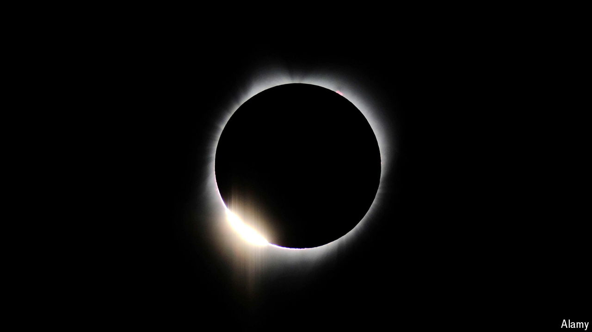

###### No-sun seekers

# Airbnb bookings for the solar eclipse reach astronomical levels 

##### Limited inventory and opportunistic travellers have kept the windfall in check 

 

> Apr 6th 2024 

THE MOON would not start to move between Earth and the sun until the morning of April 8th. But the business impact of this month’s , which started over the Pacific Ocean, cut a path across North America and ended in the Atlantic, was already plain to see. According to Jamie Lane of AirDNA, a travel-data firm, on a typical Sunday night in April around 30% of homes listed for short-term rental on Airbnb or Vrbo in areas in or around the eclipse’s path were occupied. A remarkable 92% of listings within the zone of totality had been booked for April 7th. Demand for homes just a few towns outside this roughly 180km-wide strip had barely changed.


The eclipse was visible from a handful of big or biggish cities, including Dallas, Indianapolis, Cleveland, Buffalo and Montreal. CoStar, a hotel-data provider, reckons that occupancy rates in those places were up anywhere from 12 percentage points (in Montreal) to 67 (in Indianapolis). The remaining rooms appeared to be available only at elevated prices. Ahead of the eclipse the  reported that nearly half of Super 8 motels in its path with rooms still available were charging at least twice the standard rate. 

Yet this path mostly covered areas with relatively scant lodging inventory. Of the 92,000 American short-term listings in this zone—just over 5% of the 1.6m in the United States as a whole—85,000 had been reserved for April 7th, compared with just 20,000 for the following Sunday. In theory, owners of short-term rental homes should have been able to jack up prices just like hoteliers, particularly in places with few hotel rooms. 

However, few Airbnb hosts run their properties with a hotel manager’s business acumen. AirDNA’s numbers show that in cities like Dallas and Niagara Falls, the majority of reservations for April 6th, 7th and 8th were made more than two months ago—far earlier than is typical. Savvy guests pounced on the standard prices on offer before hosts realised that they could raise them and still secure bookings. The average booking on April 7th went for $269, only slightly above the $245 level for April 14th. Combining the 65,000 additional bookings with a 10% increase in the nightly rate suggests that Airbnb and Vrbo hosts received a total revenue bump of merely $18m. Even counting the days before and after the peak of demand, when occupancy rates also exceeded 80%, only brings the cumulative additional turnover to a total of $44m.

The American hosts—and the digital platforms that live off commissions on such rentals—missed a trick, in other words. Unfortunately for both groups, they will not have another chance to learn from their mistake for a while. Alaskans have to wait until 2033 for the next total eclipse, North Dakotans and Montanans until 2044, and Floridians, tourist-friendlier providers of accommodation, until 2045. ■


