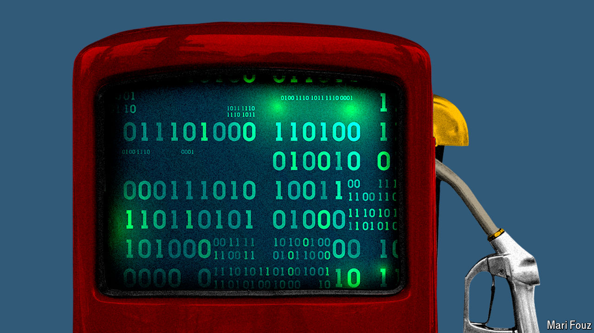

###### Schumpeter

# Generative AI has a clean-energy problem 

##### What happens when the AI revolution meets the energy transition 

 

> Apr 11th 2024 

When a colleague from this newspaper visited Sam Altman in 2022 at his home in San Francisco, he noticed two pairs of pink high-tops on a bookshelf. One had the logo of Mr Altman’s machine-learning startup, OpenAI. The other bore an emblem for Helion, a nuclear-fusion company that Mr Altman also backs. The entrepreneur is obsessed with both technologies—not just as foot fashion. He believes that the cost of intelligence and the cost of energy will fall in a mutually sustainable way. He calls it a “long and beautiful exponential curve”. 

Nasty, brutish and short, more like. Talk to utilities and data-centre operators and, though many share Mr Altman’s excitement about artificial intelligence (AI), they are grappling with an energy conundrum on which the future of three big economic shifts partly hinges: the AI revolution; the efforts to electrify swathes of the economy; and the fight against climate change. In a nutshell, “generative” AI, the sort behind OpenAI’s ChatGPT, has a ravenous appetite for electricity. It has landed, virtually out of the blue, on a global energy system that is already struggling to cope with alternative sources of power demand. As yet it is not clear whether there will be enough clean energy to meet everyone’s needs. 

At first glance, the solution looks simple. Data centres, such as those that companies like Alphabet, Amazon and Microsoft use to supply cloud-computing services, have over the past decade or so accounted for only 1-2% of global energy demand. For years the big-tech “hyperscalers” have harvested ever greater energy efficiencies from their server farms, even as the world’s computing workloads have soared. Moreover, they have invested heavily in clean energy to offset their carbon footprints. In America, electricity providers to the hyperscalers are only too keen to help. They have endured two decades of anaemic electricity demand and are desperate for new sources of growth. In recent earnings calls their bosses have promised tens of billions of dollars in investment over the next five years to pump more power to data centres. Last month one such firm, Talen Energy, sold Amazon a nuclear-powered data centre for $650m. So far, so promising. 

Generative AI changes the nature of the game, though. Since the days when they were the workhorses of the cryptocurrency boom, graphics-processing units (GPUs), the chips on which models like ChatGPT are trained and run, have been energy addicts. According to Christopher Wellise of Equinix, which rents out data centres, a pre-AI hyperscale server rack uses 10-15 kilowatts (kw) of power. An AI one uses 40-60kw. It is not just computation that gobbles up electricity. Keeping the racks of GPUs cool requires just as much oomph. Moreover, a lot of AI-related energy demand in the past year or so has come from trainers of “foundation” models like GPT-4, OpenAI’s latest offering. Widespread use of these as tools—for research, to make videos, to dress the Pope in Balenciaga—could put more strain on the grid. A search by ChatGPT may consume ten times the electricity of googling. 

It is early days in the generative-AI boom, so it is too soon to make hard and fast predictions. But informed guesses about the related rise in energy demand are striking. At the top of its range, the International Energy Agency, a global forecaster, says that by 2026 data centres could use twice as much energy as two years ago—and as much as Japan consumes today. It expects data centres to account for a third of new electricity demand in America over the next two years. Rene Haas, chief executive of Arm, a chip-design company, told the  this week that by the end of the decade AI data centres could consume as much as a quarter of all American electricity, up from 4% or less today. 

In America, two things further compound the complexities. The first is timing. The rise of generative AI coincides with a booming economy, with power consumption to match. Many power consumers want their energy to be zero-carbon, creating competition for a scarce resource. So do buyers of electric vehicles (EVs), the rise of which may have slowed but has not stopped. The second is the challenge of expanding the grid. Despite support from the White House, it is not easy for utilities to build new renewable capacity quickly. They suffer from supply-chain problems; by some accounts it takes three years to deliver a transformer, up from less than a year previously. Interest rates have pushed up the cost of wind and solar projects, making them harder to fund. Building new transmission lines is fiendishly tough. 

No doubt there will be creative thinking. The obvious solution is to make GPUs more energy-efficient. Nvidia, their biggest supplier, says it has already achieved this with its latest generation of AI servers. More efficient chips can, however, simply stimulate more usage. Another option, says Aaron Denman of Bain, a consultancy, is for the hyperscalers to use their deep pockets to help utilities overcome some of the grid constraints. He says that the real crunch may occur during certain parts of the year, such as unusually hot summer days when Americans switch on their air-conditioners. That means having small power plants on standby. The likelihood, though, is that these will be fuelled by natural gas, undermining the cloud providers’ climate commitments.

The nuclear option 

If shortages of renewable energy occur, it will come at a cost. No one knows yet how generative AI will make money. What people do know is that the cost of acquiring GPUs is rocketing. If the energy costs of running them soar, too, it could put the brakes on expansion. In addition, the electrification of the rest of the economy is highly cost-dependent; an AI v EV scramble for clean power would push up prices and serve neither industry well. By all means keep your fingers crossed for Mr Altman’s rose-tinted fusion dream to become reality. But don’t count on it. ■


