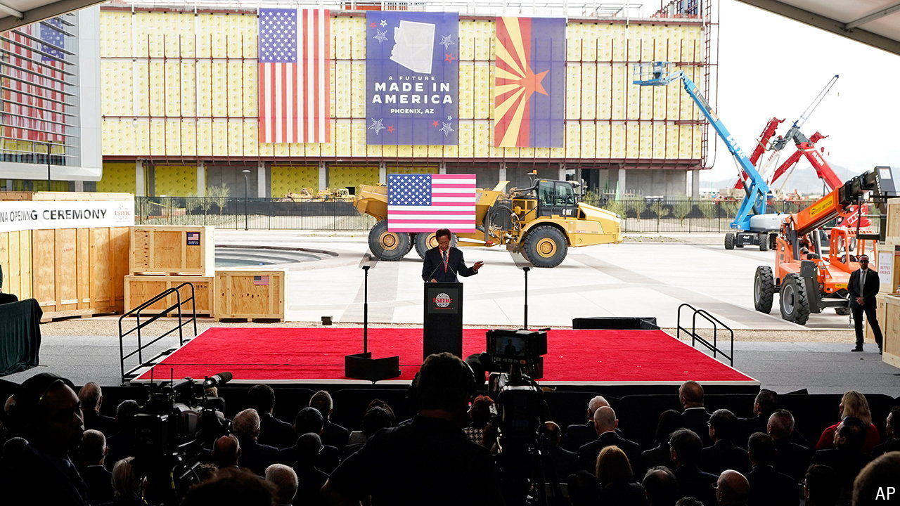

###### Raising Arizona

# TSMC’s American chipmaking plans grow $25bn more ambitious 

##### They still pale next to its Taiwanese endeavours 

 

> Apr 11th 2024 

TSMC makes about three-quarters of the world’s most cutting-edge computer chips. But even as it builds new factories (or fabs) in America and Japan, it has kept its most advanced production at home in Taiwan. Until now. On April 8th TSMC said that it intended to make “2-nanometre” chips, the current state of the art in chipmaking, at its planned fab in Arizona. It will also build a third factory in the state by 2030, on top of two already in the works. Its total American investments will rise from $40bn to $65bn. Uncle Sam will chip in another $6.6bn in grants and up to $5bn in loans.

In the eyes of Gina Raimondo, America’s commerce secretary, this shows the value of the CHIPS Act, a $50bn package of subsidies and tax credits aiming to revive domestic chipmaking and reduce America’s reliance on an island exposed to geopolitical and, as an earthquake this month in Taiwan reminded policymakers, seismic instability. But look closer and TSMC’s American ambitions may not be all that grand.

The CHIPS Act’s sweeteners notwithstanding, TSMC will continue to make most of its high-end chips at home, not across the Pacific. Building fabs in America takes longer and costs more than in Asia, though subsidies cover some of that difference. Finding workers to operate them is harder. And the factories will be smaller, which makes them more expensive to run. TSMC’s four “gigafabs” in Taiwan can each churn out more than 100,000 wafers a month, compared with 25,000 at its American “megafabs”. 

The company has not disclosed the capacity of its third plant in Arizona. But analysts expect that by 2030 it will produce around 80,000 wafers a month, all told. Bloomberg, a data provider, forecasts that TSMC’s Taiwan operation will make almost four times as many in 2024, much of it for American customers such as Apple and Nvidia. The company also plans to build “multiple fabs” in Taiwan. Morris Chang, TSMC’s retired founder, has called America’s chipmaking ambitions a “very expensive exercise in futility”. That is harsh—but probably true. ■


