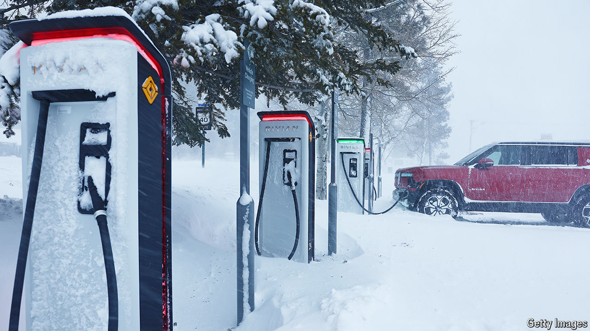
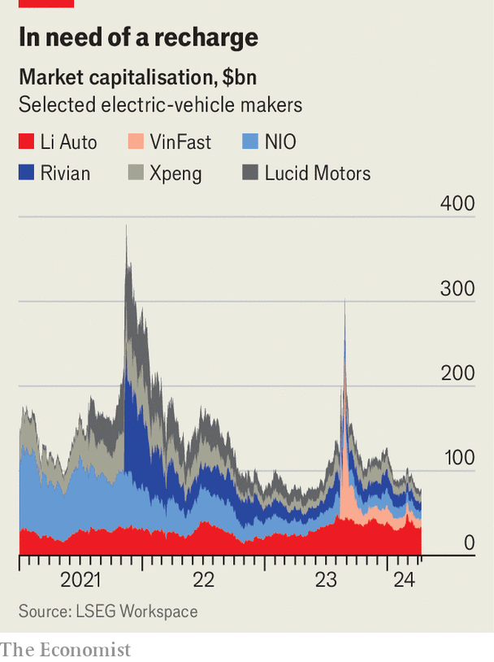

###### Unplugged

# Think Tesla is in trouble? Pity even more its wannabe EV rivals 

##### A fleet of electric-car startups is struggling to stay in business 

 

> Apr 7th 2024 

IN RECENT MONTHS Tesla has had a bumpy ride. In January the electric-vehicle (EV) pioneer warned that growth would be “notably lower” this year, as motorists’ enthusiasm for battery power loses charge. The same month it had to suspend most production at its giant factory near Berlin because of supply disruptions caused by turmoil in the Red Sea. Its market share in China, the world’s biggest EV market, is falling as it fends off cheaper local competition, especially from , which late last year briefly eclipsed Tesla as the world’s biggest EV-maker. 

Tesla hit another big pothole on April 2nd, when it reported that it had delivered fewer than 390,000 cars in the first quarter. That was down by 8.5% from a year ago—and considerably worse than already cautious Wall Street analysts were expecting. Tesla’s market value has slumped by a third this year, to less than $550bn. That is still more than any other carmaker, but less than half of the $1.2trn it was worth in 2021. Its boss, Elon Musk, is now only the world’s third-richest man. 

If you think the billionaire and his firm are having a rough time, spare a thought for their once-white-hot imitators. Three years ago, as Mr Musk showed that EV-making could be a trillion-dollar business, investors scrambled to back the newcomers promising to be the next Tesla. Two American startups that had gone public earlier that year were accelerating as briskly as their cars. The market capitalisation of Lucid Motors, founded in 2007, exceeded $90bn; that of Rivian, created two years later, hit around $150bn. Each was worth more than Ford, which was nearly 120 years old and sold 4m vehicles in 2021, compared with 125 for Lucid and 920 for Rivian. Chinese rivals such as Li Auto (founded in 2015), Nio and Xpeng (both in 2014) were also valued richly. In late 2021 the combined market value of five prominent Tesla wannabes neared a stonking $400bn. 

 


Today the five are worth $69bn, and falling (see chart). Fisker, an eight-year-old American firm, and HiPhi, a five-year-old Chinese one, have paused production. On March 25th a crumbling share price caused the trading of Fisker’s shares to be suspended and the firm may soon be delisted. HiPhi may be looking to sell itself to a big established Chinese carmaker. Faraday Future, which sold barely 11 of its upmarket EVs last year, is on the brink of bankruptcy. Lordstown, an American startup founded in 2018 to make electric pickups and SUVs, went bust in 2023. 

Even somewhat sturdier companies are struggling. VinFast, a Vietnamese firm which was set up in 2017 and went public last year, briefly—and bafflingly—almost touched $190bn in market value last August. It sold 35,000 EVs in 2023 and is now worth $9bn. Rivian sold 50,000 and is worth a fifteenth of its peak in 2021. Lucid sold 6,000 and is also worth one-fifteenth. Li Auto, Leapmotor, Nio and Xpeng, which delivered over 800,000 cars between them last year, have also seen their share prices shrivel. Only Li turns a profit, mostly because it makes nothing but hybrid vehicles; its market value plunged recently after it revealed its first pure EV. Surviving—let alone thriving—in what was meant to be a brave new electric world is proving tough. Which would-be Teslas, if any, will make it?

It was all meant to be different. Making a profit from internal combustion engines, whose thousands of moving parts drove up complexity and costs, required carmakers to churn out large volumes. In contrast, the new economics of battery power was supposed to bring down barriers to entry. The electric upstarts, aping Tesla by styling themselves as tech firms rather than manufacturers, reckoned they could keep costs in check by using simpler designs and reimagining the production process in a way stodgy incumbents could not. Components such as batteries and electric motors can be bought off the shelf, leaving the EV-makers to focus on developing whizzy software that would allow their vehicles to stand out thanks to a better experience in the car, from infotainment to mood lighting. Some companies, like Fisker, simply outsourced the metal-bending. 

These advantages have, however, failed to outweigh the old-school . Turning a profit from cars still requires producing perhaps 500,000 of them a year. “Scale is vital and manufacturing is hard,” sums up Tu Le of Sino Auto Insights, a consultancy. Though Tesla began as a luxury marque, putting big and pricey batteries in big and pricey cars, it always eyed the mass market. Profits started coming only once it overcame the near-death experience—“production hell”, in Mr Musk’s words—of trying to churn out high numbers of its cheaper Model 3.

The Tesla imitators, for their part, have taken too long to start production and are now taking too long to launch new models, says Pedro Pacheco of Gartner, a consultancy. The chances of survival by serving only a high-margin, high-price niche are low, notes Philippe Houchois of Jefferies, an investment bank. Just look at the possibly futureless Faraday Future, whose models start at $250,000. 

The electric insurgents are waking up to this reality. Their first step is to look downmarket. On March 7th Rivian announced three less expensive models that will start arriving in 2026. Last year Xpeng signed a deal with Didi Global, a Chinese ride-hailing giant, to make cheaper cars, and forged a partnership with Volkswagen to make mass-market EVs for China. Nio plans to launch two affordable sub-brands, Alps and Firefly. Even Lucid, whose cars go for as much as $250,000, plans to launch somewhat less exclusive $50,000 models within a few years. In October Leapmotor sold a 20% stake to Stellantis, a mass-market carmaker whose marques include Citroën, Chrysler, Fiat and Peugeot (and whose largest shareholder part-owns ’s parent company), for $1.6bn. The pair will team up to make EVs.

To succeed, these efforts must still produce a competitive product with one-of-a-kind features. Tesla pulled it off by putting technology first. The result was a desirable EV that wasn’t cheap but offered a svelte look and decent range; the legacy industry’s earlier attempts, such as the Nissan Leaf, were expensive but also ugly and short of juice. Despite a strong tech focus like Tesla, most startups have failed to deliver unique products at competitive cost, as they continue to lack scale, says Patrick Hummel of UBS, a bank. Now the novelty of clever EV technology “has worn off”, adds Becrom Basu of LEK, another consultancy. Good range and other once-cutting-edge tech are considered table stakes, including for incumbent carmakers with considerably beefier manufacturing chops.

Pretty, dull

As a result, many of the EV entrants lack unique big features. The cars made by Rivian and Lucid hardly stand out technologically. Their good looks alone do not justify the hefty price tag. Rivian’s cheapest electric pickup costs around $70,000, half as much again as Ford’s F-150 Lightning without offering one-and-a-half as much car. In Europe the Lucid Air, a luxury saloon, is a fair bit pricier than comparable electric BMWs or Mercedes. Fisker’s mass-market EVs are well designed but cost more than Chinese rivals with similar features, partly because its asset-light outsourcing strategy does not work well for cheaper cars. Why anyone would buy a VinFast is a mystery; reviews of its VF8 SUV were damning, to put it charitably.

With demand for EVs tepid many of the companies need more capital to keep going. On March 25th Lucid said it had managed to wangle another $1bn from its biggest investor, Saudi Arabia’s sovereign-wealth fund. Many rivals are not so lucky. Rivian had $9.4bn in net cash at the end of 2023 but will need billions more to build its cheaper models. Gone are the days when moneymen would throw treasure at any firm with a plausible PowerPoint presentation and an artist’s impression of a sleek electric car. Having put up billions of dollars in the years leading up to 2021, only to see billions torched, they look askance at missed deadlines, disappointing new models and ever receding prospects of profits. Their second thoughts have not been dispelled by the recent slowdown in growth of EV sales in many countries. Incumbent carmakers have no interest in rescuing the insurgents. Mr Hummel of UBS thinks that most of the startups will simply disappear. 

The likeliest to survive are the Chinese. One reason is that they appear to be the most innovative of the bunch. Nio’s upmarket EVs come with the option of battery swapping and, in China at least, a vast network of stations to do it. Drivers can be on their way in minutes without getting out of the car. Bernstein, a broker, considers Xpeng one of the global leaders in autonomous-driving technology.

They are also a relative bargain compared with their Western rivals. Both Nio and Xpeng, as well as Li Auto, have benefited from an impressive battery supply chain, dominated by Chinese firms like CATL, and steadfast support from central and local governments, notes Mr Le. That in turn has allowed the Chinese companies to keep both their costs and their prices down. The result has been rapid uptake of EVs in their giant domestic market, and with it greater economies of scale. 

Another wave of carmaking disruption may be swelling in China, courtesy of . In 2021 Seres, an established Chinese car firm, and Huawei, the closest thing China has to a national technology champion, created AITO, a new brand dripping with fancy tech. In January the venture delivered 33,000 cars. On March 28th Xiaomi, which has hitherto made smartphones, launched an SUV. The model, manufactured by BAIC, a state-owned car giant, and costing as little as $30,000, attracted 90,000 orders in 24 hours. 

Xiaomi aims to take on, at least at home, both Tesla and BYD. Alibaba, China’s e-commerce titan, and SAIC, another big state-owned carmaker, have been producing cars together for two years and sold 38,000 in 2023. Foxconn, a Taiwanese contract manufacturer better known for assembling iPhones for Apple, many of them in China, aspires to build half the world’s EVs for its own brand or others. If Tesla and any other survivors of the current EV shake-out thought they could catch a breath, they should think again. ■


