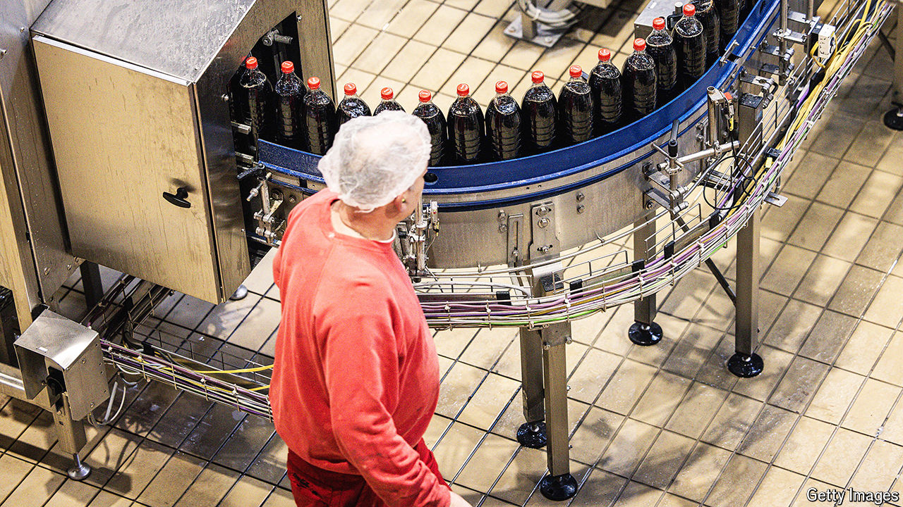
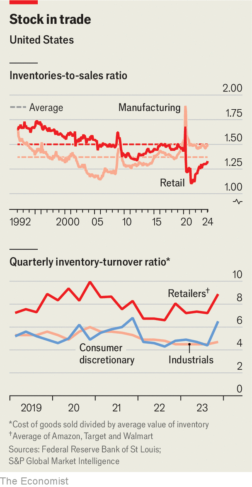

###### Strategy and stockpiles

# Who wields the power in the world’s supply chains? 

##### Inventories offer a clue 

 

> Apr 11th 2024 

SUPPLY-CHAIN managers cannot seem to catch a break. Consider the past month alone. A collapsed bridge has walled off the Port of Baltimore, one of the biggest on America’s east coast, until at least late May. A big earthquake in Taiwan, where a large share of microchips are made, has rattled an industry that increasingly underpins a lot of the world’s manufacturing. Houthi rebels in Yemen keep lobbing missiles at ships in the Red Sea, a critical passage for seaborne trade. America and China are still at loggerheads over their mutual economic entanglements. Wars still rack Ukraine and Gaza. 

These disruptions pale next to the snarl-ups of the covid-19 pandemic. But each is a reminder of the business lesson of that period: it is better to be safe than sorry. Politicians regularly hector companies to make their supply chains less “just in time” and more “just in case”. Corporate bosses often nod along, vowing to make their supplier networks shockproof. 

The simplest way to do this is to build bigger buffers, both of raw materials needed to produce whatever it is a company makes and of its finished product. In practice, this simple solution comes at a big cost. And that cost is rising. Higher interest rates make short-term loans used for day-to-day operations, including holding inventory and paying suppliers, dearer. A shortage of warehouse space means higher rents to stash the extra stocks. JPMorgan Chase, a bank, calculates that by the end of 2022, companies that make up the S&amp;P 1500 index of America’s large firms had more than $600bn trapped in working capital (the value of a business’s inventories plus what it is owed by customers minus what it owes suppliers). That was two-fifths higher than before the pandemic. The figure may have risen since.

Each dollar tied up this way is a dollar not invested in pursuit of future profits. No wonder, then, that chief executives, for all their resilience-related nodding, try to unshackle as many of those dollars as they can. Some are having considerably more luck than others. This reflects longer-running changes to the balance of power across the world’s supply chains.

 


For American business as a whole inventories look roughly as plump as they did on the eve of the pandemic, relative to sales. For all the talk of the supposed supremacy of “just in time”, such stockpiles had in fact been getting plumper for a decade before covid-19. Yet that general trend conceals a divergence. Retailers’ inventory-to-sales ratios have been coming down since the early 1990s. For manufacturers, they are (bar a brief pandemic spike) higher than at any time in the past 30 years (see chart). What is going on?

As supply chains became more efficient in the 1990s thanks to globalisation, retailers drove a harder bargain with suppliers. Being closer to the consumer, they had a better idea of what shoppers wanted and when they wanted it. At the same time, notes Niraj Dawar of Brand Strategy Group, a consultancy, limited shelf space allowed shop owners to demand that producers hold more inventory themselves in exchange for having their products displayed on those scarce shelves. Manufacturers’ hopes that e-commerce would strengthen their hand by giving them direct access to buyers were dashed; shoppers chose the convenience of e-emporiums such as those of Amazon, Target and Walmart. Retailers’ pandemic-era willingness to let suppliers dictate prices and the timing of payments and deliveries, just to get goods on shelves, proved to be a blip.

Technology has bolstered retail further. Consumer-goods firms used to know more about shopping habits, recalls the chief executive of a giant one. Now “retailers have the insights,” and these are based on real purchasing behaviour, not market research. This, he says, is putting pressure on firms like his to deliver “on time in full” (otif). If they cannot, that means lower sales, adds the supply-chains chief at another big consumer-goods firm.

The OTIF motive

OTIF requires suppliers to do one of two things. They can use forecasts to make products in advance, and keep their fingers crossed they made the right amount. The alternative is to build spare production capacity, which allows them to react to changes quickly without having to hold more inventory. “Companies can’t afford to simply increase their inventories and not address the bigger structural resiliency efforts,” says Mourad Tamoud, who oversees the supply chain of Schneider Electric. The French maker of electrical equipment has built an extra factory in two regions and plugged them into a more local network of suppliers.

Those extra factories cost money to build and maintain, which can hurt profitability if they run with plenty of idle capacity. And demand forecasts can be wrong, especially at a time when supply chains are backed up with goods which have left factories but have yet to be sold by distributors or retailers. Nicole DeBlase of Deutsche Bank calculates that for many large categories of products, including car parts, machinery, semiconductors and consumer electronics, the value of such “channel inventory” is between 30% and 110% higher than at the end of 2019. So long as all of it sits on resellers’ balance-sheets, they are unlikely to order more from manufacturers. This causes finished goods to pile up at factories, which then prefer to hold off on procuring their inputs—and so on down the value chain. 

Whether by investing in spare capacity or betting on the size of spare stocks, it is the manufacturers that pick up the tab. And this tab grows with distance to the consumer. Makers of industrial goods are turning over their stocks more slowly than sellers of consumer products. But whatever they make, manufacturers are trying to ease the pain. A common tactic is to cut down the variety of goods they produce. Hasbro, a toymaker, said in February that it was refocusing on “fewer, bigger, better” brands. Coca-Cola has cut the number of its brands in half over the past few years. Newell Brands, which makes everything from Sharpies to strollers, has trimmed its range of scented Yankee candles from 200 to 150. GE Vernova, which makes power-generating equipment, used to sell nine types of nacelle, a wind-turbine’s central hub. Now it makes three. “It’s easier to juggle three balls than nine—always,” sums up GE Vernova’s chief executive, Scott Strazik. 

Producers of hot products will always be able to dictate terms—and prices—to buyers. But what counts as a hot product can itself change rapidly, ultimately as a function of what consumers want. A shortage of semiconductors between 2020 and 2022 strengthened chipmakers’ hand. A subsequent glut in 2023, after everyone who wanted a new laptop, smartphone or car had bought one, weakened it. For manufacturers—of chips and everything else—inventory aches and pains are increasingly a chronic condition. ■


