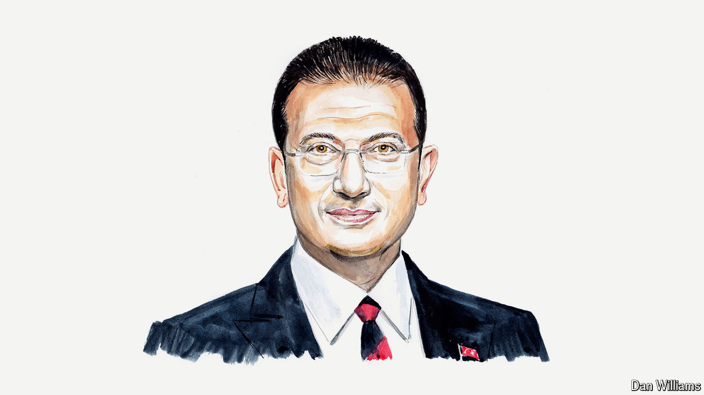

###### Erdogan humbled

# Ekrem Imamoglu on Turkey’s renewed faith in democracy 

##### Recent elections have upended the country’s politics, says Istanbul’s mayor 

 

> Apr 10th 2024 

THE RESULTS of the local elections held on March 31st are a milestone in Turkey’s history. With most local power now entrusted to the political opposition by voters, Turkey is no longer devoid of options; its trajectory is firmly set towards democracy again.

Despite unfair competition, especially in the allocation of state resources to the ruling party and its candidates and government control of the media, the opposition Republican People’s Party (CHP), of which I am a member, emerged victorious. In Istanbul, government officials and the president actively campaigned to support my opponent in the mayoral election. We won even though other opposition parties, which had allied themselves with the CHP in last year’s elections, abandoned our coalition and ran their own candidates.

This victory showed that true democratic power lies in the hands of the people. This was a vote of confidence in a new form of municipal governance that we have termed the “Istanbul Model”. This model prioritises equality, civic participation in the democratic process and more effective economic and social-development policies at the local level.

On March 31st voters elected social-democratic candidates not only in Istanbul and its districts but across Turkey, redrawing the electoral map. Their message is clear. From now on they want to see a country governed by the rule of law and democracy. They reject divisive policies and authoritarianism. They envision a united Turkey, not one torn apart by polarisation. Furthermore, this election result was a protest against the deepening economic crisis: soaring inflation, rising unemployment and a cost-of-living squeeze. 

The current government, which has held power for 22 years, has seen a loss of support from key voter groups including young people, women, blue-collar workers and pensioners. President Recep Tayyip Erdogan and his Justice and Development (AK) party suffered heavy setbacks in major cities, with their support concentrated mainly in rural areas. Conversely, the CHP won unprecedented support in central and eastern Anatolia, signalling a shift in political dynamics across Turkey.

The electoral outcome has infused the democratic opposition with new energy. Just a year ago voters narrowly supported Mr Erdogan in the presidential election. Since then the CHP has made leadership changes and launched a process to radically revamp its programme. The people of Turkey have recognised and welcomed this shift in direction. They have a strong desire for change.

The election has also shown that citizens can form much stronger alliances than political elites. Even if parties and political leaders lose hope in democracy, citizens do not. As the democrats of Turkey, we are committed to expanding this grassroots alliance. The future of Turkish democracy and the country’s prosperity hinges on it.

The past two decades have seen a crisis in democracy, with authoritarian governments coming to power around the world. Driven by populism and polarisation, this upheaval has stoked global uncertainties, prompting people to question whether the end of the democratic era is near.

For Turkey, however, March 31st marked the opposite: the end of the erosion of democracy. It is a turning-point that carries profound implications, not only for Turkey but also for its immediate region and beyond. It shows how authoritarian tendencies can be challenged and serves as an example to the world. In many countries voters are entrenched in their partisan affiliations. Turkey has demonstrated that this need not be the case. When coherent and credible alternatives for governance are presented, voters are willing to change their preferences and reject populist authoritarianism.

The task now for elected mayors, including myself, is to ensure that a common set of rules for accountable local governance is consistently implemented. This approach will require reliable internal monitoring and assessment of public services in CHP-held jurisdictions. 

At the same time, we will look to co-operate with the government to address our cities’ and the wider country’s chronic problems, particularly in earthquake and disaster preparedness and management. We will take measures to bolster our economy, democracy and legal system by developing a comprehensive set of reform proposals.

The CHP has now emerged as the strongest alternative to Mr Erdogan’s AK for the leadership of the country. Over the next five years social-democratic mayors will govern municipalities that account for more than 70% of Turkey’s population and almost 80% of its economy. As we move towards the next presidential and parliamentary elections, changes at the local level will lay the groundwork for broader changes on the national stage.

Regardless of future efforts by Mr Erdogan’s populist regime, Istanbul and Turkey will stand as symbols of freedom, democracy and social harmony. A new political ethos that puts the people first will prevail over authoritarian populism. Following a generation marked by democratic decay and economic decline, the Republic of Turkey enters its second century with a renewed faith in democracy. ■


