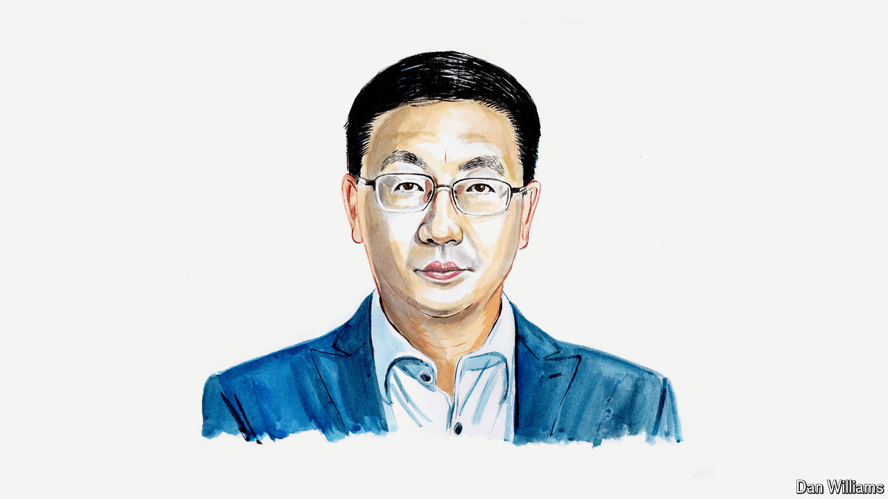

###### A Chinese view of Russia

# Russia is sure to lose in Ukraine, reckons a Chinese expert on Russia 

##### Feng Yujun says the war has strained Sino-Russian relations 

 

> Apr 11th 2024 

THE WAR between  has been catastrophic for both countries. With neither side enjoying an overwhelming advantage and their political positions completely at odds, the fighting is unlikely to end soon. One thing is clear, though: the conflict is a post-cold-war watershed that will have a profound, lasting global impact.

Four main factors will influence the course of the war. The first is the level of resistance and national unity shown by Ukrainians, which has until now been extraordinary. The second is international support for Ukraine, which, though recently falling short of the country’s expectations, remains broad. 

The third factor is the nature of modern warfare, a contest that turns on a combination of industrial might and command, control, communications and intelligence systems. One reason Russia has struggled in this war is that it is yet to recover from the dramatic deindustrialisation it suffered after the disintegration of the Soviet Union.

The final factor is information. When it comes to decision-making, Vladimir Putin is trapped in an information cocoon, thanks to his having been in power so long. The Russian president and his national-security team lack access to accurate intelligence. The system they operate lacks an efficient mechanism for correcting errors. Their Ukrainian counterparts are more flexible and effective.

In combination, these four factors make Russia’s eventual defeat inevitable. In time it will be forced to withdraw from all occupied Ukrainian territories, including Crimea. Its nuclear capability is no guarantee of success. Didn’t a nuclear-armed America withdraw from Korea, Vietnam and Afghanistan?

Though the war has been hugely costly for Ukraine, the strength and unity of its resistance has shattered the myth that Russia is militarily invincible. Ukraine may yet rise from the ashes. When the war ends, it can look forward to the possibility of joining the European Union and NATO.

The war is a turning-point for Russia. It has consigned Mr Putin’s regime to broad international isolation. He has also had to deal with difficult domestic political undercurrents, from the rebellion by the mercenaries of the Wagner Group and other pockets of the military—for instance in Belgorod—to ethnic tensions in several Russian regions and the recent terrorist attack in Moscow. These show that political risk in Russia is very high. Mr Putin may recently have been re-elected, but he faces all kinds of possible black-swan events.

Adding to the risks confronting Mr Putin, the war has convinced more and more former Soviet republics that Russia’s imperial ambition threatens their independence, sovereignty and territorial integrity. Increasingly aware that a Russian victory is out of the question, these states are distancing themselves from Moscow in different ways, from forging economic-development policies that are less dependent on Russia to pursuing more balanced foreign policies. As a result, prospects for the Eurasian integration that Russia advocates have dimmed.

The war, meanwhile, has made Europe wake up to the enormous threat that Russia’s military aggression poses to the continent’s security and the international order, bringing post-cold-war EU-Russia detente to an end. Many European countries have given up their illusions about Mr Putin’s Russia.

At the same time, the war has jolted NATO out of what Emmanuel Macron, the French president, called its “brain-dead” state. With most NATO countries increasing their military spending, the alliance’s forward military deployment in eastern Europe has been greatly shored up. The addition of Sweden and Finland to NATO highlights Mr Putin’s inability to use the war to prevent the alliance’s expansion.

The war will also help to reshape the UN Security Council. It has highlighted the body’s inability to effectively assume its responsibility of maintaining world peace and regional security owing to the abuse of veto power by some permanent members. This has riled the international community, increasing the chances that reform of the Security Council will speed up. Germany, Japan, India and other countries are likely to become permanent members and the five current permanent members may lose their veto power. Without reform, the paralysis that has become the hallmark of the Security Council will lead the world to an even more dangerous place.

China’s relations with Russia are not fixed, and they have been affected by the events of the past two years. Russia’s foreign minister, Sergei Lavrov, has just visited Beijing, where he and his Chinese counterpart once again emphasised the close ties between their countries. But the trip appears to have been more diplomatic effort by Russia to show it is not alone than genuine love-in. Shrewd observers note that China’s stance towards Russia has reverted from the “no limits” stance of early 2022, before the war, to the traditional principles of “non-alignment, non-confrontation and non-targeting of third parties”.

Although China has not joined Western sanctions against Russia, it has not systematically violated them. It is true that China imported more than 100m tonnes of Russian oil in 2023, but that is not a great deal more than it was buying annually before the war. If China stops importing Russian oil and instead buys from elsewhere, it will undoubtedly push up international oil prices, putting huge pressure on the world economy. 

Since the war began China has conducted two rounds of diplomatic mediation. Success has proved elusive but no one should doubt China’s desire to end this cruel war through negotiations. That wish shows that China and Russia are very different countries. Russia is seeking to subvert the existing international and regional order by means of war, whereas China wants to resolve disputes peacefully.

With Russia still attacking Ukrainian military positions, critical infrastructure and cities, and possibly willing to escalate further, the chances of a Korea-style armistice look remote. In the absence of a fundamental change in Russia’s political system and ideology, the conflict could become frozen. That would only allow Russia to continue to launch new wars after a respite, putting the world in even greater danger.■


