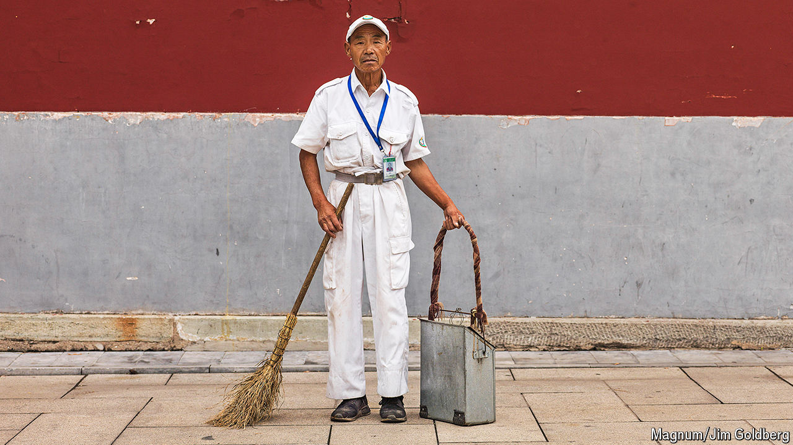
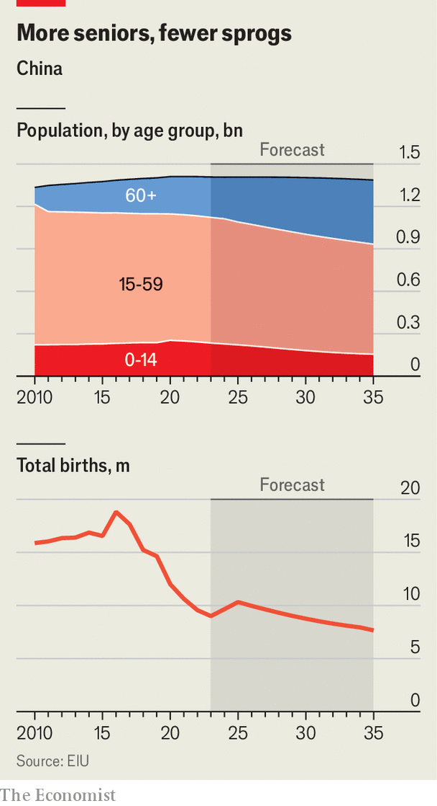

###### An ageing autocracy

# China’s high-stakes struggle to defy demographic disaster 

##### The Communist Party puts its faith in robots, gene-therapy and bathing services 

 

> Apr 9th 2024 

IF CHINA’S OLD people formed their own country, it would be the fourth most populous in the world, right behind America. This silver-haired state would be growing fast, too. China’s over-60 population sits at 297m, or 21% of the total. By 2050 those figures are expected to reach 520m and 38%. Yet demographers describe China’s future as greyer—and smaller. While its older cohorts are growing, younger ones are not (see chart). China’s total population declined for the second year in a row in 2023. Its labour force has been shrinking for most of the past decade.

 


