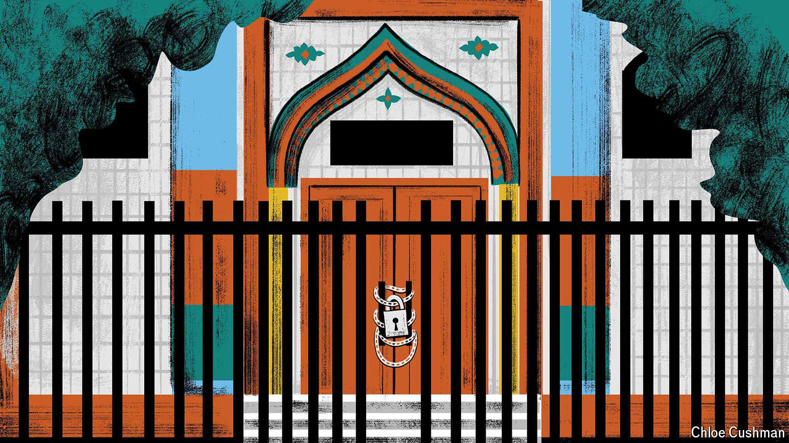

###### Chaguan

# What Ramadan is like in Xinjiang 

##### Our columnist visits a harshly controlled region 

 

> Apr 11th 2024 

CHINA’s COMMUNIST PARTY has a message for Muslim citizens. It holds their religious freedoms dear—with a special emphasis on the freedom not to believe. The right to be secular runs like a thread through religious regulations enacted this year in Xinjiang, the far-western region that is home to 12m Uyghurs and other Muslim minorities. The revised rules impose new controls on everything from religious teaching to mosque architecture, which should reflect Chinese style. The regulations talk of extremists warping minds and promoting terrorism. To prevent this, the rules state, no organisations or individual shall induce or coerce locals to believe or not believe in any religion.

This is in part a euphemism for enhanced controls on religion—in a region that at the peak of a security campaign in 2018 and 2019 saw perhaps a million of its Muslim residents locked in re-education camps. In part, an old argument is being revived. The right to believe or not believe is in China’s constitution. But a propaganda line is also taking shape: namely, that harsh rule in Xinjiang protects its residents’ free will.

