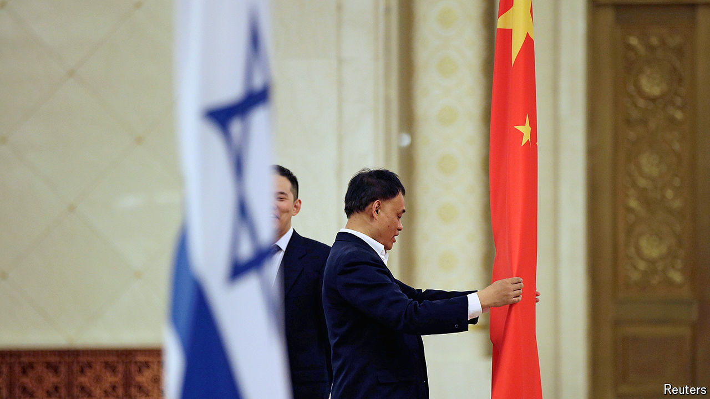

###### A relationship under fire

# Will China’s ties with Israel survive the Gaza war? 

##### Some Israelis are rethinking the country that refuses to call Hamas a terrorist group 

 

> Apr 10th 2024 

THERE IS LITTLE doubt which side China favours in the Gaza war. Its muted response to the October 7th attacks on Israel—in which it failed to condemn the perpetrator, Hamas—stands in sharp contrast to its denunciation of Israel’s actions since then. Just days after the war began, the Chinese foreign Minister, Wang Yi, said that Israel had already gone “beyond the scope of self-defence”.

But China’s criticism belies a more complicated relationship with Israel, one that leaders in Beijing have long tried to cultivate. Israel has reciprocated, with its prime minister, Binyamin Netanyahu, once calling their ties a “marriage made in heaven”. The war is not the first test of that bond. Now, though, Israelis are asking new questions about their putative partner.

