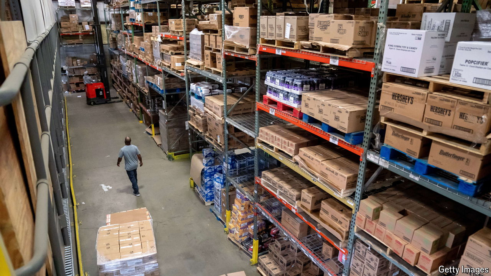

###### Barely gettin’ by

# Adelle Waldman’s new novel follows workers in a big-box store 

##### “Help Wanted” is based on the author’s own stint employed by one 

 

> Apr 11th 2024 

By Adelle Waldman. 

Adelle Waldman’s sharp-eyed observations of intellectuals in Brooklyn chasing book deals and bedmates made her first novel,  (2013), a hit. For her follow-up, she has traded the excesses of the urban elite for the struggles of unskilled workers farther afield. This may sound dreary, but “Help Wanted” is a lively, humane book.

To write about the employees of a big-box store in upstate New York, Ms Waldman spent months working at one herself, earning $12.25 an hour unloading trucks of merchandise at 4am. Many of her colleagues had been working at the shop for years, but their hours were limited and unpredictable, which made it hard for them to make plans, get a second job or reliably cover their bills. 

Town Square, the shop in “Help Wanted”, is a rare source of jobs in a town that has seen better days. The fictional Potterstown still hasn’t recovered from losing an office of IBM, a computer firm, to Mexico decades ago. The employees who show up to the “dungeon-like” warehouse in the small hours are not thrilled by their lives, but they are grateful to be there. 

Ms Waldman probes the needs of this motley morning team, such as Nicole, a young mother with an unemployed fiancé, who hides her anxiety about how she will feed her daughter beneath “an air of boredom and free-floating hostility”. These affectionate portraits chronicle the rough luck of people who cannot afford university and who struggle to make ends meet or, in some cases, to stay out of prison. 

Yet the book’s light tone and brisk pace keep it from getting bogged down. The novel’s drama comes from a scheme the workers concoct to get rid of their cartoonishly terrible manager by getting her promoted, which would also open up a rare managerial job at the store. Each character dreams of the life they might lead if only they had a salary and benefits.

The employees of Town Square enjoy their shared rituals and take pleasure in their “sense of mastery” as they expertly stack boxes and arrange displays. Their pride is real but fragile, threatened by greedy employers, monopolistic  and the prospect of , which looms ominously near the end of the book. ■


