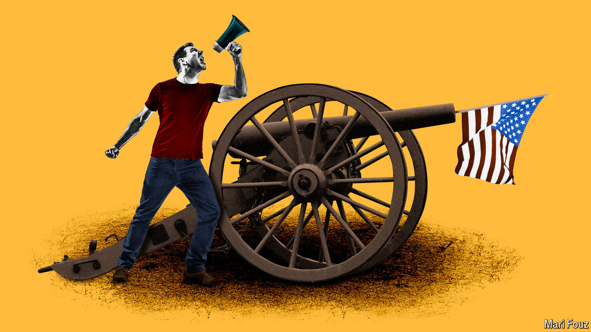

###### Return to Gettysburg

# Americans are turning to stories of civil war, real and imagined 

##### The real risks America faces are more insidious 

 

> Apr 11th 2024 

CALIFORNIA AND Texas, calling themselves the Western Forces, have seceded from the Union. Other states are following suit. The president, installed for an unconstitutional third term, vows that the uprising will be quashed quickly. He harnesses the full strength of America’s army and authorises the use of drone strikes on civilians. The Western Forces march on, determined to take the White House. 

“Civil War” arrives in cinemas on April 12th. The film does not offer an explanation of how this fictional version of America descended into chaos; instead, it follows a group of journalists and immerses the viewer in the fog of war. According to , the writer-director, anyone who has followed American politics in recent years will “know exactly what the fault lines and pressures are”. Perhaps he sees no need to point out the country’s bitter polarisation, the loss of faith in the organs of government or the threat posed by a former president who thinks  are for other people. 

In the wake of the attacks of January 6th 2021—when a mob of Donald Trump’s supporters  in an attempt to block the transfer of power—the threat of insurrection has felt uncomfortably real. A full-scale civil war remains wildly improbable, given the strength of America’s institutions and the professionalism of its armed forces. Yet according to a poll conducted by YouGov in 2022, 43% of Americans think such a war is “at least somewhat likely” to break out in the coming decade. Nearly 25% want their home state to secede from the Union. Marjorie Taylor Greene, a Trumpier-than-Trump congresswoman from Georgia, has said that: “We need to separate by red states and blue states.” In 2021 the , a left-wing magazine, ran an essay titled “The case for blue-state secession”.

For some Americans, then, “Civil War” offers a horrifying vision of the future. “This isn’t just a film. It’s a premonition,” one person wrote underneath the trailer on YouTube. Trump fans have declared that the movie is “predictive programming” as “there will be a civil war after they use illegals to steal the 2024 election.” 

The film joins a burgeoning genre: writers are gripped by the idea of a second American civil war. In a novel from 2017 by Omar El Akkad, some southern states secede after the federal government bans fossil fuels. In “DMZ” (2022), a miniseries, America is divided between the United States and the secessionist Free States. 

In “Flyover”, an absorbing novel by Douglas Kennedy which came out last year in France (it is awaiting publication in English), the United States has been succeeded by the United Republic and the United Confederacy. The United Republic is an offshoot of the Democratic Party and a purported bastion of progressivism on the coasts; the United Confederacy, its Republican counterpart, is a Christian theocracy spanning the Midwest and the South. “What I am trying to do is just say, ‘Pay attention here,’” Mr Kennedy reflects.

It is not just storytellers, either. Academics have also been ringing alarm bells in books such as (2022) by Barbara Walter, a political scientist, and “The Next Civil War” (2022) by Stephen Marche, an essayist. Both assert that the Union is in a fragile, rancorous state. “The United States is a textbook example of a country headed towards civil war,” Mr Marche has claimed, pointing to, among other things, Americans’ lack of faith in the merits of democracy. (According to the Pew Research Centre, a pollster, last year public trust in the federal government reached a near-record low.)

Many Americans prefer accounts of their country’s actual civil war to speculation about a future one. Some 60,000  have been published on that conflict—more than the number of soldiers who died at Gettysburg, the war’s bloodiest battle. The fighting in 1861-65 “holds a central place in the American imagination”, says Fredrik Logevall, a professor of history at Harvard University. “Each generation since 1865 has assessed and then reassessed the meaning of the civil war.”

Andrew Preston, a historian at Cambridge University, says the war “is a touchstone whenever Americans are in a crisis”. In the 1930s, amid the Great Depression, Franklin Roosevelt repeatedly invoked the conflict to underline the seriousness of the economic situation. He also intended to provide some comfort to the American people, for if their ancestors could go through hell and survive, they could too. 

During the civil-rights movement of the 1960s American politicians looked to  as someone who abolished slavery and acted “with malice toward none; with charity for all; with firmness in the right”. In 1963  chose to deliver his “I Have a Dream” speech on the steps of the Lincoln Memorial in Washington, to invoke the legacy of the president and to show that the fight for racial equality that Lincoln had championed was not yet finished. Yet, as divided as America looked in the 1930s and 1960s, Professors Logevall and Preston insist there was never any serious talk that a second civil war would erupt. 

Today, breathless histories of the civil war advertise their lessons for the present day. In “The Demon of Unrest”, published later this month, Erik Larson adroitly chronicles the events in the lead-up to the South’s secession in 1861. He follows a cast of characters and uses diaries and letters to trace their thinking. “What I was trying to chronicle, really, is the forces that caused Americans to actually begin to imagine the wholesale killing of one another, and how that came to pass.”

During the research, Mr Larson says he was struck by the similarities in political discourse between the mid-19th century and today. Several novelists envisioned that a civil war would break out between northern and southern states. Much as Mr Trump’s followers are convinced that the election of 2020 , southern states did not recognise Lincoln as the legitimate president, even though he had been democratically elected. This era of history is not “some dusty old thing from the past. This is the story for now,” says Mr Larson.

In looking to that past, many today yearn for a political leader like Lincoln. In 2022 Jon Meacham released “And There Was Light”, a paean; last October “Differ We Must”, an admiring biography by Steve Inskeep, became a bestseller shortly after publication. Both books emphasise that lawmakers have much to learn from Lincoln’s ability to reach across divides. 

A prudent assessment of the risks facing modern America would focus on less dramatic ones, such as Mr Trump’s probable undermining of democratic institutions during a second presidency, or the spread of hate-fanning falsehoods. But civil war makes for more exciting movies. In Mr Garland’s film, the Western Forces eventually reach Washington, DC, and a bomb goes off at the Lincoln Memorial, ripping out the neoclassical columns. ■


