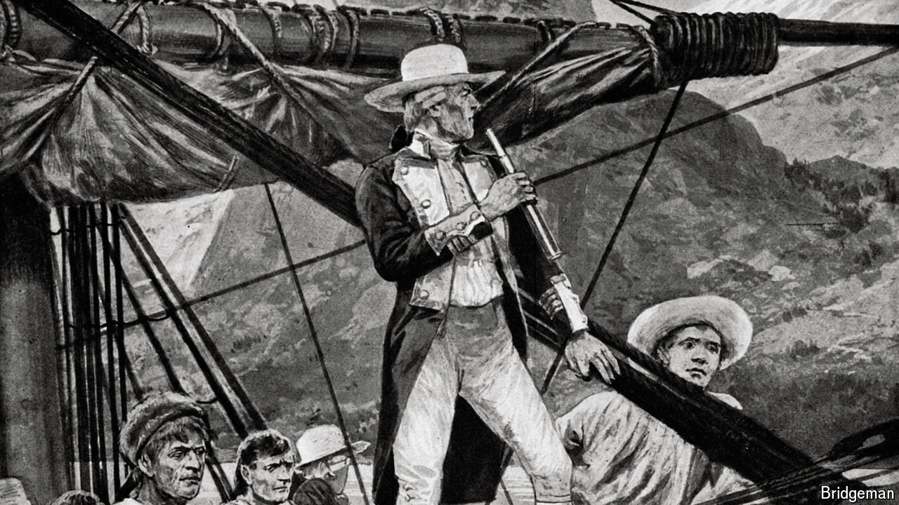

###### Sailing close to the wind

# An enthralling account of Captain Cook’s final, fatal voyage 

##### Hampton Sides also takes on the complex legacy of the British explorer 

 

> Apr 8th 2024 

 By Hampton Sides. 

UNTIL RECENTLY Captain James Cook was not a particularly controversial figure. But in January  of the 18th-century British explorer was toppled in Melbourne and the words “The colony will fall” spray-painted on the plinth. In Hawaii an obelisk in Cook’s memory has been splattered with red paint and the message “You are on native land.” Cook has joined  and Cecil Rhodes as a focal point for anti-colonialist ire.

Yet Cook was neither a slave trader nor much of an imperialist. He was, first and foremost, a brilliant navigator and cartographer. Acting under Admiralty orders, he undertook three  in the Pacific between 1768 and 1779. His mapmaking transformed Europeans’ knowledge of the world’s largest ocean.

An excellent new book draws on Cook’s letters and notebooks to tell the story of his third and final trip. Cook was almost 50 when he set off on in July 1776. Among the crew he took were William Bligh (later captain of the before the mutiny in 1789) and Mai, a Tahitian prince noted for being . Cook had secret instructions from the Admiralty not only to claim new territory for Britain, but to search for a north-west passage via the Bering Strait (a task even someone with his navigational experience found impossible). 

The author, Hampton Sides, focuses on Cook’s return to Australia and New Zealand—countries the explorer had first encountered almost a decade earlier—his discovery of the Society Islands (today part of French Polynesia) and his time in Hawaii. It was there, in February 1779, that he was killed after a botched attempt to kidnap a local chief in response to the theft of a longboat. 

Cook was a man of his era. He believed Europe would have a civilising influence on many benighted folk in the . He was cruel when meting out punishments, to his own crew as well as to any indigenous people who opposed him. 

At the same time, Cook admired many of the people and places he encountered in the South Pacific. Unlike the Spanish, he had no interest in religious conversion. He tried hard to stop his men from spreading venereal disease. For the most part, his land claims were aimed not at promoting a British empire but forestalling grabs by its rivals, France and Spain. 

As the author makes clear, there is a balance to be struck between justified admiration for Cook’s seamanship and a legitimate resentment of the colonialism that followed indigenous peoples’ first contact with Europeans. Today many Western countries are divided over how to think about such vexed legacies. In 2020 half of Britons thought it was right that Colston’s statue was removed (though many disapproved of it being dumped in Bristol harbour). Cook’s statue still stands in London, as does Rhodes’s in Oxford. The question is whether they will enjoy their perches much longer. ■


