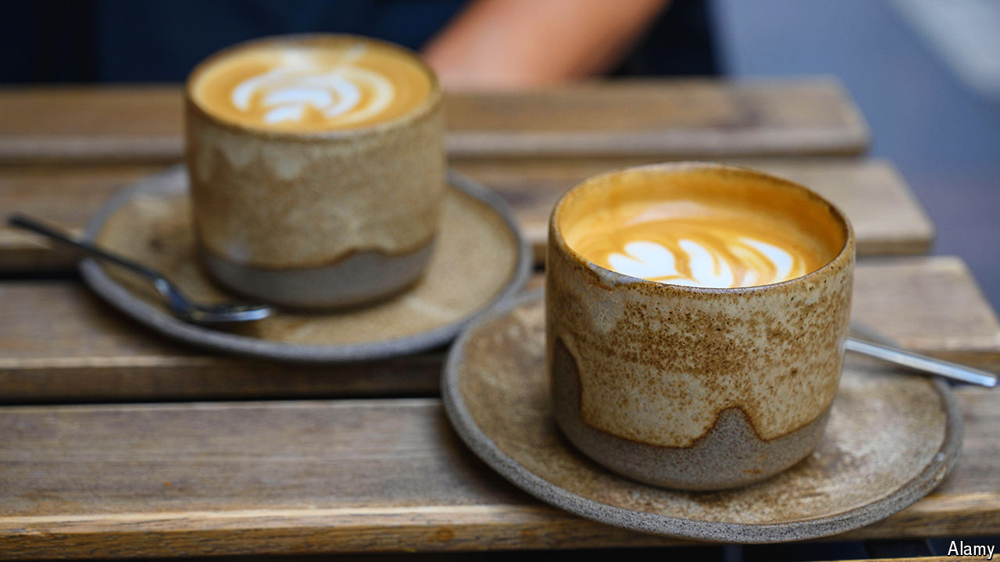

###### World in a dish

# Flat whites are Australia’s greatest culinary export 

##### They are even better than Vegemite 

 

> Apr 11th 2024 

ON ANY GIVEN day Shoreditch, a trendy part of London’s East End, is a flurry of hipsters clutching artfully designed takeaway cups. Between April 11th and 14th some 30,000  people will descend on the area for the London Coffee Festival. Many visitors will be ordering flat whites. The drink has rapidly gained popularity among those who want to taste their beans rather than temper them. 

Flat whites, which originated in Australia and New Zealand in the 1980s, are powerful yet smooth. Two shots of espresso are combined with between 140 and 180 millilitres of gently steamed milk and crowned with a sliver of “microfoam”. The result is punchy and, if done well, a little sweet: less milky than a latte and not as frothy as a cappuccino. 

Australia’s coffee-making prowess is fairly recent. Tea was the preferred beverage for British settlers in the 18th century; as a result, no one seemed to know how to make a decent cup of joe. Beans were not roasted, but boiled. To improve the taste, people added , a bitter endive, egg shells or mustard. In a letter to a newspaper in 1939, one man complained that Australia’s coffee “punishes the drinker”. 

During the second world war, American servicemen stationed in the Pacific refused to drink such concoctions and demanded that the Antipodeans up their game. The Greek and Italian immigrants who arrived after the war brought expertise. Commercial espresso-makers reached the country in the 1950s. Peter Bancroft had tasted proper coffee on holiday in London and, with the help of his father, began importing Italian machines. 

Australia’s cafés take in A$10bn ($6.6bn) a year, the most per person of any country outside Europe. Some 95% of the country’s 14,000 cafés are independently owned. It is a market in which  has struggled. The firm opened 84 shops in 2000, but has closed many; it posted a profit in Australia for the first time last year. 

Much of the country has an unfavourable climate for , so it imports far more beans than it sells. However, along with avocado toast and Vegemite, flat whites are one of Australia’s great culinary exports. In the past year one in three British consumers ordered the beverage; Pret A Manger alone sold 8m to thirsty Brits. (The company sold 9m cappuccinos, but says the gap between the pick-me-ups is shrinking.) Americans are increasingly sipping flat whites, too.

At COP, the UN’s annual climate summit, the Australian pavilion has become a social hub. Not because of the country’s —it is one of the world’s top exporters of coal and natural gas. Instead, what makes Australia so popular is the barista the delegation brings along. Call it flat-white diplomacy. ■


